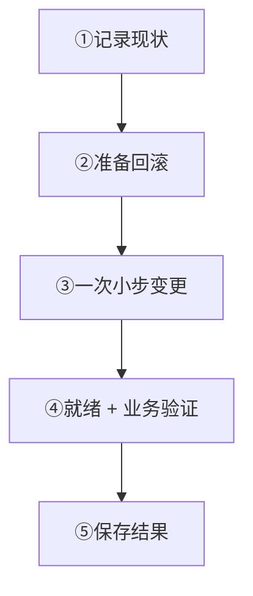

日常运维先确认三件事：节点能接流量、告警有人处理、数据有验证成功的备份。

## 第一次运维先完成这三项

1. 每个节点通过 `/readyz`，再核对业务收发与恢复。
2. 就绪、错误、队列、磁盘有告警，并指定响应人。
3. 在 Manager 配置备份、测试存储，确认至少一个完整且验证成功的备份。

## 你现在要做什么

<Cards>
  <Card title="检查服务是否正常" description="分别验证就绪、业务与监控采集。" href="/zh/server/operations/health-and-monitoring" />
  <Card title="排查故障" description="按现象检查证据，逐步缩小问题范围。" href="/zh/server/operations/troubleshooting" />
  <Card title="使用 Manager" description="登录后查看节点、健康与任务。" href="/zh/server/operations/manager" />
  <Card title="备份与恢复数据" description="验证备份，在维护窗口中恢复。" href="/zh/server/operations/backup-and-restore" />
  <Card title="增加或移除节点" description="核对迁移任务，安全排空旧节点。" href="/zh/server/operations/scaling" />
  <Card title="升级版本" description="先检查兼容性与回滚，再执行升级。" href="/zh/server/operations/upgrade-and-migration" />
  <Card title="v2 → v3 离线迁移" description="迁移冷备、验证数据，再切换客户端。" href="/zh/server/operations/v2-to-v3-migration" />
</Cards>

<Callout type="warn" title="单节点也按集群管理">
  单节点集群仍按 Manager、Controller 与 Slot 流程操作，不手工绕过它们修改数据。256 个物理哈希槽不随节点增减变化。
</Callout>

## 所有变更都按这五步做

  
每一步做什么、何时可以继续

1. **记录现状**：保存版本、配置、节点状态、`/readyz` 和关键指标。继续条件：知道变更前是什么样。

2. **准备退路**：准备回滚方法、负责人和停止条件。继续条件：出错时知道由谁、怎么停。

3. **小步执行**：一次只改一项；多节点时一次只推进一个节点或一小批任务。继续条件：当前步骤已经结束。

4. **验证业务**：测试登录或重连、消息发送、接收和历史消息。继续条件：业务正常且节点重新就绪。

5. **保存结果**：保存任务结果、错误、指标和最终节点清单。继续条件：后续能查清做过什么。

## 出现这些情况就停手

- `/readyz` 返回 503，或节点反复进入和退出就绪状态；
- Manager 中的节点、Controller、Slot、Channel 或任务状态缺失、过期或互相矛盾；
- 上一个扩缩容、恢复或升级任务还没有结束；
- 生产变更没有回滚办法，或备份从未验证成功；
- 发布说明没有明确回答当前版本能否与目标版本混合运行。

停止后先保存现场，再按[故障排查](/zh/server/operations/troubleshooting)收集证据。命令行工具见[服务端工具](/zh/server/tools)。
