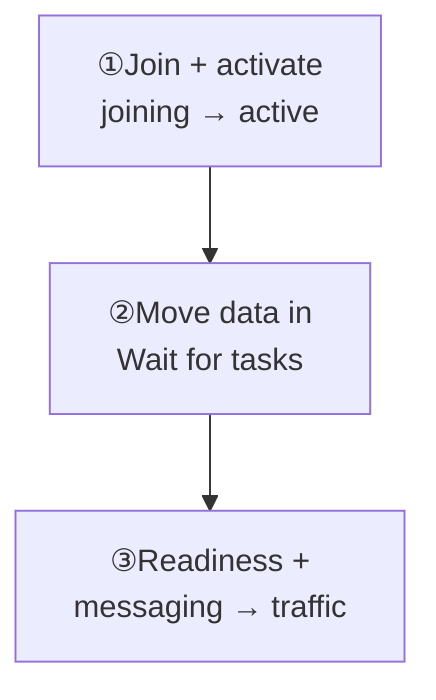
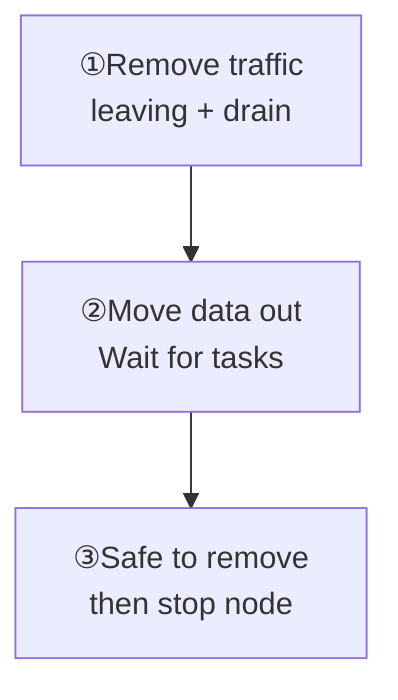

This example starts with nodes `1–3`, adds node `4` at `10.0.0.14`, and then removes it. Open **Manager → Cluster → Nodes**.

<Cards>
  <Card title="Add node 4" description="Join, activate, migrate, then admit traffic." href="/en/server/operations/scaling#scale-out" />
  <Card title="Remove node 4" description="Drain and migrate before safe removal." href="/en/server/operations/scaling#scale-in" />
</Cards>

Requires `cluster.node:w`. The cluster keeps 256 physical hash slots when nodes change.

<section id="scale-out" className="scroll-m-28">

## Scale-out: add node 4

<div className="tutorial-diagram">



</div>

### 1. Configure and start the new node

Match `cluster.id`, replica counts, and `join_token` to the existing cluster. `/healthz` checks process liveness; it does not admit traffic.

<details>
  <summary>Full configuration and startup commands</summary>

Copy an existing node's configuration and keep unrelated settings unchanged. Update `[node]`, remove `nodes` from `[cluster]`, and use:

```toml
[node]
id = 4
data_dir = "/var/lib/wukongim"

[cluster]
id = "prod-im-a"
listen_addr = "0.0.0.0:7000"
advertise_addr = "10.0.0.14:7000"
seeds = ["10.0.0.11:7000"]
join_token = "the-same-secret-as-existing-nodes"
hash_slot_count = 256
slot_replica_n = 3
channel_replica_n = 3
```

Match the existing cluster's `cluster.id`, replica counts, and `join_token`. Start the process and check liveness:

```bash
sudo systemctl enable --now wukongim
curl --fail http://10.0.0.14:5001/healthz
```

</details>

### 2. Activate it in Manager

Wait for `joining`, select **Activate node**, then confirm `active`.

<details>
  <summary>Complete activation actions</summary>

1. Wait for node 4 to show `joining`.
2. Open node 4 and select **Activate node**.
3. Wait for status `active`.

</details>

### 3. Move data in

Set **Max slot moves** to `1`. Plan and start onboarding; advance again only after active tasks reach 0, until no new task is created.

<details>
  <summary>Complete onboarding actions</summary>

1. Set **Max slot moves** to `1`.
2. Select **Plan slot onboarding** and confirm that node 4 is the target.
3. Select **Start onboarding**. When active tasks reach 0, select **Advance onboarding**.
4. Repeat until no new task is created.

</details>

### 4. Verify

Check `/readyz` on all four nodes and test message send and receive. Only then add `10.0.0.14:5100` and `10.0.0.14:5200` to the load balancer.

<details>
  <summary>Readiness commands and traffic admission</summary>

```bash
curl --fail http://10.0.0.11:5001/readyz
curl --fail http://10.0.0.12:5001/readyz
curl --fail http://10.0.0.13:5001/readyz
curl --fail http://10.0.0.14:5001/readyz
```

After all four requests pass and messages work, add `10.0.0.14:5100` and `10.0.0.14:5200` to the load balancer.

</details>

</section>

<section id="scale-in" className="scroll-m-28">

## Scale-in: remove node 4

<Callout type="warn" title="Do not stop node 4 first">
  Remove and stop it only after Manager shows **Safe to remove: Yes** (`safe_to_remove=true`). Keep the node running when blocked.
</Callout>

<div className="tutorial-diagram">



</div>

| Phase | Required result |
| --- | --- |
| Remove traffic → Mark leaving → Enable drain mode | Other nodes carry the load; active, closing, and pending connections are all 0 |
| Plan → Advance scale-in → Refresh | Slot, Channel, and active task counts are 0; **Safe to remove: Yes** |

Set **Scale-in max slot moves** to `1`; advance again after active tasks reach 0. Remove the node only after the gate passes, then stop its service.

**Done when:** Remaining nodes pass `/readyz` and messaging works. Retain node 4's data until the product is stable, then follow your retention policy.

<details>
  <summary>Complete scale-in actions and final stop command</summary>

<Callout type="warn" title="Do not stop node 4 first">
  Remove and stop the server only after Manager shows **Safe to remove: Yes**.
</Callout>

1. Remove node 4 from the load balancer and confirm that the other nodes can carry the traffic.
2. Open node 4, select **Mark leaving**, and wait for status `leaving`.
3. Select **Enable drain mode**. Wait for active, closing, and pending connection counts to reach 0.
4. Set **Scale-in max slot moves** to `1`, then select **Plan scale-in** → **Advance scale-in**. Advance again after active tasks reach 0.
5. Select **Refresh scale-in status**. When Slot, Channel, and active task counts are 0 and **Safe to remove: Yes** appears, select **Remove node**.
6. Finally, run on node 4:

```bash
sudo systemctl disable --now wukongim
```

Check `/readyz` on the remaining nodes and test messages again. Keep node 4's data directory until the product is stable, then handle it under your data-retention process.

If an action is disabled or Manager shows a blocking reason, stop and keep the node running, then follow [Troubleshooting](/en/server/operations/troubleshooting). This procedure requires `cluster.node:w`.

</details>

</section>

**Stop if blocked:** Disabled actions or blocking reasons mean keep the node running and preserve evidence. Continue through [Troubleshooting](/en/server/operations/troubleshooting#cluster-state).
