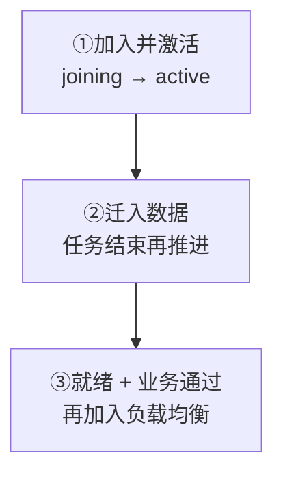
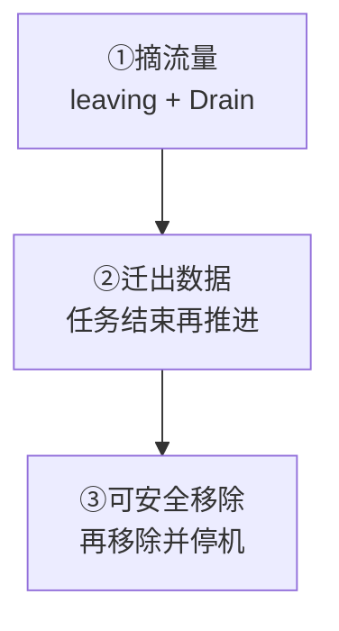

下面用一个例子直接操作：现有节点为 `1～3`，新增节点 `4`，IP 是 `10.0.0.14`。入口：**Manager → 集群 → 节点**。

<Cards>
  <Card title="增加节点 4" description="加入、激活、迁入数据，再接流量。" href="/zh/server/operations/scaling#scale-out" />
  <Card title="移除节点 4" description="先排空连接与数据，再安全移除。" href="/zh/server/operations/scaling#scale-in" />
</Cards>

需要 `cluster.node:w`。增减节点不改变 256 个物理哈希槽。

<section id="scale-out" className="scroll-m-28">

## 扩容：新增节点 4

<div className="tutorial-diagram">



</div>

### 1. 配置并启动新节点

`cluster.id`、副本数和 `join_token` 与现有集群一致。`/healthz` 只查进程存活，不能据此接入流量。

<details>
  <summary>完整配置与启动命令</summary>

复制现有节点的配置，保留其他配置不变。修改 `[node]`，并将 `[cluster]` 中的 `nodes` 删除后改为：

```toml
[node]
id = 4
data_dir = "/var/lib/wukongim"

[cluster]
id = "prod-im-a"
listen_addr = "0.0.0.0:7000"
advertise_addr = "10.0.0.14:7000"
seeds = ["10.0.0.11:7000"]
join_token = "与现有节点相同的密钥"
hash_slot_count = 256
slot_replica_n = 3
channel_replica_n = 3
```

`cluster.id`、副本数和 `join_token` 必须与现有集群一致。启动并检查进程：

```bash
sudo systemctl enable --now wukongim
curl --fail http://10.0.0.14:5001/healthz
```

</details>

### 2. 在 Manager 激活节点

等待 `joining`，点击“激活节点”，确认变成 `active`。

<details>
  <summary>完整激活步骤</summary>

1. 等节点 4 的状态显示为 `joining`。
2. 打开节点 4，点击“激活节点”。
3. 等状态变成 `active`。

</details>

### 3. 迁入数据

“迁移数量”填 `1`，规划并启动扩容；活动任务为 0 后再推进，直到不再创建新任务。

<details>
  <summary>完整迁入步骤</summary>

1. 将“迁移数量”填为 `1`。
2. 点击“规划槽位扩容”，确认目标是节点 4。
3. 点击“启动扩容”。活动任务变成 0 后，点击“推进扩容”。
4. 重复上一步，直到不再创建新任务。

</details>

### 4. 验收

四个节点都通过 `/readyz` 且消息能正常收发，再把 `10.0.0.14:5100` 和 `10.0.0.14:5200` 加入负载均衡。

<details>
  <summary>就绪检查命令与接流条件</summary>

```bash
curl --fail http://10.0.0.11:5001/readyz
curl --fail http://10.0.0.12:5001/readyz
curl --fail http://10.0.0.13:5001/readyz
curl --fail http://10.0.0.14:5001/readyz
```

四个请求都成功且消息能正常收发后，再把 `10.0.0.14:5100` 和 `10.0.0.14:5200` 加入负载均衡。

</details>

</section>

<section id="scale-in" className="scroll-m-28">

## 缩容：移除节点 4

<Callout type="warn" title="不要先关闭节点 4">
  只有 Manager 显示“可安全移除：是”（`safe_to_remove=true`）后，才能移除并停止节点；阻塞时保持节点运行。
</Callout>

<div className="tutorial-diagram">



</div>

| 阶段 | 必须看到的结果 |
| --- | --- |
| 摘流量 → 标记离开 → 启用 Drain | 其他节点能承接流量；在线、关闭中、待激活连接数全部为 0 |
| 规划 → 推进缩容 → 刷新状态 | Slot、Channel、活动任务均为 0；“可安全移除：是” |

“缩容迁移数量”填 `1`，活动任务为 0 后再推进；安全检查通过后才移除节点，最后停止服务。

**完成标准：** 其余节点通过 `/readyz` 且消息收发正常。先保留节点 4 的数据，业务稳定后按保留流程处理。

<details>
  <summary>完整缩容步骤与最后的停机命令</summary>

<Callout type="warn" title="不要先关闭节点 4">
  必须等 Manager 显示“可安全移除：是”后，才能移除和关闭服务器。
</Callout>

1. 先从负载均衡删除节点 4，确认其他节点能承接流量。
2. 打开节点 4，点击“标记离开”，等状态变成 `leaving`。
3. 点击“启用 Drain”，等在线、关闭中和待激活连接数全部变成 0。
4. 将“缩容迁移数量”填为 `1`，点击“规划缩容” → “推进缩容”。活动任务变成 0 后继续推进。
5. 点击“刷新缩容状态”。看到 Slot、Channel 和活动任务均为 0，且“可安全移除：是”后，点击“移除节点”。
6. 最后在节点 4 执行：

```bash
sudo systemctl disable --now wukongim
```

再次检查其余节点的 `/readyz` 和消息收发。先保留节点 4 的数据目录，确认业务稳定后再按自己的数据保留流程处理。

如果按钮不可用或页面显示阻塞原因，停止操作并保持节点运行，转到[故障排查](/zh/server/operations/troubleshooting)。执行本页操作需要 `cluster.node:w`。

</details>

</section>

**阻塞时停手：** 按钮不可用或存在阻塞原因时，保持节点运行、保存证据，进入[故障排查](/zh/server/operations/troubleshooting#cluster-state)。
