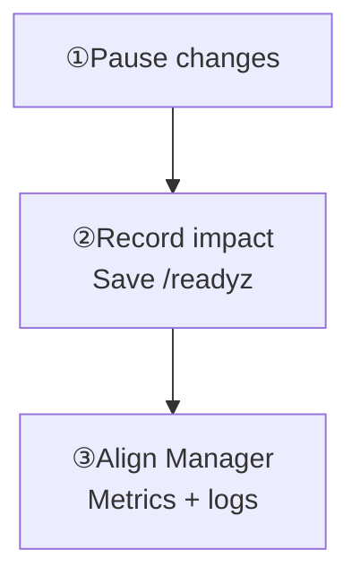

Record time, impact, and recent changes, then choose a symptom.

<Cards>
  <Card title="Readiness fails" description="The process responds, but /readyz returns 503." href="/en/server/operations/troubleshooting#not-ready" />
  <Card title="Connection or reconnect failures" description="Check protocol, advertised address, network, and gateway." href="/en/server/operations/troubleshooting#connectivity" />
  <Card title="Send failures or backlog" description="Compare errors, latency, queues, and node hot spots." href="/en/server/operations/troubleshooting#messaging" />
  <Card title="Unhealthy cluster state" description="Inspect nodes, Controller, Slots, and task evidence." href="/en/server/operations/troubleshooting#cluster-state" />
  <Card title="Disk or data problems" description="Record disk and data paths before offline read-only checks." href="/en/server/operations/troubleshooting#storage" />
  <Card title="Backup or upgrade failed" description="Preserve tasks and archives; follow stop conditions." href="/en/server/operations/troubleshooting#maintenance" />
</Cards>

<Callout type="warn" title="Pause changes when state is unclear">
  Pause releases and topology changes if node, Controller, Slot, Channel, or task state is missing, stale, or conflicting. Preserve evidence; avoid bulk restarts, leader movement, and data deletion.
</Callout>

## The first ten minutes

<div className="tutorial-diagram">



</div>

<details>
  <summary>Complete collection order and read-only commands</summary>

1. **Pause other changes**: pause releases, scaling, restore, and concurrent cluster operations. Record every active task.
2. **Record the impact**: note the start time and affected users, Channels, nodes, and entry points (TCP, WebSocket, or HTTP).
3. **Check liveness and readiness**: save the status code and full response from `/healthz` and `/readyz`; the `/readyz` failure reason matters most.
4. **Open Manager**: inspect nodes, Controller, Slots, Channels, and tasks. Mark anything unhealthy or no longer updating.
5. **Align the time range**: compare metrics, error logs, and recent release or configuration changes from the same period.

```bash
curl -sS -i http://127.0.0.1:5001/healthz
curl -sS -i http://127.0.0.1:5001/readyz
wkcli top --server http://127.0.0.1:5001 --once --json
```

Replace the address with the real API address. `0.0.0.0` is a listen setting, not a server address that clients can use.

For metric names, copyable PromQL, and result interpretation, see [Health & Monitoring](/en/server/operations/health-and-monitoring). Check collection health before comparing data from the same node and time interval.

</details>

## Continue from the symptom

<section id="not-ready" className="scroll-m-28">

### `/healthz` succeeds but `/readyz` returns 503

Save the full `/readyz` response and `reason`. Inspect maintenance, Controller, Slots, and active tasks in Manager, then compare other nodes.

**Check:** Identify the specific readiness failure. Do not restore traffic before the restore, scaling, or upgrade stop conditions are cleared.

<details>
  <summary>Readiness: complete check list</summary>

1. Save the complete `/readyz` response and `reason`.
2. In Manager, check maintenance state, Controller, Slots, and active restore or control tasks.
3. Compare time, version, configuration, and readiness with other nodes.

Do not return traffic to this node or bypass safety checks in restore, scaling, or upgrade procedures.

</details>

</section>

<section id="connectivity" className="scroll-m-28">

### Clients cannot connect or keep reconnecting

Confirm the client protocol and advertised address. Check DNS, load balancer, TLS, firewall, and gateway logs over the same interval.

**Check:** Narrow the failure to an entry, node, or connection step and retain evidence. Do not disconnect or restart in bulk without evidence.

<details>
  <summary>Connections: complete check list</summary>

1. Identify whether the user connects through TCP, WebSocket, or HTTP. Do not use the Manager address as a client address.
2. Check the advertised address, DNS, load balancer, TLS, and firewall.
3. Compare connection counts, connection errors, file descriptors, memory, and network by node. Read gateway logs for the same user and time window.

Do not disconnect sessions in bulk or restart every node without evidence.

</details>

</section>

<section id="messaging" className="scroll-m-28">

### Messages fail, slow down, or back up

Inspect send errors and high-percentile latency, then compare node queues. Use an exact Channel lookup when its ID is known.

**Check:** Identify the node or Channel hot spot. Verify commit, peer receipt, and history recovery separately; averages cannot replace high percentiles.

<details>
  <summary>Messaging: complete check list</summary>

1. Check send error rate and high-percentile latency, then see whether Channel, delivery, or push queues keep growing.
2. Compare nodes to find a single-machine or large-group hot spot.
3. When you know the Channel ID, use an exact lookup instead of listing every Channel.
4. Use pprof for a short, bounded window only after metrics and logs point to CPU, memory, or goroutines.

See [Message Flow](/en/server/architecture/message-flow) for the full path. With large groups and high message rates, averages can look normal while maximums and high percentiles are unhealthy.

</details>

</section>

<section id="cluster-state" className="scroll-m-28">

### Controller, Slot, or node state is unhealthy

Save state timestamps, control revision, `blocked_reasons`, tasks, and Slot evidence. Pause changes for missing, stale, or conflicting state.

**Check:** A diagnostic recommendation is not authorization to write. Node removal still requires `safe_to_remove=true`.

<details>
  <summary>Cluster state: read-only diagnostic commands</summary>

```bash
wkcli node ls --context production
wkcli node diagnose 4 --context production --json
```

Save state timestamps, control revision, `blocked_reasons`, tasks, and Slot evidence from the output. A diagnostic recommendation is not permission to perform a write. Node removal must still wait for `safe_to_remove=true`. Follow [Scaling](/en/server/operations/scaling) for the procedure.

</details>

</section>

<section id="storage" className="scroll-m-28">

### Disk is low or data looks inconsistent

Record free disk, IO, errors, node ID, and data paths. Do not delete data files or unknown logs to make space.

**Check:** `wkcli db` reads only stopped nodes, snapshots, or copied stores. An `import` must write to an explicitly offline target; it does not replace backup and restore.

<details>
  <summary>Disk and data: offline inspection boundaries</summary>

First record free disk, IO latency, errors, node ID, data paths, and configuration. Do not make space by deleting data files or unknown logs.

`wkcli db` can inspect only a stopped node, filesystem snapshot, or copied data directory. Start with read-only `query`, `diff`, or `export`. `import` writes data, must target an explicitly offline store, and does not replace Manager backup and restore.

</details>

</section>

<section id="maintenance" className="scroll-m-28">

### Backup, restore, or upgrade failed

Preserve Manager tasks and audits, archive inventory, physical Slot verification, and version digests. Follow the relevant task stop conditions.

**Check:** A live `/healthz` during restore does not permit traffic. Mixed-version operation requires explicit release-note support.

<details>
  <summary>Maintenance failures: archives and stop conditions</summary>

Save Manager tasks and audits, archive inventory, verification for all 256 physical Slots, and program versions and digests. Do not return traffic because `/healthz` succeeds during restore, and do not assume arbitrary versions may remain mixed after a failed upgrade. Return to the stop conditions in [Backup & Restore](/en/server/operations/backup-and-restore) or [Upgrade & Migration](/en/server/operations/upgrade-and-migration).

</details>

</section>

## Use tools in this order

Start with `/readyz`, Manager, and metrics and logs over the same interval. Narrow to one node or an exact Slot, Channel, or task. Time-box and target pprof, then disable Debug; use `wkcli bench` only in an isolated test cluster.

<details>
  <summary>Complete tool order and usage boundaries</summary>

1. Start with `/readyz` and Manager; they are the lowest-cost checks.
2. Read Prometheus metrics and error logs from the same time range.
3. Use Top or `wkcli top` for one node's current resources and short history.
4. Use [Diagnostics](/en/server/tools/diagnostics) only after the problem is narrowed to an exact node, Slot, Channel, or task.
5. Time-box and target pprof, then disable Debug access when finished.
6. `wkcli bench` creates real traffic and data. Reproduce only in an isolated test cluster; never run an unbounded load against production.

Stop increasing diagnostic cost when an earlier step already explains the problem.

</details>

## What to send when asking for help

Provide time, impact, versions and redacted configuration, full readiness responses, and matching metrics with a short log excerpt. Remove passwords, full tokens, and message bodies before sharing.

<details>
  <summary>Help request: complete evidence list</summary>

- Incident start time, impact, and recent changes.
- Node inventory, versions, cluster identity, and relevant redacted configuration.
- Complete `/healthz` and `/readyz` responses and Manager state.
- Metric screenshots or exports and a small relevant log excerpt from the same time range.
- Relevant node, Slot, Channel, task, or trace IDs.
- Checks already performed, their results, and high-risk actions deliberately not performed.

Do not send passwords, complete tokens, user message bodies, or a full unreviewed configuration file.

Troubleshooting is complete only after the product works again, queues are controlled, nodes pass `/readyz`, monitoring has recovered, and temporary Debug access, sampling, and test traffic have been removed.

</details>

**Completion criteria:** The product works, queues are controlled, nodes pass `/readyz`, monitoring has recovered, and temporary Debug access, sampling, and test traffic are removed.
