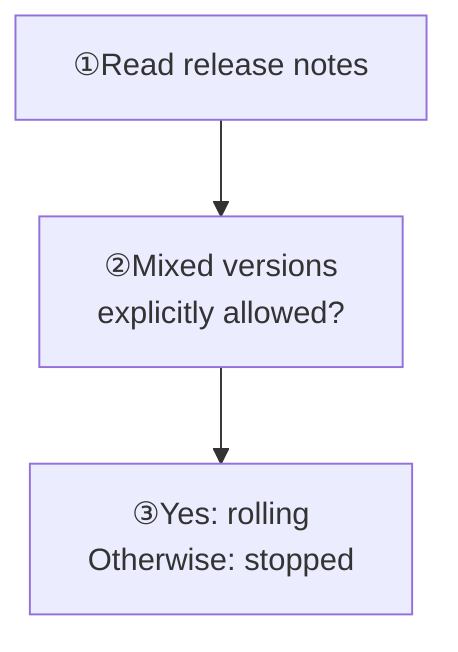
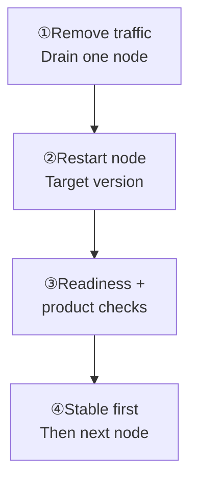
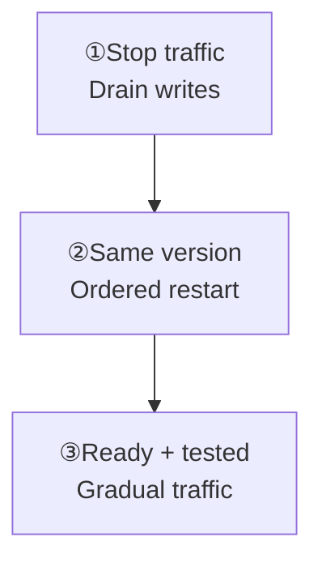

Before upgrading, answer one question: **do the target release notes explicitly allow the target and current versions to run together?** Do not guess based on cluster size or past experience.

**Moving from v2 to v3?** Use the [offline migration procedure](/en/server/operations/v2-to-v3-migration), not the upgrade flows below.

## Choose the upgrade method

<Callout type="warn" title="Do not mix versions by default">
  Rolling upgrades require explicit release-note support, including order and time limit. Silent, unclear, or incompatible notes mean a stopped upgrade, or pause and ask the release owner.
</Callout>

  
Complete version decision table and compatibility rule

| Situation | Method |
| --- | --- |
| The release notes explicitly allow these versions to mix and give an order and time limit | A rolling upgrade may update one node at a time |
| The release notes are silent, unclear, or say they are incompatible | Use a stopped maintenance window and keep every node on the same version |
| Moving from v2 to v3 | Treat it as a separate migration project; do not copy data directories or use the normal upgrade steps |

<Callout type="warn" title="Do not mix versions by default">
  Use a rolling upgrade only when the target release documentation explicitly confirms compatibility. Without that evidence, use a stopped upgrade or pause and ask the release owner.
</Callout>

## Before you start

First confirm three things:

1. Exact versions and digests, compatibility, order, mixed-version deadline, and rollback boundary are known.
2. Storage is tested, a complete archive is verified, and restore is rehearsed.
3. Readiness, metrics, and product checks have a recorded baseline.

**Unknown checks mean pause.** Do not begin a rolling upgrade when any preflight item is unclear.

  
Complete preflight check list

- Record the current and target versions and the digest of every package or image.
- Read the target release's compatibility notes for protocols, storage, configuration, Controller, Slots, and Channels.
- Write down the upgrade order, maximum mixed-version time, stop conditions, and owner.
- Confirm whether downgrade is supported and after which step a direct binary rollback becomes unsafe.
- Confirm that backup storage passed its test, one complete archive passed verification, and restore was rehearsed.
- Save a pre-change baseline for `/readyz`, errors, latency, connections, queues, disk, and cluster state.
- Test message send, receive, reconnect, history, and downstream integrations.

Do not begin a rolling upgrade if any item is unknown.

## Rolling upgrade

**Only with explicit compatibility:** One node at a time; keep its ID and data directory unchanged and obey the release-specific order and mixed-version deadline.

Pause scaling, backup/restore, and unrelated configuration changes first.

Confirm `/readyz` is 200 and Controller, Slots, Channels, errors, and queues are healthy. Then test messaging, reconnect, history, and downstream integrations with a small amount of traffic. Advance only after this node is stable. Keep headroom for reconnects and warm-up; after completion, observe a full product peak and save results.

  
Complete rolling upgrade sequence

Use this only when the release notes explicitly allow mixed versions:

1. Pause scaling, backup/restore, and unrelated configuration changes.
2. Remove one non-critical node from the load balancer and wait for connections and tasks to drain.
3. Restart it with the target version and validated configuration. Keep its node ID and data directory unchanged.
4. Wait for `/readyz` to return 200. Confirm that Controller, Slots, Channels, errors, and queues are healthy.
5. Send a small amount of traffic to the node and test message send, receive, reconnect, history, and downstream integrations.
6. Upgrade the next node only after this one is stable. Follow the release-specific node order and mixed-version deadline.
7. After all nodes are upgraded, observe at least one complete product peak and save the results.

Large groups, high message rates, and many online users amplify reconnect and cache warm-up pressure. Keep capacity headroom during the upgrade.

## Stopped maintenance upgrade

Complete backup verification, rollback rehearsal, and downtime communication first. Drain writes and downstream delivery. Follow the release's stop/start order; do not stop every Controller voter together while coordination is needed.

**Before traffic:** Every node passes `/readyz`; nodes, Controller, and logical Slots are stable; product tests pass. Restore traffic gradually and stop on unknown state or new errors.

  
Complete stopped upgrade sequence

Use this when the release notes do not explicitly allow mixed versions:

1. Complete backup verification, rollback rehearsal, and downtime communication.
2. Stop product traffic and wait for writes and downstream delivery to drain.
3. Stop nodes in the order required by the target release. Do not stop every Controller voter together while coordination is still needed.
4. Replace the program and configuration on every node. Start them according to the release instructions only after versions are consistent.
5. Wait for all nodes, Controller, and all logical Slots to stabilize and for `/readyz` to return 200 on every node.
6. Run product tests and then restore traffic gradually. Stop the cutover on unknown state or new errors.

## When rollback is safe

A direct binary rollback needs **explicit downgrade support and no data that the old version cannot read**. Configuration, metadata, and storage can create irreversible boundaries.

**Past the boundary or unsure:** Keep traffic closed and preserve logs/data. Use release-specific recovery or the rehearsed backup restore; do not blindly install the old binary.

  
Complete rollback boundary explanation

A direct binary rollback is safe only when the release notes explicitly support downgrade and the new version has not written data that the old version cannot understand. Configuration, metadata, and storage formats can all create an irreversible boundary.

After that boundary, do not blindly install the old version. Keep traffic closed, preserve logs and data, and follow the release-specific recovery procedure or the rehearsed backup restore.

## Moving from v2 to v3

`wkcli migrate` converts an original v2 stopped backup offline into a **new, empty v3 cluster**. Never open the old directories directly in v3. Follow [v2 → v3 Offline Migration](/en/server/operations/v2-to-v3-migration); after new production writes begin, a direct switch back to v2 is unsafe.

  
Complete migration scope and acceptance order

`wkcli migrate` converts complete stopped backups of original v2 into a new, empty v3 cluster offline. It does not require modifying or upgrading old v2. It is not an in-place upgrade, and v3 must never open the old data directories directly.

Follow [v2 → v3 Offline Migration](/en/server/operations/v2-to-v3-migration) to fix versions and the plan, run `prepare`, `export`, `import`, and independent `verify`, then complete runtime, client, and external integration acceptance. Renumbering requires handling client caches and cursors; after new production writes begin, a direct switch back to old v2 is unsafe.

