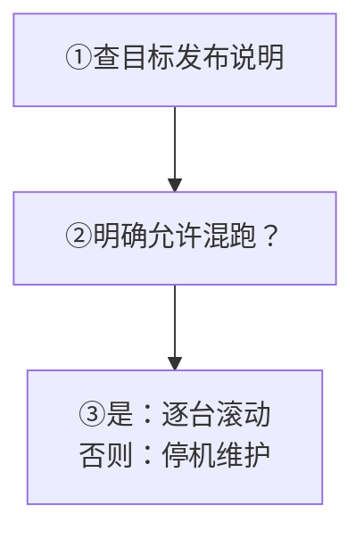
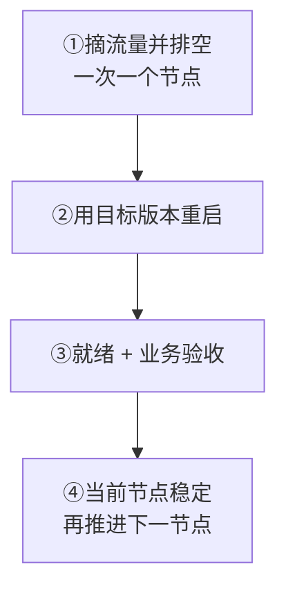
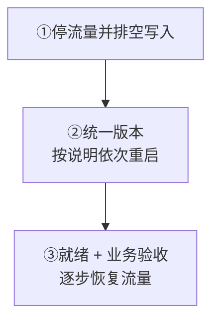

升级前先回答一个问题：**目标版本的发布说明是否明确允许它和当前版本同时运行？** 不要根据节点数量或经验猜测。

**从 v2 到 v3？** 直接进入[离线迁移](/zh/server/operations/v2-to-v3-migration)，不使用下面的普通升级流程。

## 先选择升级方式

<Callout type="warn" title="默认不要混合运行不同版本">
  滚动升级必须有发布说明明确支持，并给出顺序与时限；未说明、不清楚或不兼容时，使用停机升级，或暂停并向版本负责人确认。
</Callout>

  
完整版本判断表与兼容原则

| 情况 | 应选择的方式 |
| --- | --- |
| 发布说明明确允许当前版本与目标版本混跑，并给出顺序和时限 | 可以滚动升级，一次升级一个节点 |
| 发布说明没有说明、描述不清，或明确不兼容 | 使用停机维护窗口，所有节点保持同一版本 |
| 从 v2 迁移到 v3 | 当作独立迁移项目，不复制数据目录，不使用普通升级步骤 |

<Callout type="warn" title="默认不要混合运行不同版本">
  只有目标版本的发布说明明确确认兼容时，才使用滚动升级。没有证据时选择停机升级，或暂停并向版本负责人确认。
</Callout>

## 开始前的检查清单

先确认三件事：

1. 版本与摘要、兼容性、执行顺序、最长混跑时间和回滚边界都明确。
2. 存储测试、完整归档验证和恢复演练已完成。
3. 就绪、指标与业务测试都有变更前基线。

**任何检查项说不清楚就暂停，不开始滚动升级。**

  
完整升级前检查清单

- 记录当前版本、目标版本和每个安装包或镜像的摘要；
- 阅读目标版本关于协议、存储、配置、Controller、Slot 和 Channel 的兼容说明；
- 写清升级顺序、最长混跑时间、停止条件和负责人；
- 确认能否降级，以及升级到哪一步后不能再直接换回旧版本；
- 确认备份存储测试成功，至少有一个完整、验证成功的归档，并做过恢复演练；
- 保存 `/readyz`、错误率、延迟、连接、队列、磁盘和集群状态的变更前基线；
- 实际测试消息发送、接收、重连、历史消息和下游集成。

任何一项说不清楚，都不要开始滚动升级。

## 滚动升级

**仅明确兼容时使用：** 一次升级一个节点，节点 ID 与数据目录不变，遵守发布说明的顺序和最长混跑时间。

先暂停扩缩容、备份恢复和无关配置变更。

先确认 `/readyz` 为 200，Controller、Slot、Channel、错误与队列无异常，再用少量流量验证收发、重连、历史与下游集成。当前节点稳定后再推进；预留重连和预热余量，全部完成后观察一个完整业务高峰并保存结果。

  
完整滚动升级顺序

仅在发布说明明确允许混跑时使用：

1. 暂停扩缩容、备份恢复和无关配置变更。
2. 从负载均衡器摘除一个非关键节点，等待连接和任务排空。
3. 使用目标版本和已验证配置重启该节点，不要改变它的节点 ID 和数据目录。
4. 等待 `/readyz` 返回 200，确认 Controller、Slot、Channel、错误和队列没有异常。
5. 先给该节点少量流量，测试消息收发、重连、历史消息和下游集成。
6. 这一节点稳定后再升级下一个，并遵守发布说明规定的节点顺序和混跑时限。
7. 全部完成后观察至少一个完整业务高峰，保存升级结果。

大群、高消息率和大量在线用户会放大重连和缓存预热压力。升级期间应提前保留容量余量。

## 停机升级

先完成备份验证、回退演练与停机通知，排空写入和下游投递；按发布说明停启节点，仍需 Controller 协调时，不同时关闭所有投票节点。

**接回流量前：** 所有节点、Controller、逻辑 Slot 稳定，各节点通过 `/readyz`，业务测试正常。逐步切流，未知状态或新错误立即停止。

  
完整停机升级顺序

发布说明没有明确允许混跑时使用：

1. 完成备份验证、回退演练和停机通知。
2. 停止业务流量，等待写入和下游投递排空。
3. 按目标版本说明的顺序停止节点。需要 Controller 协调时，不要同时关闭所有 Controller 投票节点。
4. 替换所有节点的程序和配置，确认版本一致后再按说明启动。
5. 等待所有节点、Controller 和各逻辑 Slot 稳定，且每个节点的 `/readyz` 返回 200。
6. 完成业务测试后逐步恢复流量。出现未知状态或新错误时立即停止切流。

## 什么时候可以回滚

直接换回旧程序须同时满足：**发布说明明确支持降级，且未写入旧版本无法理解的数据**。配置、元数据和存储格式都可能形成不可逆边界。

**已越界或不明确：** 保持流量关闭、保存日志与数据，执行版本专用恢复或已演练的备份恢复，不盲目安装旧版本。

  
完整回滚边界说明

只有发布说明明确支持降级，并且新版本还没有写入旧版本无法理解的数据时，才可以直接换回旧程序。配置格式、元数据和存储格式都可能形成不可逆边界。

越过这个边界后，不要盲目安装旧版本。保持流量关闭，保存日志和数据，使用该版本专用的恢复步骤，或执行已经演练过的备份恢复。

## 从 v2 迁移到 v3

`wkcli migrate` 将原版 v2 的完整停机备份离线转换到**全新空 v3 集群**，不能让 v3 直接打开旧目录。按 [v2 → v3 离线迁移](/zh/server/operations/v2-to-v3-migration)执行；接收新生产写入后不能直接切回 v2。

  
完整迁移范围与验收顺序

`wkcli migrate` 支持从原版 v2 的完整停机备份离线转换到全新空 v3 集群，不需要修改或升级旧 v2。它不做原地升级，也不允许 v3 直接打开旧数据目录。

按 [v2 → v3 离线迁移](/zh/server/operations/v2-to-v3-migration) 固定版本与计划，依次执行 `prepare`、`export`、`import`、独立 `verify`，再完成运行、客户端和外部集成验收。重新编号时需处理客户端缓存与游标；开始接收新生产写入后不能直接切回旧 v2。

