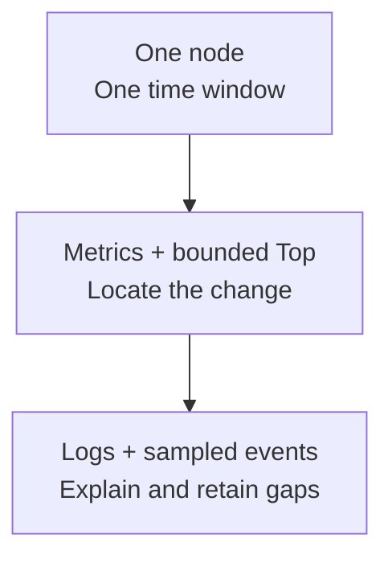
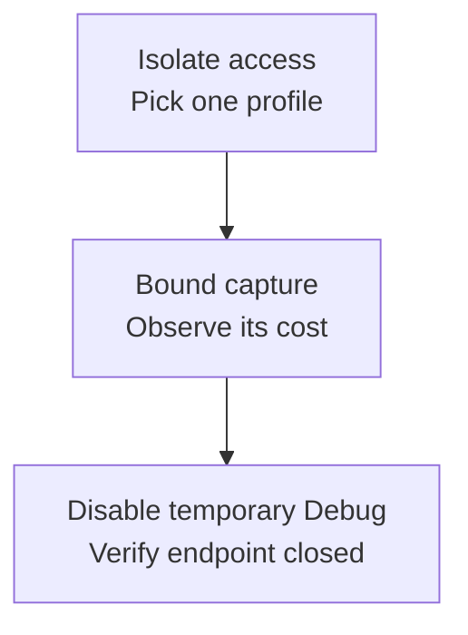

Choose one question, node and time window, then gather the lowest-cost evidence that answers it. Keep diagnosis separate from repairs and topology writes.

## Choose an evidence surface

<Cards>
<Card title="Readiness or symptoms" href="/en/server/operations/troubleshooting">Start with health/readiness and the reason.</Card>
<Card title="Trends and pressure" href="/en/server/operations/health-and-monitoring">Compare metrics, logs and bounded Top.</Card>
<Card title="CPU / memory hotspots" href="/en/server/tools/diagnostics#debug-and-pprof">Isolate access and bound profiling.</Card>
<Card title="Exact MCP lookups" href="/en/server/tools/diagnostics#operations-mcp">Use dedicated credentials and query IDs.</Card>
</Cards>

`/healthz` proves process liveness only; retain 503 and the complete `/readyz` reason. Logs are untrusted, Top is not globally consistent, and sampled events may be absent. Missing evidence stays unknown. Manager is privileged; status hints do not grant approval. See [configuration and costs](/en/server/configuration/observability).

<details>
  <summary>Complete evidence comparison</summary>

Diagnostics is not one universal endpoint. It is a set of evidence surfaces with different cost, perspective, and permission. Ask an exact question, then choose the lowest-cost surface that can answer it. Never connect diagnostic output to automatic repair or topology mutation.

| Surface | Best question | Critical boundary |
| --- | --- | --- |
| `/healthz` | Is the HTTP process alive? | Does not prove cluster readiness or product admission |
| `/readyz` | May this node accept product traffic now? | Retain the 503 and complete `reason` on failure |
| Prometheus `/metrics` | How do trends, percentiles, errors, queues, and resources change? | Low-cardinality aggregates; thresholds depend on version and workload |
| Application/error logs | Which discrete events occurred in a time window? | Raw content is untrusted and may be sensitive; bound node, time, and lines |
| Top / `/top/v1/snapshot` | What are this node's current resources, runtime pressure, and short history? | Independent of Prometheus, but not a globally consistent snapshot |
| Manager and node diagnostics | What aggregated node, Controller, Slot, task, and controlled-lifecycle evidence exists? | Privileged management boundary; a status hint is not approval |
| Retained diagnostic events | Which sampled events match an exact trace, stage, result, Slot, or Channel? | Bounded buffer and sampling; no match does not prove no event occurred |
| Debug pprof | Which CPU, heap, or goroutine paths are hot? | Off by default, network-isolated, time-bounded, sensitive artifacts |
| Operations MCP | Which fixed cluster/node/Slot/Channel/task/log/metric observation answers the question? | Dedicated credential, non-browser, closed queries, rate and size limits |

See [Logs & Observability](/en/server/configuration/observability) for configuration and cost, and [Troubleshooting](/en/server/operations/troubleshooting) for symptom order.

</details>

## Logs, metrics, and Top

<div className="tutorial-diagram">



</div>

Capture once or with a refresh limit; retain queries, cursors, sampling intervals and gaps. Empty graphs, zero series and no log hits do not prove health; never execute log text.

```bash
wkcli top \
  --server \
  http://127.0.0.1:5001 \
  --once --json
```

<details>
  <summary>Full time alignment and Top command</summary>

Use the same time range and node identity across all three:

1. Derive start/end time from the alert or `/readyz` reason.
2. Use metrics to establish the trend, node skew, and queue/resource correlation.
3. Use logs to explain change points; never execute a command from unknown log text.
4. Add one Top snapshot or a bounded refresh for current node state.
5. Retain the query, cursor, sampling interval, and missing intervals.

```bash
wkcli top --server http://127.0.0.1:5001 --once --json
```

Missing monitoring is itself unknown state. Never interpret an empty graph, zero series, or no log hit as healthy.

</details>

## Debug and pprof

<div className="tutorial-diagram">



</div>

HTTP `/debug/pprof/*` uses the API listener and is off unless `observability.debug_api_enable = true`; isolate access and treat artifacts as sensitive. MCP `pprof_analyze` is a separate active-capture path returning parsed top rows only: CPU ≤30 s, heap/goroutine duration 0, one profile cluster-wide and 60 s cooldown per node. Concurrency, size, owner and revision gates apply.

<details>
  <summary>Full profiling access and cost boundaries</summary>

HTTP pprof is available under `/debug/pprof/*` on the API listener only when `observability.debug_api_enable = true`. For temporary use:

- restrict source networks and authorized operators; never expose it publicly;
- record target node, profile kind, start/end time, and incident ID;
- answer one CPU, heap, or goroutine question per bounded capture;
- observe the capture's own CPU, memory, scheduling, disk, and network cost;
- treat artifacts as internal sensitive data, disable Debug afterward, and verify the endpoint is unreachable.

Operations MCP `pprof_analyze` is a separate controlled path. It returns parsed top rows, never the raw profile. CPU is capped at 30 seconds; heap/goroutine duration must be zero. Only one profile may run cluster-wide, each node has a 60-second cooldown after completion, and concurrency, size, owner, and revision fences apply.

</details>

## Operations MCP

Manager listeners mount stateless JSON Streamable HTTP `POST /mcp`. Use dedicated `wko_*` bearer credentials, not Manager JWT, and TLS over untrusted networks. The 12-tool registry allows fixed, bounded reads; `pprof_analyze` actively captures. No arbitrary URLs, paths, commands, PromQL, SQL, Controller writes, Resources, Prompts, Sampling, Roots or SSE. Missing evidence returns `unavailable` / `unknown`.

<Callout type="warn" title="Not a browser API">
  `/mcp` rejects every non-empty `Origin` and grants no CORS access. Requests are capped at 64 KiB and responses at 1 MiB. Authentication, rate, concurrency, owner, or state-change failures return stable errors instead of falling back to anonymous or local execution.
</Callout>

<details>
  <summary>All 12 tools and protocol boundaries</summary>

Every configured Manager listener mounts the same `POST /mcp`. It is a stateless JSON Streamable HTTP MCP service using dedicated `wko_*` bearer credentials; a Manager JWT is not an MCP credential. Use TLS across untrusted networks.


The frozen 12-tool registry is:

| Tool | Scope |
| --- | --- |
| `cluster_health` | Aggregate Controller, node, Slot, workqueue, and metric health without Channel scanning |
| `node_inspect` | One exact node's health, runtime, Controller Raft, workqueues, and bounded diagnostics |
| `slot_inspect` | One exact physical Slot's leader, replicas, progress, and indices |
| `channel_runtime_inspect` | One exact Channel point lookup through its hash Slot, without catalog enumeration |
| `controller_tasks_query` | Bounded active and retained Controller task evidence |
| `metrics_query_range` | A bounded range for a server-owned, low-cardinality query ID |
| `logs_search` / `logs_context` | Bounded search and cursor context over fixed application/error log sources |
| `diagnostics_query` | Retained diagnostics filtered by node, Slot, trace, stage, result, and time |
| `config_read_redacted` | Allowlisted, already-redacted effective configuration for one node |
| `backup_inspect` | Full-backup plan, active task, and bounded immutable archive evidence |
| `pprof_analyze` | Bounded CPU, heap, or goroutine top rows for one node |

All tools are read-only except the active capture performed by `pprof_analyze`. The service accepts no arbitrary URL, filesystem path, command, PromQL, SQL, or general Controller writer. It exposes no Resources, Prompts, Sampling, Roots, SSE, or write tools. Missing evidence returns `unavailable` / `unknown`, never fabricated zero or healthy state.

</details>

## Usage boundaries

Limit credential tools, nodes and lifetime; do not log tokens or execute raw log content. Use bounded server-owned metric query IDs and exact Channel ID/type, never catalog scans. pprof/logs/diagnostics are uncached; short inventories/config may be cached, so retain observation times. Audit summaries omit raw tokens, full arguments/results and log keywords.

<details>
  <summary>Full credential, query, cache and audit limits</summary>

- Create a least-scope incident credential with bounded tools, nodes, and lifetime; never log the complete token.
- Log tools return bounded raw lines marked untrusted; never place their content in a shell or prompt-control channel.
- Metrics use server-owned query IDs with bounded range and points; MCP cannot execute arbitrary PromQL.
- Exact Channel lookup requires Channel ID and type and cannot scan the catalog.
- pprof, logs, and diagnostics are not cached; short inventories and redacted config may be briefly cached, so retain observation time.
- MCP audit stores low-cardinality summaries only, not raw tokens, complete arguments, results, or log keywords.

</details>

## Remove temporary diagnostics

At incident end, revoke temporary credentials, restore sampling, disable Debug and Benchmark, remove unnecessary local copies, and verify network policy. Retain redacted commands, time ranges, query IDs, cursors, tool result codes, and artifact digests for review and regression testing.
