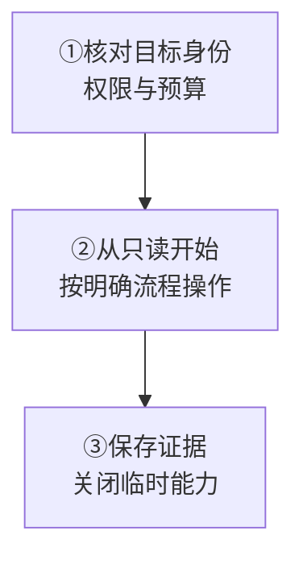

一个 `wkcli`，按目标选择子命令；先做有界只读检查，再进入明确的变更流程。

<Callout type="warn" title="先确认目标边界">
  每个部署都是集群，包括单节点集群；物理哈希槽固定为 256，生成的默认配置使用 12 个逻辑 Slot Raft Group。节点本地快照、数据库文件或 Top 结果不能自动代表整个集群。
</Callout>

## 选择工具

<Cards>
  <Card title="查看在线集群" description="wkcli：Top 与节点证据；节点变更另走受控流程。" href="/zh/server/tools/wkcli" />
  <Card title="检查离线数据" description="wkcli db：单节点查询与传输，import 会写目标。" href="/zh/server/tools/wkdb" />
  <Card title="验证负载" description="wkcli bench：隔离集群中的真实流量。" href="/zh/server/tools/wkbench" />
  <Card title="迁移原版 v2" description="wkcli migrate：冷备迁入全新离线 v3 目录。" href="/zh/server/operations/v2-to-v3-migration" />
  <Card title="有界诊断" description="关联日志、指标、Top 与限量 pprof。" href="/zh/server/tools/diagnostics" />
  <Card title="按现象排查" description="从当前症状选择第一项检查。" href="/zh/server/operations/troubleshooting" />
</Cards>

工具结果是证据；Manager 审批、权限和集群安全门槛仍然生效。

<details>
  <summary>完整工具对照与作用边界</summary>

WuKongIM 使用统一运维工具 `wkcli`，通过子命令区分操作目标：`wkcli` 面向在线集群 API，`wkcli db` 面向单节点离线数据，`wkcli bench` 面向隔离的真实流量测试，诊断能力用于回答一个有界问题。工具输出是证据，不是绕过 Manager 审批或集群安全门槛的权限。

| 目标 | 使用 | 读取或写入 | 不适合 |
| --- | --- | --- | --- |
| 查看在线节点、Top、动态节点状态 | [wkcli](/zh/server/tools/wkcli) | 多数检查只读；节点生命周期子命令会调用受控 Manager 写 API | 直接编辑 Controller/Slot 状态或管理进程 |
| 查询、导出或比较节点本地存储 | [wkcli db](/zh/server/tools/wkdb) | 离线只读为主；只有 `import` 写目标存储 | 在线集群查询、全局快照或自动迁移 |
| 验证协议流量、容量假设和回归门槛 | [wkcli bench](/zh/server/tools/wkbench) | 产生真实连接、频道、用户和消息 | 无界生产压测或通用容量数字 |
| 将原版 v2 停机备份迁入全新 v3 集群 | [wkcli migrate](/zh/server/operations/v2-to-v3-migration) | 读取冷备并写入全新离线目标目录 | 原地升级或在线增量同步 |
| 关联日志、指标、Top、诊断事件与 pprof | [诊断能力](/zh/server/tools/diagnostics) | 默认只读；pprof 是有界的主动观察 | 自动修复、任意命令或任意查询 |

</details>

## 通用工作流

<div className="tutorial-diagram">



</div>

限制目标、并发、时长、行数和制品目录，先写停止条件。保留命令、时间、退出码与脱敏输出；Manager、Benchmark、Debug 和 Operations MCP 分别授权。

<details>
  <summary>完整六步工作流</summary>

1. **确认身份**：记录仓库版本、二进制摘要、集群 ID、节点 ID 和目标地址。
2. **选择最小能力**：从只读、低成本、短时间的命令开始；不要一开始就抓 profile 或产生负载。
3. **隔离权限**：使用最小权限凭据和受控网络；Manager、Benchmark、Debug 与 Operations MCP 使用各自的信任边界。
4. **设置预算**：限制目标、并发、持续时间、返回行数和制品目录，并写明停止条件。
5. **保存上下文**：保留命令、时间范围、退出码和脱敏输出；不要只复制最终摘要。
6. **清理临时能力**：关闭 Debug、Benchmark、临时凭据、模拟器和额外采样，确认资源回到基线。

</details>

## 获取 wkcli

从 `v3.0.0-beta.12` 起，官方归档与 Linux 原生包包含配套 `wkcli`。先[安装并核对版本](/zh/server/tools/wkcli)，再选子命令。

<details>
  <summary>完整获取方式与版本起点</summary>

从 v3.0.0-beta.12 起，官方归档和 Linux 原生安装包随服务端提供 `wkcli`。先完成[安装与版本核对](/zh/server/tools/wkcli)，随后使用各子命令，无需分别安装压测、数据库和迁移工具。

</details>

## 从源码构建

仅从已审核版本构建。记录工具和目标服务端版本；开发分支工具不直接用于生产，未知版本兼容性不能假定。构建命令按需展开。

<details>
  <summary>完整源码构建命令与兼容边界</summary>

在已审核的仓库版本中构建需要的二进制：

```bash
go build -o ./bin/wkcli ./cmd/wkcli
./bin/wkcli --help
```

源码开发时，可将示例中的 `wkcli` 替换为 `./bin/wkcli`，或在仓库根目录使用 `go run ./cmd/wkcli`；后者需要符合 `go.mod` 要求的 Go。

工具与目标服务端应来自已记录、可追溯的版本。不要把开发分支工具直接用于生产，也不要假设未知版本之间的离线格式、Manager API 或 Benchmark 协议兼容。

</details>

## 失败处理

身份、认证、连接或状态新鲜度不明时停止，不提升权限继续尝试。写请求失败后先查权威任务状态；证据冲突保留双方，负载、profile 或扫描到预算即停。

<details>
  <summary>完整失败处理与排查路径</summary>

- 认证、连接、状态新鲜度或目标身份无法确认时停止，不要更换到更高权限凭据继续尝试。
- 只读输出冲突时保存双方证据，再检查时间、节点、版本和数据来源。
- 写命令失败后先读取权威任务状态；不要在不知道前一次是否生效时重复提交。
- 负载、profile 或扫描达到预算时立即停止，即使尚未得到预期结论。

按现象选择第一项检查，见[故障排查](/zh/server/operations/troubleshooting)。

</details>
