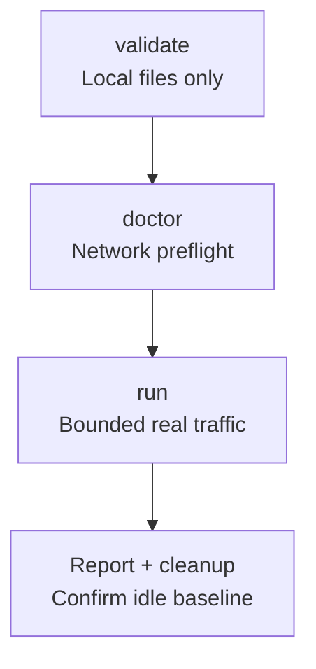
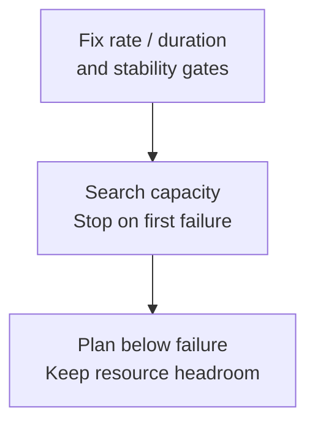

Start with the smoke workload, then search capacity against the same controlled cluster. All tests use real endpoints; a one-node target remains a single-node cluster.

<Callout type="error" title="Do not use production as a load target">
  `wkcli bench` creates real users, Channels, connections, and messages and may drive a target into backpressure or unavailability. Use only an isolated, rebuildable, authorized benchmark cluster, with hard limits for rate, concurrency, duration, disk, and stopping.
</Callout>

## Command scope

<Cards>
<Card title="Smoke workflow" href="/en/server/tools/wkbench#minimum-validation-flow">Prepare → validate → preflight → run.</Card>
<Card title="Capacity search" href="/en/server/tools/wkbench#capacity-search">Use fixed ceilings and stop gates.</Card>
<Card title="Read the report" href="/en/server/tools/wkbench#read-the-report">Check delivery and recovery too.</Card>
</Cards>

<details>
  <summary>Complete command scope</summary>

`wkcli bench` is WuKongIM's black-box benchmark driver. It talks to a running cluster through public HTTP, Benchmark HTTP, and WKProto gateway endpoints without importing server internals or bypassing cluster semantics. A one-node target is still a single-node cluster.

| Command | Purpose |
| --- | --- |
| `validate` | Statically validate target, workers, and scenario YAML plus deterministic planning, without network checks |
| `doctor` | Check target health, Benchmark API, worker control APIs, and gateway reachability |
| `worker` | Start a worker control process that holds WKProto clients and executes workload shards |
| `run` | Execute validate, preflight, assign, prepare, connect, warmup, run, cooldown, and report |
| `dev-sim` | Keep users online and sustain low-rate person/group traffic for development |
| `capacity send` | Search maximum stable ingress send QPS against an existing cluster |
| `capacity hot-channel` | Search hot-write capacity for one fixed group Channel |
| `capacity activate-channels` | Activate and hold a fixed number of real Channel runtimes |
| `capacity message-event` | Apply fixed-shape `/message/event` pressure and write a report |
| `metrics classify` | Compare before/after Prometheus snapshots and emit low-cardinality attribution hints |
| `report` | Render benchmark evidence and diagnostic reports |

</details>

## Target prerequisites

Use an isolated, authorized target with reachable health/readiness, Benchmark, gateway and metrics endpoints. Enable `bench.api_enable` and `observability.metrics_enable`; never expose `/bench/v1/*` publicly. `capacity message-event` uses Product HTTP without Benchmark API, but still writes generated data.

<details>
  <summary>Full endpoint and configuration prerequisites</summary>

A complete workflow usually requires:

- `/healthz` and `/readyz`;
- `/bench/v1/capabilities`, `/bench/v1/capacity-target`, and `/bench/v1/snapshot`;
- Benchmark user, Channel, and subscriber preparation endpoints;
- a WKProto gateway advertised at an address reachable from the runner.

Explicitly enable the Benchmark API in a controlled environment:

```toml
[bench]
api_enable = true
```

`/bench/v1/*` is not a public product API and must not be exposed to a public network. `capacity message-event` is the exception: it uses product `/channel`, `/message/send`, `/message/event`, and `/metrics` endpoints and does not need the Benchmark API. It still writes generated Channels and messages, so it also requires a controlled target.

</details>

## Minimum validation flow

Download [target.yaml](/examples/wkbench/target.yaml), [workers.yaml](/examples/wkbench/workers.yaml), and [scenario.yaml](/examples/wkbench/scenario.yaml). This smoke workload has 20 online users and two 10-member groups sending 5 messages/second each. It measures 60 seconds, plus 10 seconds each for warmup and cooldown; it is not a production capacity claim.

<div className="tutorial-diagram">



</div>

**1. Prepare.** [Install wkcli](/en/server/tools/wkcli), edit the three YAML files and use reachable test endpoints. Terminal A runs the worker; Terminal B runs the coordinator. Both use the same worker token; the API token must match `bench.api_token`. Use a fresh `WK_BENCH_RUN_ID` and test-only credentials.

<details>
  <summary>Download files and start Terminal A</summary>

First [install wkcli](/en/server/tools/wkcli). The following commands use the installed binary and do not require a source checkout or Go. Download the configurations into a working directory:

```bash
mkdir -p ./tmp/docs-wkbench
for file in target workers scenario; do
  curl --fail --location "https://docs.githubim.com/examples/wkbench/${file}.yaml" \
    --output "./tmp/docs-wkbench/${file}.yaml"
done
```

Edit `target.yaml` with the isolated test cluster's API, Gateway, and metrics endpoints. Defaults assume the test node, worker, and coordinator share a host; for separate hosts, make every endpoint reachable from the process that uses it.

Use the same worker control token in both terminals. The coordinator's API token must match `bench.api_token` on the test node, which also needs `bench.api_enable` and `observability.metrics_enable`. Do not use production credentials here.

Terminal A, start the worker:

```bash
export WK_BENCH_WORKER_TOKEN='replace-with-test-worker-secret'
wkcli bench worker \
  --listen 127.0.0.1:19090 \
  --work-dir ./tmp/docs-wkbench/worker
```

</details>

**2. Validate and preflight.** Terminal B runs `validate`, which never contacts the network, then `doctor`. On failure, fix configuration, tokens or endpoints before proceeding.

<details>
  <summary>Terminal B: identity, validate and doctor</summary>

Terminal B, configure this run. Change `WK_BENCH_RUN_ID` for every run; do not reuse an existing identity:

```bash
export WK_BENCH_WORKER_TOKEN='replace-with-test-worker-secret'
export WK_BENCH_API_TOKEN='replace-with-test-api-secret'
export WK_BENCH_RUN_ID="docs-smoke-$(date -u +%Y%m%dT%H%M%SZ)"
wkcli bench validate \
  --target ./tmp/docs-wkbench/target.yaml \
  --workers ./tmp/docs-wkbench/workers.yaml \
  --scenario ./tmp/docs-wkbench/scenario.yaml
```

`validate` does not access the network. After it passes, run preflight. If preflight fails, fix the target, tokens, or endpoints before running traffic:

```bash
wkcli bench doctor \
  --target ./tmp/docs-wkbench/target.yaml \
  --workers ./tmp/docs-wkbench/workers.yaml \
  --scenario ./tmp/docs-wkbench/scenario.yaml
```

</details>

**3. Run and check.** Run only after preflight passes. Any connection, send-ack, receive-verification, worker error or P99 gate failure fails this example. Check exit code and report, then stop Terminal A with Ctrl+C. `keep_data` retains generated data; never delete a cluster data directory to clean up one run.

<details>
  <summary>Full bounded run and result checks</summary>

Once preflight passes, execute the bounded workload:

```bash
wkcli bench run \
  --target ./tmp/docs-wkbench/target.yaml \
  --workers ./tmp/docs-wkbench/workers.yaml \
  --scenario ./tmp/docs-wkbench/scenario.yaml
```

The example fails on any connection, send-acknowledgement, receive-verification, or worker error, and also fails when P99 exceeds the configured limits. Check the exit code and report, then stop Terminal A's worker with Ctrl+C. `cleanup.strategy=keep_data` retains generated users, groups, and messages. Handle them through your isolated test environment's retention plan; do not delete cluster data directories to clean up one run.

</details>

## Design a representative workload

Match user count, Channel count/types, members, payloads and reconnects to actual use. Keep warmup outside measurement; test hot Channels, high cardinality, events and connections separately. For 100,000-member groups, include fanout, bounded queues and resource budgets.

<details>
  <summary>Full workload design checklist</summary>

- Model realistic online-user count, Channel cardinality and types, group size, payload size, acknowledgements, and reconnect behavior.
- Separate connection ramp, warmup, measurement, and cooldown; warmup counters must not enter the measured window.
- Test high Channel cardinality, one hot Channel, message events, and connection pressure separately rather than reducing every bottleneck to one QPS number.
- For 100,000-member groups, high message rates, many Channels, and many online users, account explicitly for CPU, memory, allocations, contention, bounded queues, backpressure, and fanout.
- Fix the random seed or generation rule and retain scenario YAML, tool/server revisions, hardware, topology, and configuration.

</details>

## Capacity search

<div className="tutorial-diagram">



</div>

`capacity send` starts a temporary local worker against an existing cluster; it does not manage cluster lifecycle or delete data. Use separate subcommands for hot Channels, runtime count and events. Results apply only to this version, hardware, topology, scenario and gates.

<details>
  <summary>Complete capacity command and planning rules</summary>

```bash
wkcli bench capacity send \
  --api http://127.0.0.1:5001 \
  --profile mixed \
  --start-qps 100 \
  --max-qps 5000 \
  --stable-p99 200ms \
  --duration 30s \
  --group-members 10
```

`capacity send` discovers gateways, starts a temporary local worker, and searches for a stable ingress rate under the supplied gates. It does not start or stop the cluster, build images, or remove data. Use separate `capacity` subcommands for a hot Channel, Channel-runtime cardinality, and message events.

“Maximum stable” applies only to this revision, hardware, topology, scenario, and gate. Plan below the first failure point with headroom. Actual QPS below offered QPS, tail latency, error rate, queues, disk, and recovery time are all results; never retain only the highest number.

</details>

## Results and stop conditions

Stop on any hard gate, readiness, disk-headroom, error-rate, tail-latency or worker failure; do not raise limits to obtain a larger number. Retain versions/configs, full commands, stage times, offered/actual QPS, node resources, queue recovery and cleanup evidence. See [Diagnostics](/en/server/tools/diagnostics).

<details>
  <summary>Full evidence and stop checklist</summary>

A report should retain at least:

- Git revision, binary digests, configuration, and cluster topology.
- Target/worker/scenario files and the complete command.
- Timing and status for prepare, connect, warmup, run, and cooldown.
- Offered/actual QPS, throughput, p50/p95/p99, typed operation errors, and timeouts.
- Per-node CPU, memory, goroutines, FDs, network, disk IO, queues, and replica/leader skew.
- Before/after `/readyz`, backlog recovery time, generated-data location, and cleanup result.

Stop on any hard gate, readiness, disk-headroom, error-rate, tail-latency, or worker-state failure. Do not raise limits merely to obtain a larger number. See [Diagnostics](/en/server/tools/diagnostics) for evidence selection.

</details>

## Cleanup

Stop workers and simulators, revoke temporary credentials, disable the Benchmark API, archive reports, remove generated data, and verify the cluster returns to its idle baseline. If worker stop or target recovery cannot be confirmed, treat the run as an unfinished incident, not a successful benchmark.

## Read the report

Read `summary.md` and `report.json` under `run.report_dir`, then use `plan.json` and `metrics/` to explain the result. Record hardware separately before comparison. **Values below are illustrative, not measured.** Worker-local maximum P99 is not a merged percentile; sampling two recipients cannot prove full delivery. Passing send metrics with unrecovered queues is insufficient. JSON durations are nanoseconds; prefer formatted Markdown values.

<details>
  <summary>Illustrative report and complete interpretation</summary>

In the report directory selected by `run.report_dir`, read `summary.md` and `report.json` first, then use the saved configurations, `plan.json`, and `metrics/` to explain the result. Before comparing runs, separately record server version or digest, SDK/tool version, CPU/memory/disk type per node, node count, replicas, and network conditions. Tool output does not replace a complete hardware inventory.

The following uses **illustrative values, not measured benchmark results**: the same server and tool versions, one 4-vCPU / 8-GiB / SSD single-node cluster with the default 256 hash slots, and the smoke scenario above.

| Report item | Illustrative observation | Interpretation |
| --- | --- | --- |
| Planned rate | 2 groups × 5 messages/second = 10/second | Target send rate, not achieved successful throughput |
| `summary.ingress_qps` | 9.8 | Below the target; inspect latency, errors, and scheduling |
| `summary.sendack_max_worker_p99` | 180 ms | Below the example 200-ms limit; the maximum worker-local P99, not a merged percentile across all messages |
| `summary.recv_verify_error_rate` | 0 | This example samples 2 recipients per message, so it does not prove delivery to every member |
| Delivery queue | Grows during measurement and remains after cooldown | Passing send metrics alone does not prove sustainable capacity |

Go `time.Duration` fields in JSON use nanoseconds; 180 ms is `180000000`. Prefer formatted latency values in `summary.md`. Increase load only after the measurement window, achieved throughput, errors, tail latency, recipient coverage, queue recovery, and resource headroom all satisfy your targets.

</details>
