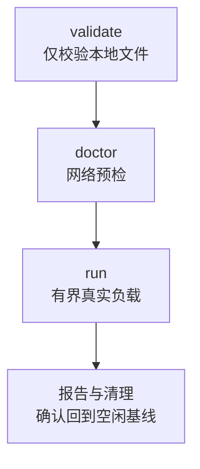
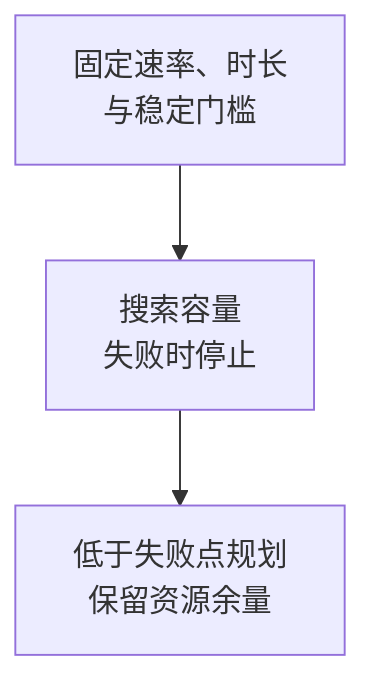

先跑通冒烟验证，再对受控集群搜索容量。工具通过真实接口工作；单节点目标仍是单节点集群。

<Callout type="error" title="不要把生产集群当作压测目标">
  `wkcli bench` 会创建真实用户、频道、连接和消息，并可能把目标推入背压或不可用状态。只能使用隔离、可重建、已授权的压测集群，并为速率、并发、持续时间、磁盘和停止条件设置硬上限。
</Callout>

## 命令范围

<Cards>
<Card title="跑通冒烟流程" href="/zh/server/tools/wkbench#最小验证流程">准备 → 校验 → 预检 → 运行。</Card>
<Card title="寻找容量边界" href="/zh/server/tools/wkbench#容量搜索">固定上限，遇到门槛立即停止。</Card>
<Card title="读懂报告" href="/zh/server/tools/wkbench#如何解读报告">同时检查接收范围与恢复。</Card>
</Cards>

<details>
  <summary>完整命令范围</summary>

`wkcli bench` 是 WuKongIM 的黑盒基准驱动器。它通过公开 HTTP、Benchmark HTTP 和 WKProto 网关与运行中的集群交互，不导入服务端内部包，也不绕过集群语义。单节点目标仍然是单节点集群。

| 命令 | 用途 |
| --- | --- |
| `validate` | 静态验证 target、workers、scenario YAML 和确定性计划，不做网络检查 |
| `doctor` | 检查目标健康、Benchmark API、worker 控制 API 和网关可达性 |
| `worker` | 启动持有 WKProto 客户端并执行分片负载的 worker 控制进程 |
| `run` | 执行 validate、preflight、分配、prepare、connect、warmup、run、cooldown 和 report |
| `dev-sim` | 维持用户在线并持续产生低速个人/群消息的开发模拟器 |
| `capacity send` | 搜索已有集群的最大稳定接入发送 QPS |
| `capacity hot-channel` | 对一个固定群频道搜索热点写入容量 |
| `capacity activate-channels` | 激活并保持固定数量的真实 Channel runtime |
| `capacity message-event` | 对 `/message/event` 执行固定形状压力并生成报告 |
| `metrics classify` | 比较前后 Prometheus 快照并给出低基数归因提示 |
| `report` | 处理已有报告与诊断证据；支持 `redact-config` 等子命令 |

</details>

## 目标前提

只用已授权的隔离目标，核对健康、就绪、Benchmark、网关与指标地址。启用 `bench.api_enable` 和 `observability.metrics_enable`；`/bench/v1/*` 不得公开。`capacity message-event` 不需 Benchmark API，但仍写入生成数据。

<details>
  <summary>完整端点与配置前提</summary>

完整工作流通常需要目标开放：

- `/healthz` 与 `/readyz`；
- `/bench/v1/capabilities`、`/bench/v1/capacity-target` 和 `/bench/v1/snapshot`；
- Benchmark 用户、频道和订阅者准备接口；
- 从运行机可访问的 WKProto 网关发布地址。

在受控环境显式启用 Benchmark API：

```toml
[bench]
api_enable = true
```

`/bench/v1/*` 不是公开业务集成 API，不得暴露到公共网络。`capacity message-event` 是例外：它使用 WuKongIM 的 `/channel`、`/message/send`、`/message/event` 和 `/metrics`，不需要 Benchmark API，但仍会写入生成的频道和消息，因此也必须使用受控目标。

</details>

## 最小验证流程

配套下载：[target.yaml](/examples/wkbench/target.yaml)、[workers.yaml](/examples/wkbench/workers.yaml)、[scenario.yaml](/examples/wkbench/scenario.yaml)。这是 20 个在线用户、2 个各 10 人的群、每群 5 条/秒的冒烟验证；测量 60 秒，另有 10 秒预热和 10 秒冷却，不代表生产容量。

<div className="tutorial-diagram">



</div>

**1. 准备。** [安装 wkcli](/zh/server/tools/wkcli)，修改三个 YAML 的测试地址。终端 A 启动 Worker，终端 B 协调运行；两边 Worker Token 相同，API Token 匹配 `bench.api_token`。每次使用新的 `WK_BENCH_RUN_ID` 和测试凭据。

<details>
  <summary>下载配置并启动终端 A</summary>

先[安装 wkcli](/zh/server/tools/wkcli)。以下命令使用已安装的程序，无需源码仓库或 Go。在工作目录下载配置：

```bash
mkdir -p ./tmp/docs-wkbench
for file in target workers scenario; do
  curl --fail --location "https://docs.githubim.com/examples/wkbench/${file}.yaml" \
    --output "./tmp/docs-wkbench/${file}.yaml"
done
```

在 `target.yaml` 中填写隔离测试集群的 API、Gateway 和指标地址。示例默认测试节点、Worker 和协调器都在同一主机；分开部署时，每个地址都必须能从对应进程访问。

在 Worker 和协调器两个终端设置相同的控制 Token；协调器的 API Token 必须与测试节点的 `bench.api_token` 相同。节点还需开启 `bench.api_enable` 和 `observability.metrics_enable`。不要在这些命令中使用生产凭据。

终端 A，启动 Worker：

```bash
export WK_BENCH_WORKER_TOKEN='replace-with-test-worker-secret'
wkcli bench worker \
  --listen 127.0.0.1:19090 \
  --work-dir ./tmp/docs-wkbench/worker
```

</details>

**2. 校验与预检。** 终端 B 先执行不联网的 `validate`，再执行 `doctor`。失败先修正配置、Token 或地址，通过后再运行负载。

<details>
  <summary>终端 B：运行标识、validate 与 doctor</summary>

终端 B，配置本次运行。每次更换 `WK_BENCH_RUN_ID`，不要复用已有运行标识：

```bash
export WK_BENCH_WORKER_TOKEN='replace-with-test-worker-secret'
export WK_BENCH_API_TOKEN='replace-with-test-api-secret'
export WK_BENCH_RUN_ID="docs-smoke-$(date -u +%Y%m%dT%H%M%SZ)"
wkcli bench validate \
  --target ./tmp/docs-wkbench/target.yaml \
  --workers ./tmp/docs-wkbench/workers.yaml \
  --scenario ./tmp/docs-wkbench/scenario.yaml
```

`validate` 不访问网络。成功后执行预检；预检失败就修正目标、Token 或地址，不继续运行负载：

```bash
wkcli bench doctor \
  --target ./tmp/docs-wkbench/target.yaml \
  --workers ./tmp/docs-wkbench/workers.yaml \
  --scenario ./tmp/docs-wkbench/scenario.yaml
```

</details>

**3. 运行与检查。** 预检通过后执行 `run`；连接、发送确认、接收校验、Worker 错误或 P99 超限均失败。核对退出码与报告，再 Ctrl+C 停止终端 A。`keep_data` 保留生成数据，不要删集群数据目录清理单次运行。

<details>
  <summary>完整有界运行与结果检查</summary>

预检通过，再执行有界负载：

```bash
wkcli bench run \
  --target ./tmp/docs-wkbench/target.yaml \
  --workers ./tmp/docs-wkbench/workers.yaml \
  --scenario ./tmp/docs-wkbench/scenario.yaml
```

示例将任意连接、发送确认、接收校验或 Worker 错误视为失败，也会把超过 P99 阈值判为失败。结束后检查命令退出码和报告，再用 Ctrl+C 停止终端 A 的 Worker。`cleanup.strategy=keep_data` 会保留生成的用户、群和消息；只在隔离测试环境中按保留计划处理这些数据，不要删除集群数据目录来清理一次运行。

</details>

## 设计代表性负载

按真实用户、频道数量与类型、成员、消息大小和重连设计场景；预热不计入测量。热点、高频道基数、事件与连接压力分别测试。十万成员群还要核算扇出、有界队列与资源预算。

<details>
  <summary>完整代表性负载清单</summary>

- 使用接近真实的在线用户数、频道基数、频道类型、群成员数、消息大小、收发确认与重连行为；
- 将连接爬升、预热、测量和冷却分开，预热计数不能混入测量窗口；
- 分开测试高频道基数、单热点频道、消息事件和连接压力，不要用一个 QPS 数字概括所有瓶颈；
- 为 100,000 成员群组、高消息率、许多频道和大量在线用户显式评估 CPU、内存、分配、锁竞争、有界队列、背压和扇出；
- 固定随机种子或生成规则，并保留场景 YAML、工具/服务版本、硬件、拓扑和配置。

</details>

## 容量搜索

<div className="tutorial-diagram">



</div>

`capacity send` 对已有集群启动临时本地 Worker，不负责集群启停或清理数据。热点、运行时基数和事件用各自子命令；结果只对本次版本、硬件、拓扑、场景与门槛成立。

<details>
  <summary>完整容量搜索命令与规划规则</summary>

```bash
wkcli bench capacity send \
  --api http://127.0.0.1:5001 \
  --profile mixed \
  --start-qps 100 \
  --max-qps 5000 \
  --stable-p99 200ms \
  --duration 30s \
  --group-members 10
```

`capacity send` 发现网关、启动临时本地 worker，并在给定门槛内搜索稳定接入速率；它不会启动/停止集群、构建镜像或清理数据。热点频道、Channel runtime 基数和消息事件需要各自的 `capacity` 子命令。

“最大稳定”只对本次版本、硬件、拓扑、场景和门槛成立。实际规划必须低于首次失败点并保留资源余量；低于提供 QPS 的实际 QPS、尾延迟、错误率、队列、磁盘和恢复时间都属于结果，不能只保留最高数字。

</details>

## 结果与停止条件

任一硬门槛、就绪、磁盘余量、错误率、尾延迟或 Worker 状态失败就停止，不提高上限追求更大数字。保留版本配置、完整命令、阶段时间、计划/实际 QPS、节点资源、队列恢复和清理证据。异常转到[诊断能力](/zh/server/tools/diagnostics)。

<details>
  <summary>完整结果证据与停止清单</summary>

报告至少应保留：

- Git 修订、二进制摘要、配置与集群拓扑；
- 目标/worker/scenario 文件和完整命令；
- prepare、connect、warmup、run、cooldown 各阶段时间与状态；
- offered/actual QPS、吞吐、p50/p95/p99、操作错误分类与超时；
- 每节点 CPU、内存、Goroutine、FD、网络、磁盘 IO、队列和副本/Leader 偏斜；
- 运行前后 `/readyz`、积压恢复时间、生成数据位置和清理结果。

任一硬门槛、目标就绪、磁盘余量、错误率、尾延迟或 worker 状态失败时停止，不要为了得到更高数字提高上限。诊断过程见[诊断能力](/zh/server/tools/diagnostics)。

</details>

## 结束清理

停止 worker 和模拟器，撤销临时凭据，关闭 Benchmark API，归档报告后清理生成数据，并验证集群回到空闲基线。无法确认 worker 已停止或目标恢复时，把测试视为未完成事件，而不是成功的基准结果。

## 如何解读报告

先读 `run.report_dir` 下的 `summary.md` 和 `report.json`，再看 `plan.json` 与 `metrics/`；比较前另记硬件条件。**下方数值是假设示例，不是实测。** 最大 Worker P99 不是合并分位；抽样两名接收者不证明全员收到，发送通过但队列未恢复也不够。JSON 时长为纳秒，优先读 Markdown 格式化值。

<details>
  <summary>假设报告示例与完整解读</summary>

在 `run.report_dir` 指定的报告目录中，先读 `summary.md` 和 `report.json`，再用保存的配置、`plan.json` 与 `metrics/` 解释结果。比较两个结果前，另行记录服务端版本或摘要、SDK/工具版本、每节点 CPU/内存/磁盘类型、节点数、副本数和网络条件；工具报告不会自动代替完整的硬件清单。

下面是**假设数据的阅读示例，不是实测报告**：背景为相同服务端与工具版本、一个 4 vCPU / 8 GiB / SSD 单节点集群、默认 256 Hash Slots，运行上面的冒烟场景。

| 报告项目 | 假设观察值 | 应如何理解 |
| --- | --- | --- |
| 计划速率 | 2 群 × 5 条/秒 = 10 条/秒 | 表示目标发送速率，不是实际成功吞吐 |
| `summary.ingress_qps` | 9.8 | 低于计划速率，需要结合耗时、错误和调度情况解释 |
| `summary.sendack_max_worker_p99` | 180 ms | 低于示例 200 ms 门槛；这是最大 Worker P99，不是全体消息合并后的 P99 |
| `summary.recv_verify_error_rate` | 0 | 本例每消息抽样 2 个接收者，不证明所有成员均已收到 |
| 投递队列 | 测量期持续增长，冷却后未消退 | 即使发送指标通过，也不能据此认定可以长期承载该负载 |

JSON 中 Go `time.Duration` 字段以纳秒表示；例如 180 ms 为 `180000000`。阅读延迟时优先使用 `summary.md` 的格式化值。只有足量测量窗口、期望吞吐、错误与尾延迟、接收范围、队列恢复和资源余量共同满足目标，才进入更高一级负载验证。

</details>
