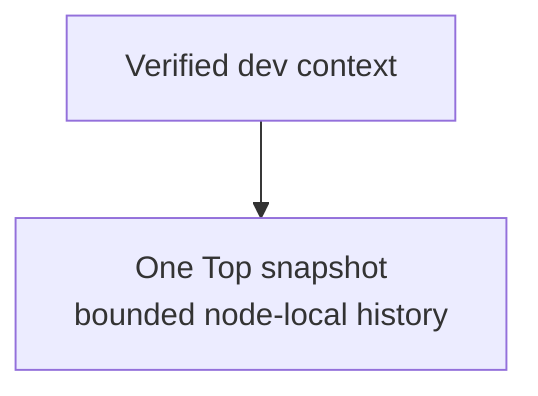
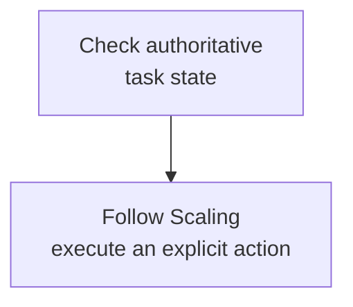

Install matching binaries, configure target addresses, then retain evidence with one Top snapshot and read-only node commands.

## Install and verify

On Linux amd64, use APT / DNF via [Linux deployment](/en/server/deployment/linux). Linux arm64 and macOS use the matching release archive with checksum verification. Paired `wkcli` and `wukongim` must match `version`, `commit`, and `build_source`. Version checks need no running server.

<details>
  <summary>Complete installation, verification, and version commands</summary>

`wkcli` is WuKongIM's unified operator CLI. Online operations use HTTP and WKProto entry points; `db` and `migrate` operate on offline data. Since **v3.0.0-beta.12**, official Linux/macOS archives and Linux native packages include both `wkcli` and `wukongim` from the same release.

On Linux amd64, follow [Linux deployment](/en/server/deployment/linux) to install the `wukongim` package through APT or DNF; it also installs `wkcli`. For Linux arm64 or macOS, download the matching OS and architecture archive from [GitHub Releases](https://github.com/WuKongIM/WuKongIM/releases), verify it against the release checksum file, and extract both binaries. The current documentation release is `WK_CURRENT_RELEASE_TAG`. Add the extracted directory to `PATH`, or use `./wkcli` and `./wukongim` there.

```bash
wukongim version --output json
wkcli version --output json
wkcli bench --help
wkcli db --help
wkcli migrate --help
```

For the paired release binaries, `version`, `commit`, and `build_source` must match. These commands need no running server and do not start a benchmark or migration. The examples below assume `wkcli` is on `PATH`; see [Tools](/en/server/tools) for source builds.

</details>

## Command boundaries

- **Online read-only:** `top`, `node ls`, and `node diagnose`; `context` saves only local target addresses.
- **Controlled writes:** node lifecycles retain Manager permissions, audit, and safety gates; they neither edit Controller / Slot directly nor manage server processes.
- **Other tasks:** `bench` / `sim` generate real traffic, `db import` writes offline storage, and `migrate` creates new offline data.

Old standalone entrypoints are removed. Use `wkcli bench`, `wkcli db`, and `wkcli migrate`; database global flags precede the operation.

<details>
  <summary>Complete commands, risks, and old entrypoint mapping</summary>

| Command | Purpose | Risk class |
| --- | --- | --- |
| `bench` | [Distributed workloads, workers, capacity and reports](/en/server/tools/wkbench) | Generates real traffic |
| `db` | [Offline query, REPL, import, export and diff](/en/server/tools/wkdb) | Import writes the target store |
| `migrate` | [Original v2-to-v3 migration](/en/server/operations/v2-to-v3-migration) | Creates new offline v3 data |
| `context` | Save and select a set of WuKongIM HTTP API addresses | Writes only the local user configuration directory |
| `top` | Read and aggregate `/top/v1/snapshot` from one or more nodes | Online read-only |
| `node ls` / `node diagnose` | Read dynamic-node state and bounded root-cause evidence | Manager read-only |
| `node activate` / `node onboarding` / `node scale-in` | Advance a dynamic-node lifecycle | Controlled Manager writes |
| `bench send` | Run a lightweight SEND/SENDACK check | Generates real connections and messages |
| `sim` | Prepare test metadata and sustain real group-message traffic | Controlled simulation environments only |

`wkcli node` neither starts nor stops server processes and never writes Controller or Slot state directly. Manager permissions, audit, and safety gates still apply.

Replace old invocations `wkbench …`, `wkdb …`, and `wkmigrate …` with `wkcli bench …`, `wkcli db …`, and `wkcli migrate …`. Old executable entrypoints are removed. Command arguments, output formats and family-specific exit codes remain unchanged. Database global flags must precede its verb.

</details>

## Configure named contexts

Configure absolute `http://` / `https://` API addresses. Repeat `--server` or comma-separate addresses. Recheck cluster identity and credential scope after selection; a context name does not grant approval.

<details>
  <summary>Complete context configuration commands</summary>

```bash
wkcli context add dev \
  --server http://127.0.0.1:5001 \
  --server http://127.0.0.1:5002 \
  --description "development cluster" \
  --select

wkcli context ls
wkcli context show
wkcli context current
```

`--server` may be repeated or comma-separated, and every address must be an absolute `http://` or `https://` API URL. A context stores target addresses; selecting a context named production does not grant operational approval. Recheck cluster identity and credential scope before execution.

</details>

## Use Top

<div className="tutorial-diagram">



</div>

After configuring the context, run:

```bash
wkcli top --context dev \
  --once --json
```

**Result:** retain the node snapshots and cross-check `/readyz`, Manager, and Prometheus. Aggregates are not globally consistent snapshots. Top needs no Prometheus and refreshes continuously by default; use `--once` or `--max-refresh` to bound scripts.

<details>
  <summary>Complete Top output and refresh options</summary>

```bash
wkcli top --context dev --once
wkcli top --context dev --once --json
wkcli top --context dev --interval 2s --max-refresh 5
wkcli top --context dev --alerts
```

Top reads bounded node-local history and does not depend on Prometheus. It refreshes until interrupted by default; use `--once` or `--max-refresh` for scripts and incident evidence. Cross-check aggregates with `/readyz`, Manager, and Prometheus.

</details>

## Read dynamic-node evidence

Use `node ls`, `node diagnose`, and `node scale-in status`. Keep health freshness, control revision, `blocked_reasons`, `safe_to_remove`, drain counters, and task / audit / Slot evidence. Missing data stays unknown.

<details>
  <summary>Complete read-only dynamic-node commands</summary>

```bash
wkcli node ls --context dev
wkcli node diagnose 4 --context dev
wkcli node diagnose 4 --context dev --json
wkcli node scale-in status 4 --context dev
```

Retain health freshness, control revision, `blocked_reasons`, `safe_to_remove`, gateway drain counters, and bounded task/audit/Slot evidence. Missing data stays unknown; never infer healthy from an empty value.

</details>

## Node mutations

<div className="tutorial-diagram">



</div>

Run mutations only within [Scaling](/en/server/operations/scaling). Joining does not automatically assign Slot replicas or leaders; Controller voter changes require a separate decision. Removal needs authoritative `safe_to_remove=true`; diagnostic advice cannot replace it.

<details>
  <summary>Complete node mutations and lifecycle gates</summary>

```bash
wkcli node activate 4 --context dev
wkcli node onboarding start 4 --context dev --max-slot-moves 1
wkcli node scale-in start 4 --context dev
wkcli node scale-in drain 4 --context dev --draining=true
wkcli node scale-in remove 4 --context dev
```

Run these only inside the explicit [Scaling](/en/server/operations/scaling) procedure. A dynamically joined node does not automatically receive Slot replicas or leaders, and Controller voter change is a separate explicit decision. Removal must wait for authoritative `safe_to_remove=true`; a CLI diagnostic recommendation does not replace that gate.

</details>

## Lightweight send checks

`bench send` creates real sessions and messages to check WKProto SEND throughput and SENDACK latency. Use dedicated test identities/channels and bound clients, messages, channels, and time. Use `wkcli bench` for full scenarios.

<details>
  <summary>Complete lightweight send example</summary>

```bash
wkcli bench send \
  --gateway 127.0.0.1:5100 \
  --clients 8 \
  --msgs 1000 \
  --channels 10 \
  --channel-prefix check-g \
  --channel-type group \
  --size 128B
```

`bench send` is a quick WKProto SEND-throughput and SENDACK-latency check, not a replacement for a complete `wkcli bench` scenario. It creates real sessions and messages. Bound clients, messages, channels, and runtime, and use dedicated test identities and channels.

</details>

## Long-running simulation

`sim` prepares metadata through Benchmark APIs and sends real `SEND → SENDACK` gateway traffic. Use only isolated development / benchmark clusters with explicitly enabled Benchmark API and a reachable advertised gateway.

`--rate` is per group; total rate grows with group count. Stop at the time limit, disable Benchmark API, and clean generated data according to the plan.

<details>
  <summary>Complete bounded simulation and capacity path</summary>

`sim` prepares group metadata through `/bench/v1/*`, keeps users online through the real WKProto gateway, and sends `SEND -> SENDACK` traffic. The target must explicitly enable the Benchmark API and advertise a reachable gateway.

```bash
wkcli sim \
  --server http://127.0.0.1:5001 \
  --users 100 \
  --groups 50 \
  --group-members 10 \
  --rate 0.25/s \
  --max-runtime 30s
```

`--rate` is per group, so aggregate offered traffic grows with group count. Run only against an isolated development or benchmark cluster, then disable the Benchmark API and remove generated data. Use [wkcli bench](/en/server/tools/wkbench) for full validation, capacity search, and reports.

</details>

## Stop safely

Stop when identity, Manager permission, or authoritative state is unclear. Read task state after write timeouts before retrying. Stop Top and workloads at their budget. Check for simulators, temporary contexts, Benchmark API, and unfinished node tasks afterward.

<details>
  <summary>Complete stopping checklist</summary>

- Do not run node mutations when target identity, Manager permission, or authoritative state is unclear.
- After a write request times out, read task state before retrying.
- Stop Top, send checks, and simulations when their time or traffic budget is reached.
- On exit, confirm there is no simulator, temporary context, exposed Benchmark API, or unfinished node task left behind.

</details>

<Cards>
  <Card title="Offline database" description="Queries, export, and controlled import." href="/en/server/tools/wkdb" />
  <Card title="Full workload validation" description="Use isolated clusters and reviewable reports." href="/en/server/tools/wkbench" />
</Cards>
