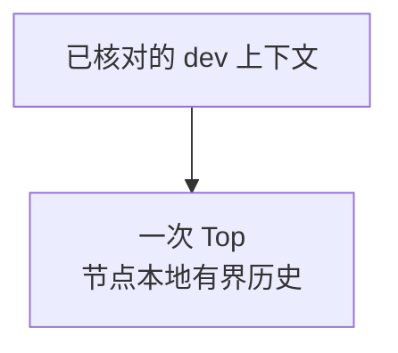
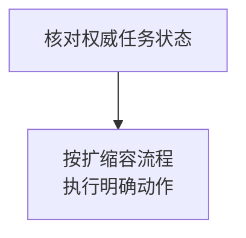

先安装配套版本，配置目标地址，再用一次 Top 和节点只读命令保存证据。

## 安装与版本核对

Linux amd64 按[Linux 部署](/zh/server/deployment/linux)用 APT / DNF 安装；Linux arm64 和 macOS 使用对应发布归档并校验摘要。配套 `wkcli` 与 `wukongim` 的 `version`、`commit`、`build_source` 应一致。核对命令无需启动服务。

<details>
  <summary>完整安装、校验与版本命令</summary>

`wkcli` 是 WuKongIM 的统一运维工具。在线操作通过 HTTP 和 WKProto 入口执行，`db` 和 `migrate` 处理离线数据。从 **v3.0.0-beta.12** 起，官方 Linux/macOS 归档和 Linux 原生安装包均包含同一版本的 `wkcli` 与 `wukongim`。

Linux amd64 按 [Linux 部署](/zh/server/deployment/linux)通过 APT 或 DNF 安装 `wukongim` 软件包，即可同时获得 `wkcli`。Linux arm64 或 macOS 从 [GitHub Releases](https://github.com/WuKongIM/WuKongIM/releases)下载对应系统与架构的归档，按发布的校验文件核对摘要，再解压两个程序。当前文档版本为 `WK_CURRENT_RELEASE_TAG`。将解压目录加入 `PATH`，或在该目录使用 `./wkcli` 和 `./wukongim`。

```bash
wukongim version --output json
wkcli version --output json
wkcli bench --help
wkcli db --help
wkcli migrate --help
```

配套发布的两个程序应返回相同的 `version`、`commit` 和 `build_source`。以上命令无需启动服务，也不会执行压测或迁移。下文默认 `wkcli` 已在 `PATH` 中；源码构建方式见[工具总览](/zh/server/tools)。

</details>

## 命令边界

- **在线只读：** `top`、`node ls`、`node diagnose`；`context` 只保存本机目标地址。
- **受控写入：** 节点生命周期走 Manager 权限、审计与安全门槛，不直接修改 Controller / Slot，也不管理服务进程。
- **其他任务：** `bench` / `sim` 产生真实流量，`db import` 写离线存储，`migrate` 创建全新离线数据。

旧独立入口已移除，改用 `wkcli bench`、`wkcli db`、`wkcli migrate`；数据库全局参数放在操作前。

<details>
  <summary>完整命令、风险与旧入口映射</summary>

| 命令 | 作用 | 风险类别 |
| --- | --- | --- |
| `bench` | [分布式负载、worker、容量测试与报告](/zh/server/tools/wkbench) | 产生真实流量 |
| `db` | [离线查询、REPL、导入、导出与比较](/zh/server/tools/wkdb) | import 写入目标存储 |
| `migrate` | [原版 v2 到 v3 迁移](/zh/server/operations/v2-to-v3-migration) | 创建全新离线 v3 数据 |
| `context` | 保存和选择一组 WuKongIM HTTP API 地址 | 只写本机用户配置目录 |
| `top` | 读取并聚合一个或多个节点的 `/top/v1/snapshot` | 在线只读 |
| `node ls` / `node diagnose` | 读取动态节点与有界根因证据 | Manager 只读 |
| `node activate` / `node onboarding` / `node scale-in` | 推进动态节点生命周期 | Manager 受控写入 |
| `bench send` | 进行轻量 SEND/SENDACK 检查 | 产生真实连接与消息 |
| `sim` | 准备测试元数据并持续产生真实群消息流量 | 受控模拟环境专用 |

`wkcli node` 不启动或停止服务进程，也不直接写 Controller 或 Slot 状态。Manager 的权限、审计和安全门槛仍然生效。

旧调用 `wkbench …`、`wkdb …`、`wkmigrate …` 分别改为 `wkcli bench …`、`wkcli db …`、`wkcli migrate …`。旧独立入口已移除；各命令的参数、输出格式和退出码约定保持不变。数据库全局参数仍须放在具体操作之前。

</details>

## 配置命名上下文

配置绝对 `http://` / `https://` API 地址；`--server` 可重复或逗号分隔。选择上下文后，仍要核对集群身份和凭据范围；上下文名称不授予操作审批。

<details>
  <summary>完整 context 配置命令</summary>

```bash
wkcli context add dev \
  --server http://127.0.0.1:5001 \
  --server http://127.0.0.1:5002 \
  --description "development cluster" \
  --select

wkcli context ls
wkcli context show
wkcli context current
```

`--server` 可以重复或使用逗号分隔，地址必须是绝对 `http://` 或 `https://` API URL。上下文保存的是目标地址，不会把“选择了 production”变成操作审批；执行前仍要核对集群身份和凭据范围。

</details>

## 使用 Top

<div className="tutorial-diagram">



</div>

完成上下文配置后运行：

```bash
wkcli top --context dev \
  --once --json
```

**结果：** 保存各节点快照，结合 `/readyz`、Manager 和 Prometheus 交叉验证；聚合不代表全局一致快照。Top 不依赖 Prometheus，默认持续刷新；脚本用 `--once` 或 `--max-refresh` 限制时间。

<details>
  <summary>完整 Top 输出与刷新选项</summary>

```bash
wkcli top --context dev --once
wkcli top --context dev --once --json
wkcli top --context dev --interval 2s --max-refresh 5
wkcli top --context dev --alerts
```

Top 读取节点本地有界历史，不依赖 Prometheus。默认持续刷新，脚本和事件证据应使用 `--once` 或 `--max-refresh` 限定时间。聚合结果仍应与 `/readyz`、Manager 和 Prometheus 交叉验证。

</details>

## 读取动态节点证据

用 `node ls`、`node diagnose` 和 `node scale-in status` 查看节点证据。保留健康新鲜度、控制修订、`blocked_reasons`、`safe_to_remove`、排空计数和任务 / 审计 / Slot 信息；缺失保持未知。

<details>
  <summary>完整动态节点只读命令</summary>

```bash
wkcli node ls --context dev
wkcli node diagnose 4 --context dev
wkcli node diagnose 4 --context dev --json
wkcli node scale-in status 4 --context dev
```

保留输出中的健康新鲜度、控制修订、`blocked_reasons`、`safe_to_remove`、网关排空计数以及有界任务、审计和 Slot 证据。缺失信息保持未知，不要用空值推断健康。

</details>

## 节点写操作

<div className="tutorial-diagram">



</div>

只在[扩缩容流程](/zh/server/operations/scaling)中执行。加入不自动分配 Slot 副本或 Leader，Controller voter 变化需单独决策。删除必须等权威状态 `safe_to_remove=true`；诊断建议不能替代。

<details>
  <summary>完整节点写命令与生命周期门槛</summary>

```bash
wkcli node activate 4 --context dev
wkcli node onboarding start 4 --context dev --max-slot-moves 1
wkcli node scale-in start 4 --context dev
wkcli node scale-in drain 4 --context dev --draining=true
wkcli node scale-in remove 4 --context dev
```

这些命令必须放在明确的[扩容与缩容](/zh/server/operations/scaling)流程中。动态节点加入后不会自动获得 Slot 副本或 Leader；Controller voter 变化也是单独的显式决策。缩容删除必须等待权威状态给出 `safe_to_remove=true`，命令行诊断建议不能替代这个门槛。

</details>

## 轻量发送检查

`bench send` 创建真实会话与消息，只检查 WKProto SEND 吞吐与 SENDACK 延迟。使用专用测试身份和频道，限制客户端、消息、频道和时间；完整场景另用 `wkcli bench`。

<details>
  <summary>完整轻量发送示例</summary>

```bash
wkcli bench send \
  --gateway 127.0.0.1:5100 \
  --clients 8 \
  --msgs 1000 \
  --channels 10 \
  --channel-prefix check-g \
  --channel-type group \
  --size 128B
```

`bench send` 用于快速检查 WKProto SEND 吞吐与 SENDACK 延迟，不替代完整 `wkcli bench` 场景。它会创建真实会话和消息；先限制客户端、消息、频道和运行时间，并使用专用测试身份与频道。

</details>

## 长期模拟

`sim` 通过 Benchmark API 准备元数据，通过真实网关发送 `SEND → SENDACK`。只用隔离的开发 / 压测集群，显式开启 Benchmark API 并发布可达网关。

`--rate` 是每群速率，总速率随群数增长。到时停止，关闭 Benchmark API 并按计划清理生成数据。

<details>
  <summary>完整有界模拟示例与容量入口</summary>

`sim` 通过 `/bench/v1/*` 准备群元数据，通过真实 WKProto 网关维持用户在线并发送 `SEND -> SENDACK` 流量。目标必须显式启用 Benchmark API，并发布可访问的网关地址。

```bash
wkcli sim \
  --server http://127.0.0.1:5001 \
  --users 100 \
  --groups 50 \
  --group-members 10 \
  --rate 0.25/s \
  --max-runtime 30s
```

`--rate` 是每个群的发送率，总提供速率随群数增加。仅在隔离的开发或压测集群运行，结束后关闭 Benchmark API 并清理生成数据。需要完整验证、容量搜索和报告时使用 [wkcli bench](/zh/server/tools/wkbench)。

</details>

## 安全停止

身份、Manager 权限或权威状态不清楚时停止。写请求超时先查任务状态，避免重复提交；Top 与负载到预算即停。结束后检查模拟器、临时上下文、Benchmark API 和未完成节点任务。

<details>
  <summary>完整停止检查清单</summary>

- 目标身份、Manager 权限或权威状态不清楚时不要执行节点写命令。
- 写请求超时后先读取任务状态，不要盲目重复。
- Top、发送检查和模拟达到时间/流量预算时立即停止。
- 退出后确认没有遗留模拟器、临时上下文、开放的 Benchmark API 或未完成节点任务。

</details>

<Cards>
  <Card title="离线数据库" description="查询、导出与受控导入。" href="/zh/server/tools/wkdb" />
  <Card title="完整负载验证" description="使用隔离集群与可复查报告。" href="/zh/server/tools/wkbench" />
</Cards>
