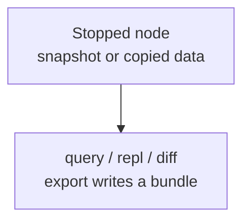
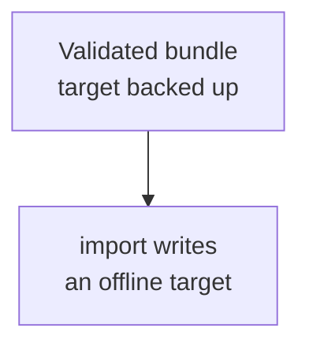
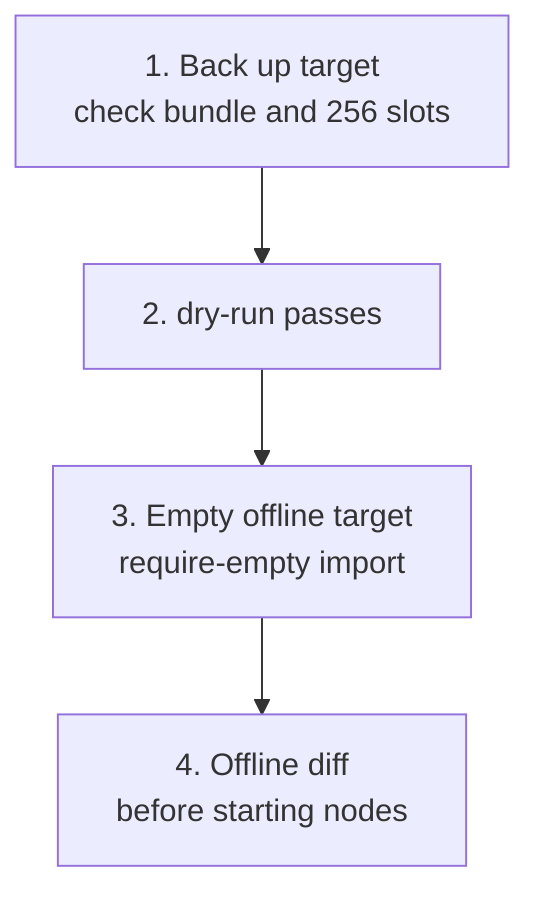

Verify one node’s data identity first. Keep read-only inspection and controlled import separate. The tool works on node files; it neither connects to the cluster nor reads global Controller / Raft / runtime state.

<Callout type="error" title="Do not operate on a live data directory">
  `info` only reads immutable identity and can run while the node is online. Other exact inspection should use a stopped node, filesystem snapshot, or copied data directory. Live files continue changing and cannot provide consistent evidence. `import` needs an explicitly offline target, a dry run, and a backup before writing.
</Callout>

## Operation classes

<div className="grid gap-4 sm:grid-cols-2">

<div>

### Read the source

<div className="tutorial-diagram">



</div>

Queries only return results; diff compares two offline directories. Export reads the source and writes a separate output directory.

</div>

<div>

### Write offline targets

<div className="tutorial-diagram">



</div>

Only import writes WKDB. It neither joins a cluster nor migrates Controller / Raft state.

</div>

</div>

[Install wkcli](/en/server/tools/wkcli) first. Global flags follow `wkcli db` and precede the operation; operation-specific flags follow it.

<details>
  <summary>Complete operations and read/write scope</summary>

`wkcli db` is a local offline tool for one WuKongIM node data directory. It never connects to cluster nodes and does not read global Controller, Raft, or runtime state. Begin with read-only inspection; only `import` writes WKDB storage.


Install [wkcli](/en/server/tools/wkcli) before using these examples. Database flags belong after `wkcli db` and before the operation.

| Command | Source access | Additional writes | View scope |
| --- | --- | --- | --- |
| `info` | Reads identity without opening databases | Standard output only | Node format and creator identity |
| `query` / `repl` | Read-only | Standard output only | One node's metadata and message stores |
| `export` | Read-only | Writes the `--output` bundle directory | Exportable bundle-v1 data from one node |
| `diff` | Both sides read-only | Standard output only | Bundle-v1 data differences between two offline node directories |
| `import` | Reads a bundle | Writes offline target WKDB | Data kinds supported by the bundle |

Global flags must precede the command; command-specific flags follow it.

</details>

## Inspect the data version

Use matching versions (`info` starts in `v3.0.0-beta.13`); replace the path with the actual node root:

```bash
wkcli db --data-dir ./node-1 \
  info
```

**Result:** `registered` means valid identity and supported format; `unregistered` infers neither v2 nor v3; `unsupported` means the server rejects the format. Success verifies identity reading, not business data.

`info` opens no database or database lock, creates or writes no directory, and can run online. Missing paths or corrupt markers fail. Supply a node root or config without `--meta-path`, `--message-path`, or `--hash-slot-count`.

Current format is `wukongim-v3` / `2`. Format 1 and nonempty unregistered directories are rejected, without automatic migration. Never edit `DATA-FORMAT.json` to bypass checks; preserve it in full backups. Archive restore retains target creation identity; older binaries do not guarantee safe rollback.

<details>
  <summary>Complete data-version commands, identity, and compatibility</summary>

This feature is available starting with v3.0.0-beta.13. Use matching server and tool versions.

```bash
wkcli db --data-dir ./node-1 info
wkcli db --data-dir ./node-1 --format json info
wkcli db --config ./wukongim.toml info
```

Every fresh empty node directory receives `DATA-FORMAT.json`. Migration targets receive it too, with the migration tool as their creator. `format` (currently `wukongim-v3`) and `format_version` (currently `2`) identify data compatibility. `created_by` records the program, version, commit, and build source; `created_at` records creation time. Ordinary software upgrades and repeated imports preserve these fields.

| Status | Meaning |
| --- | --- |
| `registered` | Valid identity with a format supported by this tool |
| `unregistered` | Directory exists without identity; neither v2/v3 nor creator is inferred |
| `unsupported` | Identity is readable, but the current server rejects this format at startup |

`info` opens no database or database lock, creates no directory, and writes nothing. It can run while a node is online. Missing paths and corrupt markers fail; a successful read is not verification of business data. Supply the node root or config, without `--meta-path`, `--message-path`, or `--hash-slot-count`.

Format 2 includes user/channel send policies and their versions. Format 1 and
nonempty unregistered data directories are rejected before opening stores; this
change does not migrate old data. Use matching server/CLI binaries and new or
explicitly imported compatible directories. Do not change the marker to bypass
the check. Preserve the marker in full directory backups; restoring an archive
keeps the target node's creation identity. Older binaries cannot use this marker
to guarantee safe rollback.

</details>

## Locate storage

Check node / cluster ID, copy time, version, and directory digests. `--data-dir` derives `slotmeta` and `messages`; paths can be overridden. `--config` reads TOML with `WK_` overrides. Physical hash slots are `256` and must match the source.

<details>
  <summary>Complete storage paths and flags</summary>

```bash
wkcli db --data-dir ./node-1 --hash-slot-count 256 query "show tables"
wkcli db --config ./wukongim.toml query "select * from meta.user limit 20"
```

- `--data-dir` derives `slotmeta` and `messages` from the current node layout.
- `--meta-path` and `--message-path` explicitly override those paths.
- `--config` reads paths and hash-slot count from TOML; `WK_` environment variables still override file values.
- `--hash-slot-count` must match the cluster that produced the data. WuKongIM uses 256 physical hash slots.

Record node ID, cluster ID, copy/snapshot time, server version, and directory checksums so the wrong targets are not compared.

</details>

## Read-only queries

A `uid` / `channel_id` partition key locates its hash slot; otherwise the tool scans this node with bounds. `limit` caps the whole result. Continue with the returned cursor; `offset` is unsupported. JSONL ends with stats containing `has_more` and `next_cursor`.

<details>
  <summary>Complete query, cursor, and output examples</summary>

```bash
wkcli db --data-dir ./node-1 --hash-slot-count 256 \
  query "select * from meta.user where uid='u1'"

wkcli db --data-dir ./node-1 \
  query "select * from message.channels limit 20"

wkcli db --data-dir ./node-1 \
  query "select * from message.message where channel_key='g1:2' limit 50"
```

With a partition key such as `uid` or `channel_id`, the tool derives its hash slot. Without a partition key it performs a bounded scan over this node's files. `limit` is the total result size, not a per-slot limit. Continue a large result with the returned cursor; `offset` is unsupported:

```bash
wkcli db --data-dir ./node-1 --hash-slot-count 256 \
  query "select * from meta.user limit 100 cursor '<next_cursor>'"
```

Select `--format table|json|jsonl`. JSONL emits data rows followed by a final stats object containing `has_more` and `next_cursor`.

</details>

## Export a bundle

Read-only source access produces a bundle-v1 manifest and JSONL with supported data, row counts, and SHA-256. It neither aggregates peers nor exports increments or online-consistent snapshots; it excludes Controller / Raft / runtime state and is not a Manager backup. Verify output paths before `--overwrite`.

<details>
  <summary>Complete export commands and bundle scope</summary>

```bash
wkcli db --data-dir ./node-1 --hash-slot-count 256 \
  export --output ./wkdb-dump
```

`export` opens the source read-only and writes only the output directory. WKDB Import Bundle v1 contains a manifest plus JSONL files for supported user, device, Channel, subscriber, ordinary membership, CMD membership, latest-sequence, and message data, with file row counts and SHA-256 digests.

It does not aggregate other nodes, create an online-consistent snapshot, export increments, include Controller/Raft/runtime state, or produce a Manager backup archive. Before adding `--overwrite`, resolve and verify the existing output path.

</details>

## Import a bundle

<div className="tutorial-diagram">



</div>

Use `--require-empty` for a new or deliberately empty offline target to prevent accidental merges. `--dry-run` opens no writable target. Preserve the target before writing. A one-node bundle does not become a complete cluster.

<details>
  <summary>Complete dry-run and import commands</summary>

First validate without opening a writable target:

```bash
wkcli db --data-dir ./node-new --hash-slot-count 256 \
  import --input ./wkdb-dump --dry-run
```

After validation, use a new or deliberately empty offline target:

```bash
wkcli db --data-dir ./node-new --hash-slot-count 256 \
  import --input ./wkdb-dump --require-empty
```

`import` is the sole command that writes WKDB storage. It does not join a cluster, migrate Controller or Raft state, or turn a one-node bundle into a complete cluster. Preserve the target, confirm bundle version and hash-slot count, use `--require-empty` to avoid accidental merging, and run an offline diff before starting any node.

</details>

## Compare two offline directories

`summary` compares rows and payload checksums; `full` also hashes message payload bytes. Equal data exits `0`; verified differences exit `2`. Retain stderr so read / configuration errors are not mistaken for data differences. Complete offline diff before starting nodes.

<details>
  <summary>Complete summary / full diff commands</summary>

```bash
wkcli db --hash-slot-count 256 diff \
  --source-data-dir ./node-old \
  --target-data-dir ./node-new

wkcli db --hash-slot-count 256 diff \
  --source-data-dir ./node-old \
  --target-data-dir ./node-new \
  --mode full
```

The default `summary` mode compares rows and payload checksums; `full` also hashes message payload bytes. Equal data exits 0 and a verified mismatch exits 2. Retain stderr with the exit code so a configuration or read error is not mistaken for a data mismatch.

</details>

## Cluster-restore boundary

Use [Manager Backup & Restore](/en/server/operations/backup-and-restore) for cluster recovery: verify cluster identity, archive, tasks, and all `256` physical hash slots, then follow maintenance-mode atomic switching or rollback.

<details>
  <summary>Complete node-transfer and cluster-restore boundaries</summary>

A `wkcli db` bundle is for node-local offline inspection and controlled transfer; it does not replace [Manager Backup & Restore](/en/server/operations/backup-and-restore). Cluster restore must also verify cluster identity, archives, tasks, and all 256 physical hash slots, then use the maintenance-mode atomic switch or rollback procedure.

</details>

<Cards>
  <Card title="Cluster backup and restore" description="Verify cluster archives through maintenance procedures." href="/en/server/operations/backup-and-restore" />
  <Card title="Inspect live clusters" description="Use wkcli for Top and node evidence." href="/en/server/tools/wkcli" />
</Cards>
