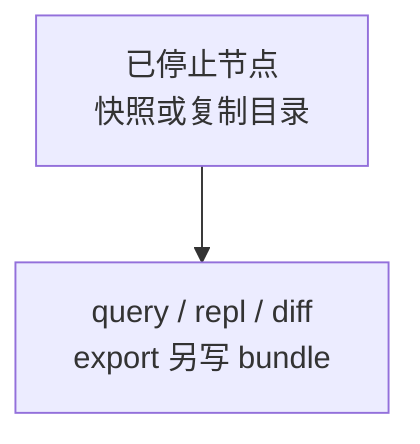
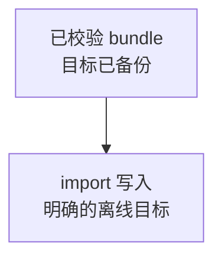
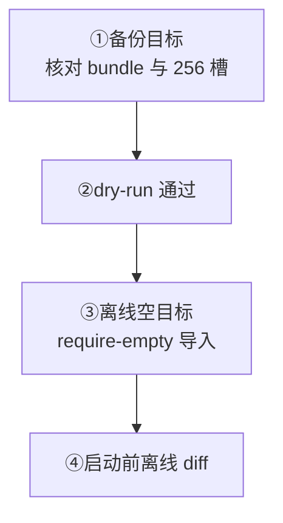

先核对一个节点的数据身份；只读查询与受控导入分别操作。工具只处理节点文件，不连接集群，也不读取 Controller / Raft / 运行时全局状态。

<Callout type="error" title="不要操作在线数据目录">
  `info` 只读不可变标识文件，可以在节点运行时使用；其他精确检查应针对已停止节点、文件系统快照或复制出的数据目录。在线文件可能持续变化，不能形成一致证据；`import` 必须使用明确的离线目标，并在写入前完成 dry run 与备份。
</Callout>

## 操作类别

<div className="grid gap-4 sm:grid-cols-2">

<div>

### 只读源数据

<div className="tutorial-diagram">



</div>

查询仅输出结果；diff 对比两个离线目录。export 只读源目录，另写输出目录。

</div>

<div>

### 写离线目标

<div className="tutorial-diagram">



</div>

仅 import 写 WKDB；它不会加入集群或迁移 Controller / Raft 状态。

</div>

</div>

先[安装 wkcli](/zh/server/tools/wkcli)。全局参数在 `wkcli db` 后、操作名前；命令专属参数在操作后。

<details>
  <summary>完整操作类别与读取写入范围</summary>

`wkcli db` 是面向一个 WuKongIM 节点数据目录的本地离线工具。它不会连接集群节点，也不会读取 Controller、Raft 或运行时全局状态。默认从只读查询开始；只有 `import` 会写 WKDB 存储。


使用示例前先[安装 wkcli](/zh/server/tools/wkcli)。数据库全局参数位于 `wkcli db` 之后、具体操作之前。

| 命令 | 源数据访问 | 额外写入 | 视图范围 |
| --- | --- | --- | --- |
| `info` | 只读版本标识，不打开数据库 | 仅标准输出 | 单节点数据格式与创建程序 |
| `query` / `repl` | 只读 | 仅标准输出 | 单节点元数据与消息存储 |
| `export` | 只读 | 写 `--output` bundle 目录 | 单节点可导出的 bundle-v1 数据 |
| `diff` | 两端只读 | 仅标准输出 | 两个离线节点目录的 bundle-v1 数据差异 |
| `import` | 读取 bundle | 写离线目标 WKDB | bundle 支持的数据类型 |

全局参数必须放在命令前，命令专属参数放在命令后。

</details>

## 查看数据版本

使用配套版本（`info` 从 `v3.0.0-beta.13` 提供），将路径换成实际节点根目录：

```bash
wkcli db --data-dir ./node-1 \
  info
```

**结果：** `registered` 表示标识有效且格式受支持；`unregistered` 不推断 v2 / v3；`unsupported` 表示服务端拒绝该格式。成功只表示读到标识，不代表业务数据校验。

`info` 不开数据库、不加数据库锁、不创建或修改目录，可在线查询；路径不存在或标识损坏会报错。只传节点根目录或配置，不用 `--meta-path`、`--message-path`、`--hash-slot-count`。

当前格式为 `wukongim-v3` / `2`；格式 1 和未登记非空目录被拒绝，不自动迁移。不得修改 `DATA-FORMAT.json` 绕过检查，完整备份需保留它；归档恢复保留目标创建记录，旧二进制不保证安全回退。

<details>
  <summary>完整数据版本命令、标识与兼容限制</summary>

以下功能从 v3.0.0-beta.13 起提供，请使用配套版本的服务端和工具。

```bash
wkcli db --data-dir ./node-1 info
wkcli db --data-dir ./node-1 --format json info
wkcli db --config ./wukongim.toml info
```

每个全新空节点目录会自动生成 `DATA-FORMAT.json`。迁移生成的目标目录也会记录，创建程序为迁移工具。文件中的 `format`（当前 `wukongim-v3`）和 `format_version`（当前 `2`）描述数据格式；`created_by` 保存创建程序、版本、提交和构建来源，`created_at` 保存创建时间。普通软件升级与重复导入不会改写这些信息。

| 返回状态 | 含义 |
| --- | --- |
| `registered` | 标识有效，当前工具支持该格式 |
| `unregistered` | 目录存在但没有标识；不会推断为 v2 或 v3，也不猜测创建程序 |
| `unsupported` | 标识可读取，但当前程序不支持该格式，服务端会拒绝启动 |

`info` 不打开数据库、不获取数据库锁、不创建或修改目录，可在节点运行时查询。路径不存在或文件损坏会报错；查询成功只表示读取了标识，不代表业务数据已校验。使用节点根目录或配置文件，不要传 `--meta-path`、`--message-path`、`--hash-slot-count`。

格式 2 包含用户/频道发送禁令及其版本。格式 1 和未登记的非空目录会在打开存储前被拒绝；本次不迁移旧数据。请使用配套服务端/CLI 与全新或显式导入的兼容目录，不要修改标识绕过检查。完整目录备份须保留标识；恢复归档时保留目标节点的创建记录。更早的二进制不能据此保证安全回退。

</details>

## 定位存储

核对节点 / 集群 ID、复制时间、版本和目录摘要。`--data-dir` 推导 `slotmeta` 与 `messages`；可显式覆盖路径。`--config` 读取 TOML，`WK_` 仍覆盖；物理哈希槽为 `256`，必须与源数据一致。

<details>
  <summary>完整路径定位命令与参数</summary>

```bash
wkcli db --data-dir ./node-1 --hash-slot-count 256 query "show tables"
wkcli db --config ./wukongim.toml query "select * from meta.user limit 20"
```

- `--data-dir` 按当前节点布局推导 `slotmeta` 与 `messages`；
- `--meta-path`、`--message-path` 可以显式覆盖路径；
- `--config` 从 TOML 读取路径和哈希槽数量，`WK_` 环境变量仍会覆盖文件值；
- `--hash-slot-count` 必须与源数据所属集群一致。WuKongIM 的物理哈希槽数量为 256。

记录节点 ID、集群 ID、数据复制/快照时间、服务端版本和目录校验值，避免比较错目标。

</details>

## 只读查询

有 `uid` / `channel_id` 分区键时定位哈希槽，否则在本节点做有界扫描。`limit` 限制整次结果；用返回的 cursor 分页，不支持 `offset`。JSONL 最后输出含 `has_more`、`next_cursor` 的 stats。

<details>
  <summary>完整查询、游标与输出示例</summary>

```bash
wkcli db --data-dir ./node-1 --hash-slot-count 256 \
  query "select * from meta.user where uid='u1'"

wkcli db --data-dir ./node-1 \
  query "select * from message.channels limit 20"

wkcli db --data-dir ./node-1 \
  query "select * from message.message where channel_key='g1:2' limit 50"
```

包含 `uid` 或 `channel_id` 等分区键时，工具会推导对应哈希槽；没有分区键的查询会在本节点文件上进行有界扫描。`limit` 是整次查询总行数，不会对每个哈希槽重复应用。大结果使用返回的游标继续分页，不支持 `offset`：

```bash
wkcli db --data-dir ./node-1 --hash-slot-count 256 \
  query "select * from meta.user limit 100 cursor '<next_cursor>'"
```

使用 `--format table|json|jsonl` 控制输出。JSONL 会在数据行之后输出最终 stats 记录，其中包含 `has_more` 和 `next_cursor`。

</details>

## 导出 bundle

源存储只读，输出 bundle-v1 清单与 JSONL，包含支持的数据、行数和 SHA-256。不会聚合其他节点、导出增量或在线一致快照，也不包含 Controller / Raft / 运行时状态，不是 Manager 备份。覆盖输出前先核对路径，再用 `--overwrite`。

<details>
  <summary>完整导出命令与 bundle 范围</summary>

```bash
wkcli db --data-dir ./node-1 --hash-slot-count 256 \
  export --output ./wkdb-dump
```

`export` 以只读方式打开源存储，只写输出目录。WKDB Import Bundle v1 包含清单和 JSONL 文件，可覆盖受支持的用户、设备、频道、订阅关系、普通 membership、CMD membership、频道最新序号和消息数据，并为文件记录行数与 SHA-256。

它不会聚合其他节点、创建在线一致性快照、导出增量、包含 Controller/Raft/运行时状态，也不是 Manager 备份归档。需要覆盖已有输出目录时，先核对路径再显式添加 `--overwrite`。

</details>

## 导入 bundle

<div className="tutorial-diagram">



</div>

新建或明确清空的离线目标使用 `--require-empty`，防止意外合并。`--dry-run` 不打开可写目标；先保存目标副本再写入。单节点 bundle 不会变成完整集群。

<details>
  <summary>完整 dry-run 与导入命令</summary>

先只验证 bundle，不打开可写目标：

```bash
wkcli db --data-dir ./node-new --hash-slot-count 256 \
  import --input ./wkdb-dump --dry-run
```

通过校验后，针对新建或明确清空的离线目标执行：

```bash
wkcli db --data-dir ./node-new --hash-slot-count 256 \
  import --input ./wkdb-dump --require-empty
```

`import` 是唯一写 WKDB 存储的命令。它不加入集群、不迁移 Controller 或 Raft 状态，也不保证把单节点 bundle 变成完整集群。写入前应保存目标副本、确认 bundle 版本与哈希槽数量、使用 `--require-empty` 防止意外合并，并在启动任何节点前执行离线 diff。

</details>

## 比较两个离线目录

`summary` 比较行与 payload 校验值，`full` 还散列消息 payload。相等退出 `0`，确认差异退出 `2`；同时保存 stderr，避免把读取 / 配置错误当作数据差异。启动节点前先完成离线比对。

<details>
  <summary>完整 summary / full 比对命令</summary>

```bash
wkcli db --hash-slot-count 256 diff \
  --source-data-dir ./node-old \
  --target-data-dir ./node-new

wkcli db --hash-slot-count 256 diff \
  --source-data-dir ./node-old \
  --target-data-dir ./node-new \
  --mode full
```

默认 `summary` 比较行和 payload 校验值；`full` 还会散列消息 payload 字节。相等时退出 0，确认存在差异时退出 2。退出码必须与标准错误一起保存，避免把配置或读取错误误判为数据差异。

</details>

## 与集群恢复的边界

集群恢复另走 [Manager 备份与恢复](/zh/server/operations/backup-and-restore)：核对集群身份、归档、任务与全部 `256` 个物理哈希槽，再按维护状态下的原子切换或回滚流程执行。

<details>
  <summary>完整节点传输与集群恢复边界</summary>

`wkcli db` bundle 适合节点本地的离线检查和受控数据转移，不替代 [Manager 备份与恢复](/zh/server/operations/backup-and-restore)。集群恢复还必须验证集群身份、归档、任务以及全部 256 个物理哈希槽，并通过维护状态下的原子切换或回滚流程。

</details>

<Cards>
  <Card title="集群备份恢复" description="按维护流程验证集群级归档。" href="/zh/server/operations/backup-and-restore" />
  <Card title="在线集群检查" description="用 wkcli 查看 Top 和节点证据。" href="/zh/server/tools/wkcli" />
</Cards>
