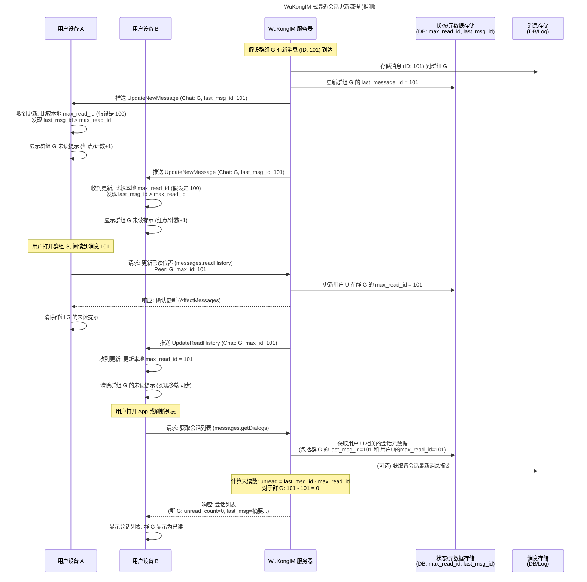

```mermaid

sequenceDiagram
    title WuKongIM 式最近会话更新流程 (推测)

    participant ClientA as 用户设备 A
    participant ClientB as 用户设备 B
    participant Server as WuKongIM 服务器
    participant StateStore as 状态/元数据存储<br/>(DB: max_read_id, last_msg_id)
    participant MessageStore as 消息存储<br/>(DB/Log)

    %% --- Scenario 1: 新消息到达群组 G ---
    Note over Server: 假设群组 G 有新消息 (ID: 101) 到达
    Server->>MessageStore: 存储消息 (ID: 101) 到群组 G
    Server->>StateStore: 更新群组 G 的 last_message_id = 101
    Server->>ClientA: 推送 UpdateNewMessage (Chat: G, last_msg_id: 101)
    ClientA->>ClientA: 收到更新, 比较本地 max_read_id (假设是 100)<br/>发现 last_msg_id > max_read_id
    ClientA->>ClientA: 显示群组 G 未读提示 (红点/计数+1)
    Server->>ClientB: 推送 UpdateNewMessage (Chat: G, last_msg_id: 101)
    ClientB->>ClientB: 收到更新, 比较本地 max_read_id (假设是 100)<br/>发现 last_msg_id > max_read_id
    ClientB->>ClientB: 显示群组 G 未读提示 (红点/计数+1)

    %% --- Scenario 2: 用户在设备 A 阅读消息 ---
    Note over ClientA: 用户打开群组 G, 阅读到消息 101
    ClientA->>Server: 请求: 更新已读位置 (messages.readHistory)<br/>Peer: G, max_id: 101
    Server->>StateStore: 更新用户 U 在群 G 的 max_read_id = 101
    Server-->>ClientA: 响应: 确认更新 (AffectMessages)
    ClientA->>ClientA: 清除群组 G 的未读提示
    Server->>ClientB: 推送 UpdateReadHistory (Chat: G, max_id: 101)
    ClientB->>ClientB: 收到更新, 更新本地 max_read_id = 101
    ClientB->>ClientB: 清除群组 G 的未读提示 (实现多端同步)

    %% --- Scenario 3: 用户在设备 B 获取会话列表 ---
    Note over ClientB: 用户打开 App 或刷新列表
    ClientB->>Server: 请求: 获取会话列表 (messages.getDialogs)
    Server->>StateStore: 获取用户 U 相关的会话元数据<br/>(包括群 G 的 last_msg_id=101 和 用户U的max_read_id=101)
    Server->>MessageStore: (可选) 获取各会话最新消息摘要
    Note over Server: 计算未读数: unread = last_msg_id - max_read_id<br/>对于群 G: 101 - 101 = 0
    Server-->>ClientB: 响应: 会话列表<br/>(群 G: unread_count=0, last_msg=摘要...)
    ClientB->>ClientB: 显示会话列表, 群 G 显示为已读


```