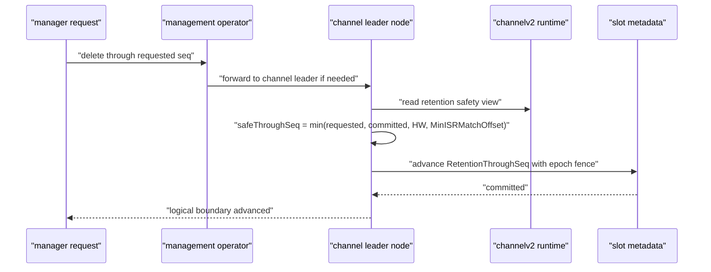
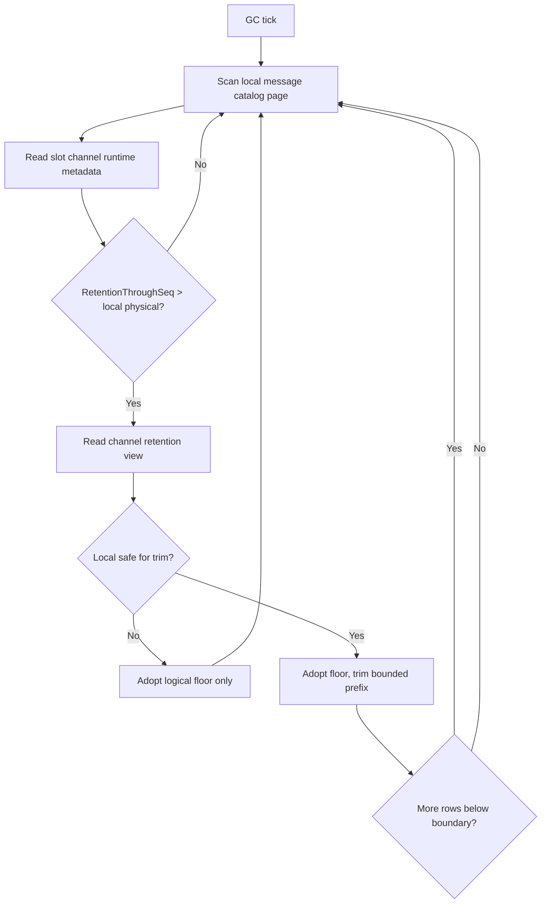

# InternalV2 Message Retention Physical Cleanup Design

## 背景

`internalv2` 已经支持把某个 channel 的 `RetentionThroughSeq` 写入权威 channel runtime metadata，并且读路径会按 `RetentionThroughSeq + 1` 裁剪 committed message。这一步解决的是逻辑不可见：`messageSeq <= RetentionThroughSeq` 不再对外返回。

物理清理要解决的是释放本地 message store 空间。这个能力不能做成节点本地 TTL 删除，因为 channel message log 类似 Raft replicated log：leader 和 ISR follower 对同一段 log 的可见边界必须一致，落后副本不能因为 leader 先删了前缀而失去追赶路径，leader 切换后旧消息也不能重新可见。

因此物理清理采用 slot log compaction 风格：权威边界先由 slot metadata 提交，所有副本只消费这个权威边界，本地删除只释放已经被权威边界覆盖的前缀。

## 目标

- 对已经提交的 `RetentionThroughSeq` 做本地物理前缀删除。
- 删除 message primary row、payload row、message id index、client msg no index 和 from uid idempotency index。
- 删除失败或落后不影响逻辑读边界，不让旧消息重新可见。
- 物理删除必须遵守 channel replicated log 一致性，不能让当前 ISR 副本失去追赶所需日志。
- 支持大群和大量 channel：扫描分页，单轮删除限额，后台异步执行，不在 HTTP 请求内做重 I/O。
- 保持单节点部署也是单节点集群，不引入绕过集群语义的本地分支。

## 非目标

- Phase 1 不做 TTL 自动推进逻辑边界。
- Phase 1 不做冷归档、历史恢复或 snapshot install。
- Phase 1 不把 `LogStartOffset` 当 retention 边界推进。
- Phase 1 不引入跨副本物理删除共识。物理删除进度是本地状态，权威逻辑边界仍是 slot metadata。
- Phase 1 不补 committed side-effect replay 的新 durable cursor。`internalv2/app/FLOW.md` 当前明确 channel append post-commit 副作用失败后只做 bounded retry 和日志记录，retention 物理清理不能凭空引入新的 replay 安全承诺。

## 核心水位

| 水位 | 层 | 含义 |
| --- | --- | --- |
| `RetentionThroughSeq` | slot metadata | 权威逻辑清理边界。`<= N` 不再对外可见，单调递增。 |
| `MinAvailableSeq` | runtime derived | 第一个可读 committed seq，等于 `RetentionThroughSeq + 1` 和 snapshot lower bound 的较大值。 |
| `LocalRetentionThroughSeq` | local message store | 本节点已经持久采用的 retention floor。重启后不能低于它。 |
| `PhysicalRetentionThroughSeq` | local message store | 本节点已经物理删除完成的最高 seq。可落后于 `RetentionThroughSeq`。 |
| `RetainedMaxSeq` | local message store | 前缀全删后用于恢复 LEO floor 的本地最大 retained seq。 |
| `LEO` | channel store/runtime | 本地 log end offset。前缀删除不能让 LEO 回退。 |
| `HW` | channel runtime | 当前已提交水位。 |
| `CheckpointHW` | channel runtime/store | 已持久 checkpoint 的提交水位。 |
| `MinISRMatchOffset` | leader runtime | 当前 ISR 所有成员在当前 leader epoch 内可证明已经追上的最小 match offset。 |

## 一致性原则

### 权威边界和物理删除分离

`RetentionThroughSeq` 是唯一影响对外可见性的权威边界。物理删除只是本地释放空间，不能决定某条消息是否可读。

应用顺序为：

1. slot metadata 已提交 `RetentionThroughSeq=N`。
2. runtime 读取并发布 `MinAvailableSeq=N+1`。
3. 本地 store 持久采用 `LocalRetentionThroughSeq=N`。
4. 满足安全条件后，store 物理删除 `<=N` 的本地前缀，并推进 `PhysicalRetentionThroughSeq`。

第 2 步必须早于第 4 步。这样即使物理删除失败、进程重启或某个副本落后，旧消息也不会重新可见。

### Leader 不得删除 ISR 还没追上的前缀

物理删除虽然是各节点本地动作，但 leader 本地删除会影响 follower 通过 pull 从 leader 追赶。因此在推进逻辑边界，或在 leader 上执行物理删除前，必须确认边界不超过当前 ISR 的最小 match offset。逻辑边界不等待本地 durable checkpoint；checkpoint 只约束物理删除。

安全边界：

```text
safeThroughSeq = min(
  requestedThroughSeq,
  latestCommittedVisibleSeq,
  HW,
  MinISRMatchOffset,
)
```

如果 `MinISRMatchOffset < requestedThroughSeq`，请求应被阻塞或降级到安全边界。未知 ISR progress 不能当作已追上，只能证明到当前已存在的 retention boundary。

### Follower 不独立计算清理边界

Follower 只消费 slot metadata 里的 `RetentionThroughSeq`。Follower 本地不能根据本机时间、磁盘空间或本地消息 timestamp 独立推进逻辑边界。

Follower 可以本地异步物理删除已经采用的权威 boundary，但删除条件仍需满足本地 `HW`、`CheckpointHW`、`LEO` 和 `PhysicalRetentionThroughSeq`。

### LEO 不能回退

如果物理删除把一个 channel 的所有 message row 都删光，重启后不能把 LEO 恢复为 0。message store 必须通过 `RetainedMaxSeq` 保留 log floor：

```text
RecoveredLEO = max(maxMessageSeqInRows, RetainedMaxSeq)
```

这保证删除旧前缀后，下一条 append 仍从正确 seq 之后继续。

### 落后副本处理

如果某个副本本地 `LEO < RetentionThroughSeq`，它不能尝试读取或复制 boundary 以下的消息。Phase 1 的处理是 adoption reset：

1. 持久采用 `LocalRetentionThroughSeq=RetentionThroughSeq`。
2. 持久推进 `RetainedMaxSeq` 至至少 `RetentionThroughSeq`。
3. runtime 的 LEO floor 至少提升到 `RetentionThroughSeq`。
4. 后续复制从 `RetentionThroughSeq + 1` 继续。

该副本在追上 leader 之前不应进入 ISR，也不应成为 leader。Phase 1 不实现 snapshot install，只处理 retention floor adoption。

## 组件设计

### MessageDB

`pkg/db/message` 是物理删除的唯一落点，不能绕过它直接操作 Pebble。

需要新增或强化：

- Paged channel catalog scan，避免一次性 `ListChannels` 扫全库。
- Bounded prefix trim，避免单个大 channel 一轮删除过多 row。
- Retention state 持久化，包含 `LocalRetentionThroughSeq`、`PhysicalRetentionThroughSeq`、`RetainedMaxSeq`。
- Trim batch 同时删除 primary、payload 和所有二级索引。

删除结果需要可重复调用。同一 boundary 已删过时返回 no-op。

### ChannelV2 Store

`pkg/channelv2/store.ChannelStore` 需要暴露 retention adoption 和 bounded trim contract，而不是让上层拿到 message DB 私有类型。

建议接口：

```go
type RetentionState struct {
    LocalRetentionThroughSeq    uint64
    PhysicalRetentionThroughSeq uint64
    RetainedMaxSeq              uint64
}

type RetentionTrimOptions struct {
    MaxMessages int
    MaxBytes    int
}

type RetentionTrimResult struct {
    DeletedThroughSeq uint64
    Deleted           int
    More              bool
}

type ChannelStore interface {
    LoadRetentionState(ctx context.Context) (RetentionState, error)
    AdoptRetentionBoundary(ctx context.Context, throughSeq uint64, cursorName string) (uint64, error)
    TrimMessagesThrough(ctx context.Context, throughSeq uint64, opts RetentionTrimOptions) (RetentionTrimResult, error)
}
```

`AdoptRetentionBoundary` 返回 adoption 后的 retained LEO floor。`cursorName` 在 Phase 1 可以保留为 committed replay cursor 的兼容入口，但 `internalv2` 不把它作为推进逻辑边界的 gate。

### ChannelV2 Runtime

runtime 需要提供 per-channel retention view 和 apply operation。

`RetentionView` 至少包含：

- `RetentionThroughSeq`
- `LocalRetentionThroughSeq`
- `PhysicalRetentionThroughSeq`
- `LEO`
- `HW`
- `CheckpointHW`
- `MinISRMatchOffset`
- `Role`
- `Leader`
- `Replicas`
- `ISR`

`ApplyRetentionBoundary` 做两类事情：

1. 在 reactor 状态内单调发布权威 `RetentionThroughSeq`。
2. 通过 store worker 执行 adoption 和 bounded trim。

物理 trim 不应阻塞 reactor loop；它应该走 worker pool，返回 result 后再更新 runtime 的 `LocalRetentionThroughSeq` 和 `PhysicalRetentionThroughSeq`。

### ClusterV2

`pkg/clusterv2.Node` 拥有 channel service、slot metadata DB 和 message DB catalog，适合作为 physical GC 的组合点。

建议新增能力：

- `ChannelRetentionView(ctx, channelKey)`：返回 runtime retention safety view。
- `ApplyChannelRetentionBoundary(ctx, channelKey, throughSeq, opts)`：对本节点该 channel 应用权威 boundary。
- `RunChannelRetentionGCOnce(ctx)`：分页扫描本地 message catalog，对每个 channel 读取 slot metadata 中的 `RetentionThroughSeq`，再调用 apply。

后台循环由配置控制。HTTP manager 请求只推进逻辑边界，不在请求内做物理清理。

### InternalV2 Manager

现有 manager retention 请求应该继续只负责逻辑边界推进，但要补齐 replicated log safety gate。计算 boundary 时必须从 channelv2 runtime 读取 `HW`、`MinISRMatchOffset`，并结合最新 committed visible seq 把请求限制在可复制安全边界内。`CheckpointHW` 不截断 manager logical boundary；它只约束后续本地 physical trim。

Phase 1 不使用 replay cursor blocked reason。该 reason 可以保留在 contract 中，但实现返回时应明确只有存在 durable committed replay cursor 后才启用。

## 流程

### 手动删除请求



### 后台物理清理



本地安全条件：

```text
throughSeq <= HW
throughSeq <= CheckpointHW
throughSeq <= LEO
throughSeq > PhysicalRetentionThroughSeq
```

Leader 还需要保证：

```text
throughSeq <= MinISRMatchOffset
```

Follower adoption 可以先发生；如果本地 `HW`、`CheckpointHW` 或 `LEO` 不足，只采用 logical floor，不做物理 trim，等待后续追上。physical GC 可以在 checkpoint 落后时提交一个有界 checkpoint；checkpoint 完成后下一轮再执行 trim，不把 checkpoint 写入 manager 请求路径。

## 配置

Phase 1 建议新增 internalv2 配置：

| Key | 默认值 | 含义 |
| --- | --- | --- |
| `WK_CHANNEL_MESSAGE_RETENTION_PHYSICAL_GC_ENABLE` | `false` | 是否启用后台物理清理循环。 |
| `WK_CHANNEL_MESSAGE_RETENTION_SCAN_INTERVAL` | `1m` | 后台扫描间隔。 |
| `WK_CHANNEL_MESSAGE_RETENTION_CHANNEL_BATCH_SIZE` | `128` | 每轮 catalog 扫描 channel 数。 |
| `WK_CHANNEL_MESSAGE_RETENTION_MAX_TRIM_MESSAGES` | `1000` | 单个 channel 单轮最多物理删除消息数。 |

不在 Phase 1 引入 `TTL` 配置，避免让使用者误以为系统已经支持自动逻辑 retention。

## 观测

需要补齐以下 metrics 或 diagnostic event：

- 物理清理扫描 channel 数。
- adoption 成功、失败、no-op 次数。
- trim 成功、失败、deleted message 数。
- physical trim blocked reason：`no_boundary`、`hw_lag`、`checkpoint_lag`、`leo_lag`、`min_isr_lag`。
- local lag：`RetentionThroughSeq - PhysicalRetentionThroughSeq`。
- 单轮耗时和单 channel trim 耗时。

这些指标用于排查大群、大量 active channel 和磁盘压力场景。

## 测试策略

- `pkg/db/message` 单测：
  - bounded trim 删除 primary、payload、二级索引。
  - trim 后 `LEO` 通过 `RetainedMaxSeq` 不回退。
  - repeated trim no-op。
  - paged catalog scan 不漏 channel。
- `pkg/channelv2/store` 单测：
  - adapter adoption 和 bounded trim contract。
  - memory store 行为和 message DB store 一致。
- `pkg/channelv2/reactor` 单测：
  - apply boundary 后读 view 立即看到 `RetentionThroughSeq`。
  - worker trim 完成后更新 physical progress。
  - `CheckpointHW` 或 `HW` 落后时只 adopt，不 trim；`checkpoint_lag` 会触发 retention-owned checkpoint，下一轮可继续 trim。
- `pkg/clusterv2` 单测或集成测试：
  - GC once 扫 catalog，读取 slot metadata boundary，执行本地 apply。
  - leader 上 `MinISRMatchOffset` 落后时 manager logical advance 被阻塞或降级。
- `test/e2ev2/message/message_retention`：
  - 三节点非 leader manager 请求推进逻辑边界。
  - 所有节点读路径隐藏旧 seq。
  - 启用 physical GC 后旧 seq 对应本地 DB row 和 indexes 最终消失。
  - leader restart 后 boundary 和 physical progress 不导致旧消息重现。

## 分期建议

Phase 1 只做“手动逻辑删除后的物理清理”：

1. MessageDB bounded trim 和 paged catalog。
2. ChannelV2 retention store/runtime contract。
3. ClusterV2 local physical GC once 和后台 loop。
4. Manager logical advance safety gate 补齐 latest committed seq、`HW`、`MinISRMatchOffset`；physical trim 单独使用 `CheckpointHW`。
5. InternalV2 config、metrics、FLOW 和 e2e。

Phase 2 再做 TTL 自动逻辑 boundary：

1. Leader-only expired prefix scan。
2. Durable committed replay cursor gate。
3. Retention catch-up protocol 的显式错误和 reset。
4. 更完整的 metrics、admin visibility 和运维保护。

这个拆法能先把当前用户可触发的 message delete 做成真正释放磁盘空间，同时不提前承诺自动 TTL 和 replay durability。
