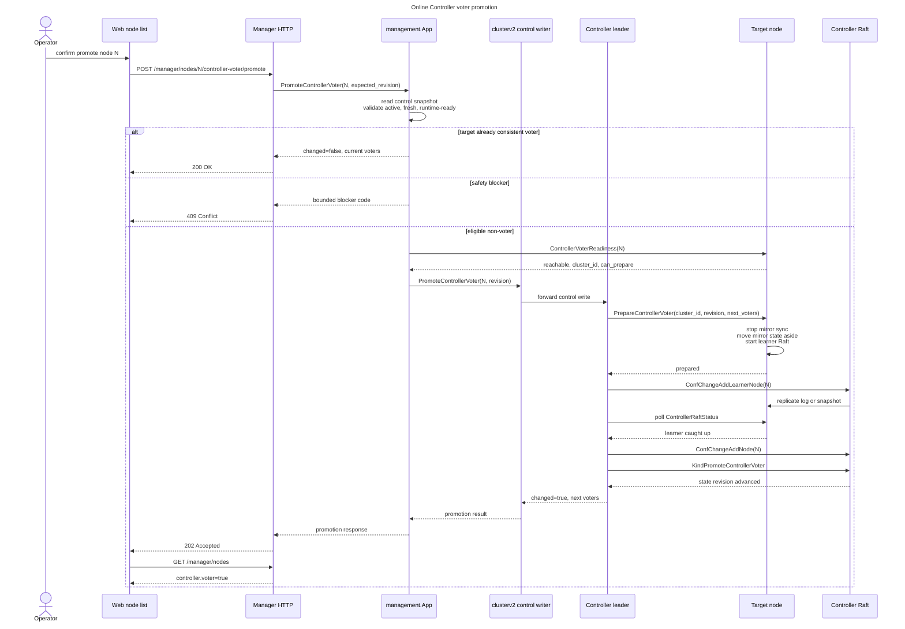
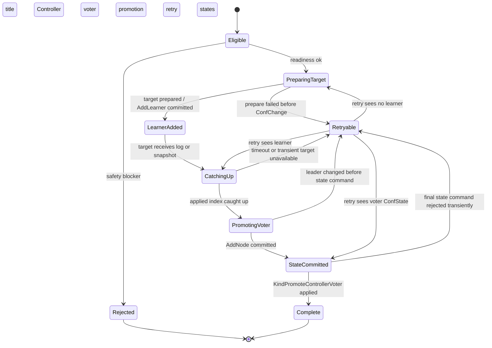

# Controller Voter Promotion Design

Date: 2026-07-01
Status: Approved for implementation planning
Scope: internalv2 manager node list, management usecase, clusterv2 control writer, ControllerV2 Raft membership, web node operations

## 1. Purpose

Cluster operations should let an operator promote an active non-Controller node
to a Controller voter from the manager node list. The operation must be online
and must change the real Controller Raft membership. Updating only the
manager-facing role or only `cluster-state.json` is not enough, because the
actual Controller quorum would remain unchanged.

The design treats single-node deployment as a single-node cluster. No path may
create a local-only or cluster-bypass mode for promotion.

## 2. Current State

The codebase already has several useful pieces:

- `internalv2/access/manager` exposes `/manager/nodes` and Controller Raft
  status/compaction routes.
- `internalv2/usecase/management` builds node rows from the local clusterv2
  control snapshot and already exposes controller role/voter fields.
- `pkg/clusterv2/control` has a generic control-write RPC path for join,
  activation, leaving, removed, health report, and Slot replica move requests.
- `pkg/controllerv2/state.ClusterState` stores both `Controllers` and
  `Nodes[].Roles`; validation requires each Controller voter to reference an
  active node with the controller voter role.
- ControllerV2 Raft already applies committed `ConfChange` entries in the run
  loop, but the public service does not yet expose an operator-facing
  membership-change API.

Important gaps:

- Dynamic join intentionally creates data/mirror nodes only.
- `JoinNodeRequest.Roles` currently ignores controller voter requests.
- `KindUpdateControllerVoters` only replaces the `Controllers` slice. It does
  not atomically add `controller_voter` to the target node role, so it is not a
  complete promotion command.
- Mirror nodes sync `cluster-state.json` but do not run Controller Raft. A
  promoted target must switch from mirror state sync to a prepared Controller
  Raft participant without claiming stale mirrored state as locally applied
  Raft state.
- Node list action hints do not expose controller voter promotion.

## 3. Goals

1. A manager user can promote an eligible non-voter node from the node list.
2. The operation performs a real Controller Raft learner-add and voter-promote
   sequence before durable ControllerV2 state declares the node a voter.
3. Safety checks fail closed when target health, readiness, revision, or
   Controller Raft catch-up evidence is missing.
4. Promotion is idempotent for an already promoted node.
5. Failures are visible through bounded manager errors, Controller Raft status,
   and low-cardinality metrics.
6. The promotion path stays outside foreground SEND, append, route, delivery,
   and presence hot paths.

## 4. Non-Goals

- Do not demote or remove Controller voters in this slice.
- Do not implement batch Controller voter changes.
- Do not automatically rebalance Slot or Channel ownership after promotion.
- Do not mutate local config files such as `wukongim.conf`.
- Do not rely on an operator manually restarting the target node for the happy
  path.
- Do not expose a broad service object; keep the existing
  access -> usecase -> control writer -> ControllerV2 layering.

## 5. Operator UX

The node list adds a row action named `Set as Controller voter` for eligible
nodes. The action appears only when the backend returns
`actions.can_promote_controller_voter=true`.

Eligibility shown in the UI is a hint only. The backend revalidates everything
from a fresh control snapshot when the operator confirms.

Confirmation copy should state:

- the operation changes Controller Raft quorum membership;
- adding an even-numbered voter may not improve fault tolerance;
- `1 -> 2` creates a two-voter Controller quorum where either node failure
  blocks Controller writes, so a later `2 -> 3` promotion is recommended.

The node detail panel should continue to show:

- controller role: leader, follower, or none;
- voter: yes/no;
- local Controller Raft status and watermarks when available.

No new explanatory text should be added to the main page body. Use the existing
confirm dialog and row action menu patterns.

## 6. Manager API

Add:

```text
POST /manager/nodes/:node_id/controller-voter/promote
```

Permission:

```text
cluster.controller:w
```

Request body:

```json
{
  "expected_revision": 0
}
```

`expected_revision` is optional. When omitted, the usecase reads the latest
local control snapshot and uses that revision as the write fence.

Response body:

```json
{
  "changed": true,
  "node_id": 4,
  "state_revision": 27,
  "previous_voters": [1, 2, 3],
  "next_voters": [1, 2, 3, 4],
  "warnings": ["controller_voter_count_even"]
}
```

HTTP mapping:

- `202 Accepted`: promotion changed Controller membership or durable state.
- `200 OK`: target was already a Controller voter and state is consistent.
- `404 Not Found`: target node does not exist.
- `409 Conflict`: target is not eligible or the revision fence failed.
- `503 Service Unavailable`: control writer, readiness reader, target RPC, or
  Controller leader write path is unavailable.

## 7. Backend Usecase

Add `PromoteControllerVoter` to `internalv2/usecase/management`.

New ports:

```go
type ControllerVoterPromoter interface {
    PromoteControllerVoter(context.Context, control.PromoteControllerVoterRequest) (control.PromoteControllerVoterResult, error)
}

type ControllerVoterReadinessReader interface {
    ControllerVoterReadiness(context.Context, uint64) (ControllerVoterReadiness, error)
}
```

The usecase performs these checks before calling the writer:

- target node ID is non-zero;
- target exists in the fresh control snapshot;
- target is `active`;
- target is not already a Controller voter;
- target has a stable non-empty address;
- target health is fresh, alive, and runtime-ready;
- target observed control revision is at least the snapshot revision;
- target runtime summary is not unknown and has observed the snapshot revision;
- target readiness RPC confirms matching cluster ID, reachable transport, and
  local ability to prepare Controller Raft;
- no active Controller voter promotion is already in progress for the same
  target;
- the expected revision, when provided, matches the snapshot revision.

The usecase returns bounded blocker codes such as:

- `target_not_active`
- `target_already_controller_voter`
- `target_health_stale`
- `target_runtime_unknown`
- `target_revision_stale`
- `controller_leader_unknown`
- `controller_promotion_in_progress`
- `expected_revision_mismatch`

These blocker codes are suitable for UI messages and low-cardinality metrics.

## 8. ControllerV2 State Command

Add an atomic ControllerV2 command:

```text
KindPromoteControllerVoter
```

The command carries:

- target node ID;
- target address;
- expected state revision;
- expected previous Controller voter set;
- observed Controller Raft learner/voter proof.

The FSM mutation must update both:

- `ClusterState.Controllers`, by appending the target voter;
- `ClusterState.Nodes[target].Roles`, by adding `controller_voter` while
  preserving `data`.

This avoids invalid intermediate states. It also keeps the existing invariant
that every Controller voter references an active `controller_voter` node.

The command is idempotent when:

- target is already present in `Controllers`;
- target node already has `controller_voter`;
- target address matches the request.

It rejects when:

- target is missing;
- target is not `active`;
- target address differs;
- target is `joining`, `leaving`, or `removed`;
- the observed Raft proof does not show the target as a voter in the live
  Controller Raft configuration;
- expected revision mismatches.

## 9. Raft Membership Flow

Promotion must use a learner-first sequence:

```text
manager route
  -> management.PromoteControllerVoter
  -> target readiness + prepare Controller Raft participant
  -> control writer forwards to current Controller leader
  -> Controller leader proposes ConfChangeAddLearnerNode(target)
  -> target catches up through normal Controller Raft replication/snapshot
  -> Controller leader verifies target applied/caught up
  -> Controller leader proposes ConfChangeAddNode(target)
  -> Controller leader proposes KindPromoteControllerVoter
  -> all voters apply state with Controllers and node role updated
```

Mermaid sequence view:



The learner phase is required because adding a voter directly can raise quorum
before the target is caught up. Learner catch-up does not change quorum. Only
after the target proves it can receive and apply Controller Raft state does the
leader promote it into the voter set.

`pkg/controllerv2/raft.Service` should expose narrow membership methods:

```go
AddLearner(ctx context.Context, nodeID uint64) (MembershipChangeResult, error)
PromoteLearner(ctx context.Context, nodeID uint64) (MembershipChangeResult, error)
```

The service should return the committed conf-change index and the resulting
ConfState. The status surface should include bounded current voters and
learners so the manager and tests can prove membership convergence.

## 10. Mirror-to-Raft Preparation

A non-voter target currently mirrors Controller state through full-file sync.
Promotion needs a target-side preparation path before the leader sends learner
traffic.

Add a node-scoped internal RPC:

```text
PrepareControllerVoter(node_id, cluster_id, expected_revision, next_voters)
```

The target performs:

1. stop mirror sync refresh for ControllerV2;
2. preserve the latest mirrored snapshot for foreground route continuity;
3. start a Controller Raft participant in promotion mode with bootstrap
   disabled;
4. do not publish the participant as authoritative until Raft has installed or
   replayed state through the committed membership path;
5. expose readiness/status as `controller_promotion_prepared`.

Existing recovery rejects a materialized `cluster-state.json` whose applied
index is ahead of the local Raft WAL. Promotion must handle this explicitly
instead of silently reusing mirror state as Raft-applied state. The first
implementation should atomically move the mirrored `cluster-state.json` aside
before starting the learner Raft store, then let Controller Raft snapshot/log
replication materialize a new authoritative state file. The in-memory
foreground control snapshot remains available for route continuity while the
target catches up.

If preparation fails before learner add, no cluster state changes. If learner
add succeeds but voter promotion does not, the target remains a learner and the
operation reports a conflict or unavailable status. A later retry can continue
from the observed learner state.

## 11. clusterv2 Control Integration

Add to `pkg/clusterv2/control`:

```go
type PromoteControllerVoterRequest struct {
    NodeID uint64
    ExpectedRevision uint64
}

type PromoteControllerVoterResult struct {
    Changed bool
    Node Node
    Revision uint64
    PreviousVoters []uint64
    NextVoters []uint64
    Warnings []string
}
```

Add `ControlWriteActionPromoteControllerVoter` to the generic control-write
codec. The request must forward to the current Controller leader before local
follower validation, matching activation behavior.

Expose:

```go
func (n *Node) PromoteControllerVoter(ctx context.Context, req control.PromoteControllerVoterRequest) (control.PromoteControllerVoterResult, error)
```

The root `Node` remains a thin foreground facade and delegates to the control
runtime. It must not own the safety policy.

## 12. Node List Read Model

Extend manager node actions:

```go
type NodeActions struct {
    CanDrain bool
    CanResume bool
    CanScaleIn bool
    CanOnboard bool
    CanPromoteControllerVoter bool
}
```

`CanPromoteControllerVoter` is true only for active, non-controller nodes that
are not already leaving or removed. Health/revision/readiness may still fail at
write time, so this stays a hint.

Manager DTO and web type changes:

- `actions.can_promote_controller_voter`
- new manager API client method `promoteControllerVoter(nodeId)`
- row action in `web/src/pages/nodes/page.tsx`
- i18n strings in English and Chinese
- page tests covering visibility, confirmation, success refresh, and conflict
  display.

## 13. Error Handling And Idempotency

Idempotent success:

- target already has node role `controller_voter`;
- target is present in `Controllers`;
- live Controller Raft ConfState already lists target as voter.

Conflict:

- state says voter but Raft ConfState does not;
- Raft ConfState says voter but state lacks the role after the final command
  repeatedly rejects;
- target is stale, down, or not runtime-ready;
- target address differs from the state record.

Unavailable:

- no known Controller leader;
- target prepare RPC failed due to network;
- control writer is not wired;
- target status cannot be read after learner add.

Retries should be monotonic:

- retry after prepare failure starts over;
- retry after learner add checks learner state and proceeds to catch-up or
  voter promotion;
- retry after voter ConfChange but before state command proposes only the final
  state command when live proof is present.

Mermaid retry state view:



## 14. Observability

Add low-cardinality metrics:

- controller voter promotion attempts by result;
- promotion blocker count by bounded reason;
- current Controller Raft learner count;
- current Controller Raft voter count;
- promotion duration histogram by phase.

Do not label metrics by node ID, address, task ID, or cluster ID.

Controller Raft status should expose enough evidence for the manager:

- current voters;
- current learners;
- leader ID;
- term;
- commit index;
- applied index;
- first/last/snapshot indexes;
- degraded/error reason.

The existing Controller Raft log page remains the detailed audit source for the
committed ConfChange and final promotion command.

## 15. Performance And Safety Notes

Promotion is an operator action, not a hot path. It may use bounded synchronous
RPCs and polling. Every wait loop must have a context deadline and a small
poll interval.

Large-cluster considerations:

- never scan channels, messages, or online sessions for this operation;
- do not block SEND, append, delivery, or route lookup on promotion state;
- do not update Slot assignments or hash-slot routing;
- keep state changes to one target node and the Controller voter set.

Quorum policy:

- allow adding an even-numbered voter, but return a warning;
- learner-first promotion prevents quorum from increasing until the target is
  caught up;
- demotion/removal requires a separate design because it can reduce quorum and
  must prove remaining voters are healthy.

## 16. Test Plan

Focused unit tests:

- ControllerV2 FSM atomically updates `Controllers` and node roles.
- FSM rejects missing, non-active, removed, or address-mismatched targets.
- FSM idempotently accepts already promoted targets.
- Raft service proposes AddLearner and PromoteLearner ConfChanges and reports
  resulting ConfState.
- Control-write codec round-trips promotion request/response and preserves
  semantic errors.
- `control.Runtime` forwards promotion to the leader before follower-local
  validation.
- management usecase blocks stale, down, not-ready, already-voter, and revision
  mismatch targets.
- manager HTTP route enforces `cluster.controller:w`, maps 200/202/404/409/503,
  and returns bounded warnings.
- web node page shows the action only when the backend hint permits it and
  refreshes after success.

Integration tests:

- three Controller voters plus one active mirror node promote the mirror to a
  fourth Controller voter.
- promotion failure after learner add can be retried and completes.
- `1 -> 2` promotion returns the even/quorum warning and still follows
  learner-first safety.
- node list and Controller Raft status agree after promotion.

Black-box verification:

- run a real wukongimv2 multi-node cluster;
- send traffic during promotion and verify SEND -> SENDACK continues;
- promote one active data mirror;
- verify `/manager/nodes` shows `controller.voter=true`;
- verify `/manager/nodes/:node_id/controller-raft` reports the new voter with
  applied index caught up.

## 17. Implementation Order

1. Add ControllerV2 atomic promotion command and FSM tests.
2. Add Controller Raft membership methods and status ConfState evidence.
3. Add target prepare RPC and mirror-to-learner runtime preparation.
4. Add clusterv2 control write request/response and `Node` facade method.
5. Add management usecase checks and manager HTTP route.
6. Add node-list action hint and web action.
7. Add integration and black-box coverage.
8. Update `FLOW.md` files whose described routes or package responsibilities
   change.

## 18. Implementation Guardrail

The design fixes the product behavior: online learner-first promotion. The
implementation must prove the mirror-state handoff with ControllerV2 Raft tests
before wiring the manager action. If empty learner startup cannot safely
materialize from leader snapshot/log replication, stop and revise this spec
instead of falling back to a fake state-only promotion.
