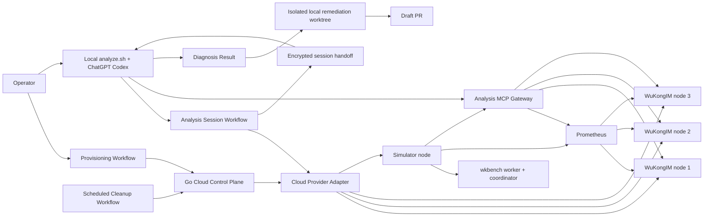
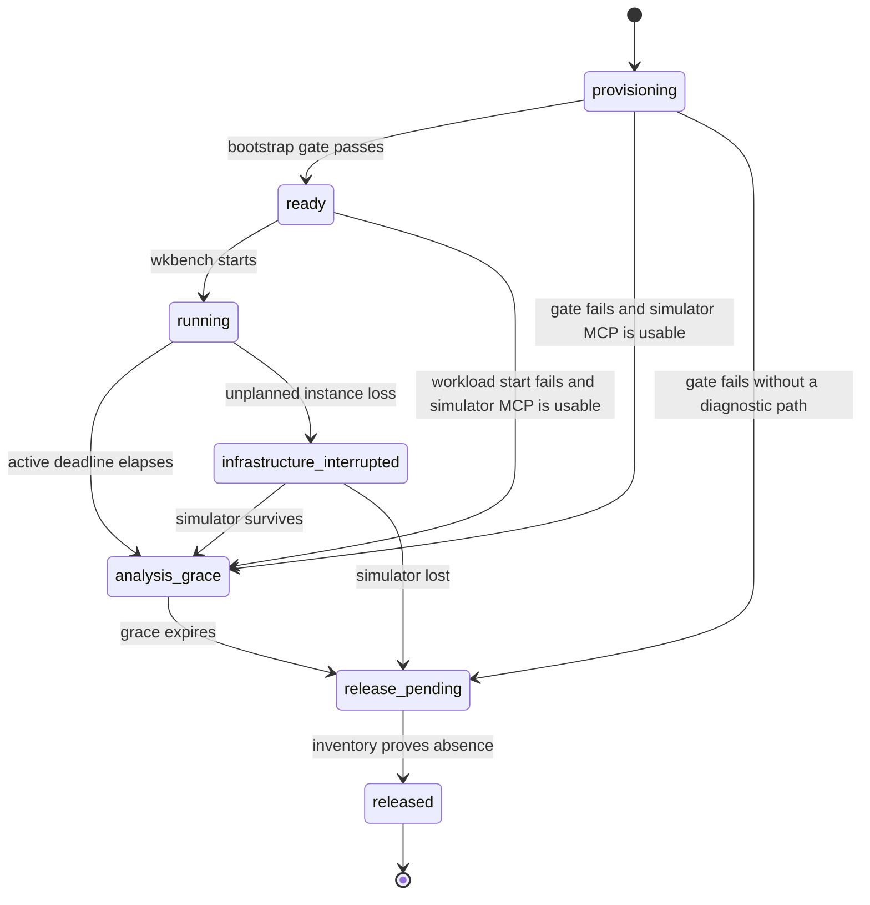

# Cloud Simulation GitHub Actions Design

**Date:** 2026-07-14

## Status

Implemented for repository phases 1 through 4 and the phase-5 Alibaba stress
prerequisites. Real Alibaba canary/drill attestations remain pending; the
Tencent Adapter is intentionally blocked until every required Alibaba drill is
green.

## Problem

WuKongIM needs a reproducible way to exercise a real three-node cluster for
hours or days without keeping a GitHub-hosted runner alive for the complete
test. An operator should be able to provide a cloud-account binding, request
four temporary spot instances, run one repository-defined wkbench scenario,
and later run a separate local Codex analysis against the still-live system
using a ChatGPT subscription rather than an OpenAI API key.

The design must prevent four classes of false confidence:

- a workflow that remains green only because it successfully launched a test;
- a load generator bottleneck attributed to WuKongIM;
- a spot interruption attributed to a product defect;
- a Codex remediation process that simultaneously holds cloud diagnostic and
  repository write privileges.

It must also prove that temporary resources are released even when workflows,
instances, or cleanup calls fail.

## Goals

1. Create four temporary spot instances: three WuKongIM cluster nodes and one
   simulator/observability node.
2. Run a trusted, versioned `wkbench/v1` Scenario Profile for `30m`, `2h`,
   `24h`, or `48h` after a strict cluster readiness gate.
3. Keep provisioning, long-running workload execution, live analysis, and
   cleanup independently retryable.
4. Let a manually started local Analysis Session query live metrics, logs,
   diagnostics, traces, and bounded profiles through a WuKongIM Analysis MCP
   and repository Analysis Skill, with GitHub acting only as the cloud-identity
   and encrypted-session broker.
5. Optionally produce a tested Draft PR when a high-confidence Diagnosis Result
   identifies a repository defect.
6. Support a two-Secret AccessKey onboarding path, while retaining short-lived
   GitHub OIDC identities as the hardened fallback.
7. Bound cost, concurrency, diagnostic perturbation, public ingress, and
   resource lifetime.
8. Implement Alibaba Cloud end to end first while preserving a provider-neutral
   boundary for a later Tencent Cloud Adapter.

## Non-goals

- Keeping a GitHub job alive for the complete simulation duration.
- Persisting logs, metrics, profiles, or an Evidence Bundle after cloud release.
- Running arbitrary source revisions or fork pull-request code in the first
  version.
- Automatically replacing a reclaimed spot instance.
- Multi-zone placement or planned fault injection in the first version.
- Exposing cluster nodes, manager APIs, metrics, pprof, or SSH permanently.
- Giving Codex SSH, shell, cloud-resource, service-restart, or configuration
  mutation capabilities.
- Deploying Grafana, Loki, ELK, Terraform state, a container registry, or cloud
  object storage solely for this system.
- Automatically merging remediation pull requests.
- Implementing Alibaba Cloud and Tencent Cloud concurrently.

## Architecture



GitHub Actions is the asynchronous control plane. The simulator owns the
long-running workload process. No cloud credential is installed on any
Simulation Run host.

## Workflow Surface

### Provisioning Workflow

`.github/workflows/cloud-sim-provision.yml` is manually dispatched from the
default branch. Its inputs are:

- `region`;
- optional `source_sha`, which must be reachable from trusted `main` and
  defaults to the current remote `main`;
- `scenario`;
- `infrastructure_preset`;
- `duration`: `30m`, `2h`, `24h`, or `48h`, default `2h`;
- `analysis_grace`: `30m`, `1h`, or `6h`, default `30m`;
- `max_total_cost`.

The first version fixes the provider to Alibaba Cloud. A protected GitHub
Environment may require approval before any billable resource is created.

The build job has no cloud credential. It produces one content-addressed
Deployment Bundle for the selected commit. A separate provisioning job obtains
the selected AccessKey or OIDC cloud identity, creates the run, deploys that
exact bundle, and writes a Job Summary containing the Run Identity, selected
resources, cost estimate, expiry, and a direct next-step reference to the local
analysis command.

After workload start, provisioning uploads a 90-day Finalization Schedule
Artifact containing only the Run Identity, active workload deadline,
initial analysis time, and immutable lease expiry. It is control
metadata, not an Evidence Bundle or a historical observability archive.

### Local Finalization Command

The preferred operator entrypoint is `scripts/cloud-sim/finalize.sh <run_id>`.
It downloads the exact Provisioning Workflow's Finalization Schedule, waits
until terminal workload data should exist, and invokes `analyze.sh`. A validated
`workload_inspect.state=in_progress` result retains the run for another attempt
while the immutable lease can safely admit one. The command then dispatches an
exact request-correlated Cleanup Workflow and invokes the released preflight
again. Success requires a structured provider-released result backed by empty
exact-tag inventory. If diagnosis or optional remediation fails, exact cleanup
and zero-resource verification still run; remediation failure does not replace
an already-valid Diagnosis Result. A run already confirmed released stops
without another cleanup request.

### Local Analysis Command and Session Workflow

Operators run `scripts/cloud-sim/analyze.sh` with:

- exact `run_id`;
- optional diagnostic focus;
- optional `--allow-fix-pr`.

There is no `latest` selector. The command requires a local Codex CLI logged in
through ChatGPT, creates an ephemeral RSA key pair, and dispatches
`.github/workflows/cloud-sim-analyze.yml` with `operation=prepare`, the exact
Run Identity, a unique request identifier, the local public IPv4 address, and
the ephemeral public key. The workflow validates the Run Locator and cloud
inventory before creating any live Codex session. Provider-confirmed released
resources cause a clear terminal notice before Codex is invoked. An unknown
locator is reported as `unknown_run`, not as a released run.

The workflow also accepts `operation=close` for an exact request so the local
command can explicitly revoke its Analysis Access Window. These low-level
inputs are an implementation boundary owned by `analyze.sh`, not the normal
operator interface.

### Cleanup Workflow

`.github/workflows/cloud-sim-cleanup.yml` runs every 15 minutes and may also be
dispatched manually with an exact Run Identity for protected early destruction.
It discovers resources from mandatory provider tags, reconciles all resource
types, and fails visibly while any billable resource remains. It uses a
dedicated `cloud-sim-cleanup` Environment without required reviewers so lease
reconciliation cannot be blocked by the billable-creation approval policy.

## Simulation Run Lifecycle



The Run Lease is the maximum cloud-side lifetime. It includes a bounded
50-minute provisioning allowance, the selected active workload duration, and the
selected Analysis Grace. It cannot be extended, but a failed or manually
stopped run may be released earlier.

Every compute instance receives the provider's native scheduled-release
deadline at creation time. The Cleanup Workflow is an independent second layer
for compute, disks, addresses, security rules, subnets, and VPCs.

The provisioning workflow persists `provisioning -> ready -> running` in
provider tags. Entering `running` records the exact active workload deadline;
provider reconciliation projects an elapsed running deadline as
`analysis_grace`, so later jobs recover the current phase without workflow-local
state. Failed provisioning enters `analysis_grace` only when the recorded MCP
self-check passed; otherwise it immediately invokes provider cleanup.

## Cloud Resource Topology

Each run owns one tagged VPC, subnet, and security group in one region and one
availability zone:

- cluster node 1: private address and independent data disk;
- cluster node 2: private address and independent data disk;
- cluster node 3: private address and independent data disk;
- simulator: private address plus a temporary public address.

The three cluster nodes have no public address. Cluster, manager, metrics, and
profiling traffic remains private. The simulator has no standing inbound rule.
The first version deliberately excludes multi-zone placement so cross-zone
latency is not mixed into the baseline.

Logical resource tags must include at least:

- managed-by identity;
- Run Identity;
- repository identity;
- resource role;
- source SHA;
- Scenario Profile digest;
- Deployment Bundle digest;
- expiry;
- run-specific MCP certificate fingerprint where applicable.

Provider Adapters map these logical fields to provider tag constraints. Cleanup
and analysis use tags and provider inventory, never workflow-local state or
resource display names.

## Provider-neutral Cloud Control Plane

A repository-owned Go control plane exposes lifecycle operations equivalent to:

```text
create
status
open-analysis
close-analysis
destroy
sweep
```

It does not use shell scripts or Terraform state as the run authority. Its
Provider Adapter owns pricing, quota and spot-capacity checks, resource
creation, tags, native scheduled release, temporary ingress, inventory, and
destruction.

The first Adapter targets Alibaba Cloud. Tencent Cloud is added only after the
complete Alibaba path, including cleanup failures and live analysis, passes.

## Cloud Account Binding

The simplest onboarding path stores one complete Alibaba AccessKey pair as the
repository Secrets `ALIBABA_CLOUD_ACCESS_KEY_ID` and
`ALIBABA_CLOUD_ACCESS_KEY_SECRET`. A partial pair fails before any cloud API
call. Provision uses the authenticated account to discover the non-secret
provider config, persists it before creating billable resources, and retains it
as a Run-Identity-scoped Artifact for Analysis and Cleanup. The AccessKey is
never written to source, artifacts, summaries, tags, or cloud hosts and must
remain valid until cleanup proves empty inventory. A dedicated least-privilege
RAM user is preferred over an account-level AccessKey.

When neither Secret exists, the existing GitHub OIDC binding remains supported
as a hardened alternative. Before ordinary OIDC workflows can authenticate, an
operator runs one idempotent bootstrap from the cloud provider's
browser-authenticated CloudShell. It supports `plan`, `apply`, and `remove` and
creates only:

- the GitHub OIDC identity provider;
- a least-privilege Provisioner Role and policy;
- a least-privilege Analyzer Role and policy;
- trust-policy conditions for repository, default branch, workflow path,
  protected Environment, and expected audience.

The preferred operator interface is `scripts/cloud-sim/setup.sh`. It discovers
the caller account, live region list, audited x86 public image family, candidate
zone, and every compatible entry in the paginated x86 non-GPU spot inventory;
delegates RAM authority to
`wkcloudbootstrap`; configures the GitHub Environments, non-secret Variables,
and OIDC subject; reads back the configured non-secret state; and dispatches
a live GitHub OIDC-to-Alibaba identity-exchange check correlated to that exact
setup dispatch. Provider, role, and
policy names are deterministically scoped to the repository, and existing
Environment protection rules are preserved. An Environment read error other
than a confirmed HTTP 404 aborts rather than creating or replacing it. The
wizard never creates Simulation Run infrastructure, and the Provision Adapter
remains the authority for live price, quota, capacity, and cost admission.

The Provisioner role has distinct trust statements for the approved provision
Environment/workflow and the unattended cleanup Environment/workflow; one
subject cannot authorize the other path.

Because Alibaba RAM exposes only `oidc:iss`, `oidc:aud`, and `oidc:sub` for
OIDC federation, a one-time GitHub workflow configures the repository subject
template as `repo + context + job_workflow_ref`. The resulting exact subject
encodes repository, Environment, workflow path, and branch in the single
`oidc:sub` condition; unsupported per-claim RAM condition keys are not used.

The optional OIDC bootstrap does not create Simulation Run infrastructure or
export an AccessKey. It
prints only non-secret account, role, provider, and region identifiers for
GitHub Variables. Removal refuses while active tagged runs exist.

## Cost and Capacity Guardrails

Provisioning fails atomically before resource creation when:

- another active run already exists for the same repository and cloud account;
- pricing cannot be obtained;
- the worst-case lease estimate exceeds `max_total_cost`;
- required quota, subnet capacity, or spot capacity is unavailable;
- the selected Infrastructure Preset is below the Scenario Profile minimum.

`small`, `standard`, and `stress` are provider-neutral capacity classes defined
by minimum CPU, memory, network, disk capacity, and disk performance. The
Adapter selects the lowest-cost current allowlisted spot type that satisfies
the class and records the concrete SKU and spot price.

The estimate includes all four instances, system and independent data disks,
the simulator public address, bootstrap allowance, active duration, and
Analysis Grace. Variable traffic charges are displayed as a caveat rather than
silently treated as bounded.

## Deployment

The Deployment Bundle contains static Linux binaries, generated node-specific
configuration, fixed observability binaries, and systemd units. Cloud hosts do
not clone source, compile code, install Docker, or pull a mutable image.

Provisioning creates a Deployment Access Window:

1. Generate an ephemeral SSH key.
2. Admit the current GitHub runner address to the simulator's SSH port only.
3. Transfer the bundle through the simulator to the three private nodes.
4. Verify the same content digest on all four hosts.
5. Install root-readable configuration and systemd units.
6. Remove the authorized key and ingress rule in unconditional cleanup.

SSH is a provisioning transport only. It is never available to Codex or the
Analysis MCP.

The cloud deployment runs native systemd services:

- each cluster node runs one `wukongim` process;
- the simulator runs a persistent `wkbench worker`, one non-restarting
  `wkbench run`, Prometheus, host observation, and the Analysis MCP Gateway.

Docker Compose remains the local development and topology reference. Contract
tests keep relevant cluster and scenario defaults aligned.

## Workload Contract and Bootstrap Gate

Repository-owned `wkbench/v1` YAML is the only workload schema. Scenario
Profiles define online users, connection rate, person and group channel shapes,
large-group members, message rates, payloads, verification, thresholds, and a
deterministic seed. Specialized workloads are added as reviewed scenario files,
not assembled from unrestricted workflow inputs.

The cluster remains a three-node cluster with the default 256 hash slots.
Active duration begins only after the 20-minute Bootstrap Gate proves:

- one Deployment Bundle digest on all four hosts;
- all expected systemd services active;
- all three node readiness endpoints healthy;
- exactly three converged cluster members;
- all 256 slots, leaders, and replicas healthy;
- no pending controller convergence;
- every expected Prometheus target up;
- Analysis MCP self-check success;
- `wkbench validate` and `wkbench doctor` success.

The simulator then uses the existing wkbench coordinator and worker phases:

```text
prepare -> connect -> warmup -> run -> cooldown
```

No separate cloud workload supervisor or second state machine is introduced.
The local retrying `wkbench dev-sim` remains a Docker Compose development tool.

For high-online profiles, the simulator may receive multiple private source
addresses and use existing worker TCP source pools. Sustained simulator CPU
above 70 percent, memory above 80 percent, source-port exhaustion, queue
saturation, or sender saturation makes attribution `insufficient_evidence`.
High utilization on a cluster node remains a valid observation.

## Internal Service Credentials

Each run generates independent 256-bit capabilities:

- Bench Token for `/bench/v1` preparation;
- Worker Control Token for local coordinator-to-worker operations;
- Diagnostic Token used only by the run-specific analysis Manager identity;
- Manager JWT signing secret, which is not accepted as any other capability.

They are stored only in the necessary root-readable systemd environment files
and are never placed in cloud tags, GitHub artifacts, summaries, Diagnosis
Results, or Codex context. Private security-group rules further restrict their
source. Human manager credentials and default passwords are not reused.

## Live Observability Plane

The simulator hosts Prometheus and scrapes all three WuKongIM nodes plus all
four host metric exporters. Metrics retention and disk preflight cover active
duration plus Analysis Grace.

WuKongIM structured logs stay rotated on their originating nodes. The Analysis
MCP aggregates existing private manager log, diagnostics, task-audit,
workqueue, and profiling surfaces. Simulator service logs come from its local
journald. Provisioning failures remain in the Provisioning Workflow summary.

The first version has no Grafana, Loki, ELK, or historical observability
backend. Once the run is released, no further diagnosis is supported.

## Analysis MCP and Skill

One Analysis MCP Gateway runs on the simulator. The three cluster nodes do not
host or expose MCP. The repository contains
`.agents/skills/wukongim-cloud-analysis/SKILL.md`, which the local diagnosis process
invokes explicitly.

Before Codex starts, the local command supplies a run-specific MCP
configuration through command-line overrides. The MCP is required, uses a
strict tool allowlist, and receives its bearer token only through a one-process
environment variable. Logs, message content, and MCP-returned text are treated
as untrusted data rather than instructions.

The narrow tool contract includes:

- `run_inspect`;
- `workload_inspect` for the bounded final wkbench diagnostic summary;
- `cluster_snapshot`;
- `metrics_query_range`;
- `logs_search` and `logs_context`;
- `diagnostics_query` and `task_audits_query`;
- `trace_start` and `trace_query`;
- `profile_capture`, `profile_top`, and `profile_list`;
- `config_read_redacted`.

`workload_inspect` accepts only the exact Run Identity and parses the simulator's
bounded final `diagnostic-summary.json`. It returns threshold measurements,
actual phase windows, and structured failed-worker evidence, but never raw
worker reports, message content, URLs, or file paths. A missing final summary is
`in_progress` and cannot prove health. Worker phase endpoints and asynchronous
status carry stable reason codes, and assignment or report-collection failures
are emitted as `assign` or `collect` evidence without parsing error text.

Every Observation identifies the Run Identity, node, observation time, data
window, completeness, and warnings. Tool parameters cannot select arbitrary
URLs, files, commands, processes, or unbounded collection.

Read operations have hard range, series, sample, line, response-size, and
timeout limits. Active diagnostics permit one node at a time, CPU profiles of
at most 30 seconds each and 60 seconds total per Analysis Session, symbolic
heap and goroutine snapshots, and expiring message/send tracking. They cannot
restart services, change configuration or log level, operate cloud resources,
or delete data.

## Analysis Identity and Network Window

The Analysis Session Workflow authenticates to the cloud through the selected
AccessKey or OIDC account binding, validates the Run Locator and tagged
inventory, and briefly admits only its current runner public address while it
proves the run. For a live run it then moves the Analysis Access Window to the
requesting local client's public `/32`.

Each run uses a self-signed server certificate with the simulator public IP in
its SAN. The private key exists only on the simulator. The immutable public
fingerprint is read from protected cloud tags, verified, and pinned; insecure
TLS is never allowed.

The workflow requests a GitHub OIDC token with audience
`wukongim-cloud-sim:<run_id>`. The gateway validates issuer, repository,
trusted branch, workflow reference, Environment, Run Identity, and expiry
before issuing an Analysis Token.

The workflow encrypts that token with RSA-OAEP SHA-256 to the ephemeral
3072-bit public key supplied by the local process. A request-correlated
one-day artifact contains only the encrypted token, session metadata, and the
pinned public CA. The private key never leaves the local process. The local
command verifies the request, Run Identity, source SHA, Scenario Profile
digest, endpoint, expiry, and certificate fingerprint before decrypting the
token and passing it to one ephemeral read-only Codex process running in a
detached worktree at the exact deployed source SHA. Codex tool subprocesses
inherit no caller environment and receive only an isolated home, approved
executable path, and fixed locale. A strict least-privilege permission profile
lets tool subprocesses read only the detached source worktree and minimal tool
runtime and denies tool network access; the token and Codex auth home remain
visible only to the Codex/MCP process and cannot be read by tool subprocesses.
Project execution rules are ignored. The command fails closed before Codex if
the exact deployed source contains `.codex/config.toml` or `.codex/hooks.json`,
so a trusted project configuration cannot extend the selected profile.

Each Analysis Session is bounded as follows:

- local diagnosis timeout: 45 minutes;
- access-window maximum: 50 minutes;
- token expiry: the earlier of 45 minutes after issue or five minutes before
  the Run Lease;
- minimum remaining Run Lease at start: 30 minutes;
- no renewal; further work requires a new Analysis Session.

Normal completion dispatches and waits for `operation=close`. Failure,
interruption, and local cancellation request best-effort closure. Token expiry,
the immutable Run Lease, and the scheduled sweeper remain independent
backstops. Provider inventory reconstructs each run-owned rule deadline; the
sweeper preserves an unexpired local Analysis Session and closes expired,
malformed, or duplicate windows.

## Run Locator and Released-run Handling

Provisioning retains for 90 days a minimal GitHub Run Locator containing only:

- Run Identity;
- provider and region;
- cloud-account ID hash;
- source SHA and Scenario Profile digest;
- creation and expiry times;
- provisioning workflow run ID.

It contains no logs, metrics, profiles, or diagnosis data. Analysis first
validates the locator and then inventories all relevant tagged compute, disk,
address, security, subnet, and VPC resources.

- valid locator plus matching provider/account/region authority plus proven
  empty inventory: `released`, notify and terminate successfully before Codex;
- missing locator: `unknown_run`, ask the caller to verify input;
- present resources but unreachable MCP: `insufficient_evidence`, not released;
- ambiguous or mismatched resource identity: fail closed.

## Diagnosis and Remediation

The local command isolates live diagnosis from any repository mutation.

### Diagnose

GitHub uses the selected AccessKey or OIDC Analyzer identity but never runs
Codex. The local diagnosis process has temporary MCP access and read-only
repository contents. It uses only the operator's existing local ChatGPT login;
no OpenAI API key, Codex `auth.json`, or ChatGPT session is stored in GitHub or
on a cloud host. It emits a strict JSON-Schema-validated Diagnosis Result and
then closes live access.

The Diagnosis Result contains:

- run, source, scenario, and analyzed-window identity;
- one verdict, severity, and confidence;
- root-cause scope;
- compact Observation references, including `workload_inspect` state and
  terminal status when that tool is referenced;
- supporting, contradictory, and unresolved signals;
- Remediation Eligibility;
- proposed regression coverage;
- cloud-revalidation requirement.

It does not copy raw logs or metric series. Invalid output is a fail-closed,
nonzero analysis error and is never remediation-eligible. The JSON exists only
in the local temporary session directory and is deleted at command exit.

### Remediate

The optional remediation process runs only with `--allow-fix-pr` when the
Diagnosis Result is high-confidence, repository-attributable, and testable.
The command first waits for confirmed Analysis Access Window closure, then
starts a fresh local Codex process in an isolated worktree at the deployed
source SHA. That process has repository workspace write access but runs with an
isolated home directory and no GitHub credential, cloud identity, MCP
configuration, Analysis Token, or live network window. Its strict permission
profile can write only the remediation worktree and isolated Go cache/temp
roots, can read only the Go toolchain/module cache required by tests, and denies
tool network access. After it exits, the
trusted local orchestrator uses the operator's GitHub login for branch, CI, and
Draft PR operations.

It must stop when code inspection contradicts the diagnosis. Otherwise it adds
a regression test and passes static local guards without executing generated
code under the operator's host identity. The script pushes the temporary
branch, dispatches the existing read-only `CI` Workflow for that exact commit,
and may create a Draft PR only after all CI jobs pass.
Performance patches requiring cloud A/B are labeled
`cloud_revalidation_required`. No remediation path can merge automatically.
Draft PR titles and bodies contain only trusted static run/CI status; model-authored
diagnostic strings are never sent to GitHub metadata.

## Verdict and Local Command Conclusion

A schema-valid, identity-matched Diagnosis Result completes the analysis
command even when its verdict reports a problem; callers must consume the
structured verdict rather than treating process exit zero as health. A healthy
verdict additionally requires a complete `workload_inspect` result with
`state=completed` and `status=passed`:

| Verdict | Local command | Draft PR |
| --- | --- | --- |
| `healthy` | valid diagnosis | no |
| `product_defect` | valid diagnosis | eligible when explicitly enabled |
| `infrastructure_interrupted` | valid diagnosis | prohibited |
| `scenario_invalid` | valid diagnosis | production-code fix prohibited |
| `insufficient_evidence` | valid diagnosis when returned by Codex | prohibited |
| `released` | successful terminal notice before Codex | prohibited |
| `unknown_run` | failure before Codex | prohibited |

The local output always shows exactly one verdict, confidence, key Observation
references, affected time range, and any Draft PR URL. The GitHub Job Summary
shows only the session-broker outcome and never a Diagnosis Result. Successful
Codex execution or command exit zero is not itself a healthy result. Broker
preflight failure, timeout, invalid output, or identity mismatch still returns
a nonzero command exit.

Unplanned spot reclaim stops workload generation and does not replace the
instance. If a cluster node is reclaimed, the simulator and survivors remain
until Analysis Grace for attribution. If the simulator is reclaimed, live
analysis is impossible and cleanup may release survivors early. Spot reclaim
itself can never justify a source-code PR.

## Security Boundaries

- AccessKey mode reads one complete pair from GitHub Repository Secrets;
  CloudShell bootstrap remains the optional OIDC cloud-admin operation.
- OIDC mode stores no cloud AccessKey.
- In OIDC mode, Provisioner and Analyzer Roles are separate and
  workflow-conditioned.
- In OIDC mode, billable provisioning and unattended cleanup use different
  exact Environment subjects even though both attach the Provisioner policy.
- Build jobs have no cloud credential.
- Cloud hosts have no cloud role or GitHub credential.
- Deployment SSH is ephemeral and absent during analysis.
- Diagnosis has cloud-read/MCP capability but no repository write.
- Remediation has repository write but no cloud or MCP capability.
- AI-generated remediation tests execute only on an ephemeral, read-only-token
  GitHub CI runner; the local orchestration process never executes them.
- Local ChatGPT authentication never leaves the operator's device; GitHub
  receives neither an OpenAI API key nor Codex `auth.json`.
- GitHub receives only an ephemeral RSA public key and returns only a
  request-correlated RSA-OAEP-encrypted Analysis Token.
- Third-party Actions must be pinned to reviewed immutable commit SHAs.
- Secrets are excluded from logs, tags, artifacts, summaries, MCP responses,
  and Diagnosis Results.

## Verification Strategy

### Local fast gates

- provider-neutral lifecycle and failure-state unit tests with a fake provider;
- mandatory-tag and Run Locator schema tests;
- pricing, quota, concurrency, expiry, and cleanup reconciliation tests;
- MCP tool parameter, response-bound, redaction, and Diagnostic Budget tests;
- Analysis Skill fixtures for healthy, product, infrastructure, scenario, and
  insufficient-evidence cases;
- Diagnosis Result JSON Schema tests;
- workflow YAML parsing and action-pin checks.

Go tests use repository-approved explicit roots with `GOWORK=off`; no root
`go test ./...` gate is introduced.

### Local integration

- run the MCP and Skill against the existing local three-node Compose topology;
- prove that all MCP tools use supported private APIs rather than SSH or shell;
- prove sim saturation invalidates attribution;
- prove remediation begins after live-session closure and receives no MCP
  configuration, token, or cloud environment.
- prove the exact remediation commit passes the existing CI Workflow before a
  Draft PR is created, without executing generated test code on the operator's
  host.

### Manual cloud integration

- Alibaba Cloud `small + 2h` lifecycle canary;
- cancellation after each provisioning stage;
- native scheduled release plus sweeper reconciliation;
- forced stale security rule and disk cleanup;
- one reclaimed cluster-node case and one lost-simulator case;
- released and unknown Run Identity preflight;
- one healthy and one seeded product-defect diagnosis;
- one eligible Draft PR with cloud access already closed.

Cloud integration remains manual and bounded; it is not part of normal unit
tests.

## Delivery Phases

1. **Local contracts:** provider-neutral control plane, fake provider, Run
   Locator, Analysis MCP, and Analysis Skill against local Compose.
2. **Alibaba lifecycle:** AccessKey or OIDC account binding, four spot hosts,
   systemd deployment, Bootstrap Gate, Run Lease, and leak-free cleanup.
3. **Live analysis:** temporary ingress, certificate pinning, OIDC exchange,
   live observations, and released/unknown handling.
4. **Draft-PR remediation:** isolated local Codex processes, validated Diagnosis
   Result, tests, and pull-request guardrails.
5. **Stress and multi-cloud:** resource presets, high-online source pools,
   interruption drills, cleanup failure drills, then Tencent Cloud Adapter.

No phase advances until the previous phase proves resource cleanup.

## Acceptance Criteria

1. A trusted `main` commit can create exactly three private WuKongIM nodes and
   one simulator on allowlisted Alibaba Cloud spot capacity.
2. The complete selected workload duration begins only after the three-node,
   256-slot Bootstrap Gate passes.
3. The workflow ends after provisioning while the remote wkbench coordinator
   continues independently.
4. Every host runs the same verified Deployment Bundle and no host compiles
   source or stores a cloud/GitHub credential.
5. Cost, concurrency, quota, capacity, and simulator-headroom failures are
   fail-closed and cannot be attributed to WuKongIM.
6. One local Analysis Session can access only one live Run Identity through a
   pinned certificate, short-lived encrypted token, `/32` ingress, and
   allowlisted MCP tools.
7. Provider-confirmed released resources stop analysis before Codex; unknown
   locators and unreachable MCP are reported distinctly.
8. Active diagnostics remain within their time, concurrency, and response
   budgets and record their perturbation windows.
9. Diagnosis and remediation never share cloud/MCP and repository-write
   privileges.
10. Eligible fixes produce tested Draft PRs only; infrastructure and
    inconclusive findings never produce source changes.
11. Native instance release and the scheduled sweeper together prove absence of
    all tagged billable resources after expiry, interruption, cancellation, and
    manual destruction.
12. Tencent Cloud work does not begin until the Alibaba Cloud lifecycle,
    analysis, remediation, and cleanup drills are green.
13. A new operator can start an AccessKey-mode run after configuring only the
    two repository Secrets; provider config and account binding are discovered
    without CloudShell, a cloud account number, or an OpenAI API key.
14. Optional OIDC bootstrap completes only after written GitHub configuration
    is read back and a fresh workflow proves GitHub OIDC can assume the Alibaba
    Analyzer Role with short-lived credentials.
15. The local Analysis Session uses ChatGPT authentication without uploading it;
    its private key never leaves the local process and GitHub artifacts contain
    only an RSA-OAEP-encrypted, expiring Analysis Token.

## Decision Records

The accepted decisions are recorded in `docs/adr/0001` through
`docs/adr/0038`. The repository glossary for this design is `CONTEXT.md`.

## External References

- [GitHub OIDC for cloud providers](https://docs.github.com/en/actions/how-tos/secure-your-work/security-harden-deployments/oidc-in-cloud-providers)
- [Codex authentication](https://learn.chatgpt.com/docs/auth.md)
- [Codex non-interactive mode](https://learn.chatgpt.com/docs/non-interactive-mode.md)
- [Codex MCP configuration](https://developers.openai.com/codex/mcp)
- [Codex repository skills](https://developers.openai.com/codex/skills)
- [Alibaba CloudShell CLI](https://www.alibabacloud.com/help/en/cloud-shell/use-alibaba-cloud-cli-to-manage-alibaba-cloud-resources)
- [Alibaba RAM role for an OIDC identity provider](https://www.alibabacloud.com/help/en/ram/user-guide/create-a-ram-role-for-a-trusted-idp)
