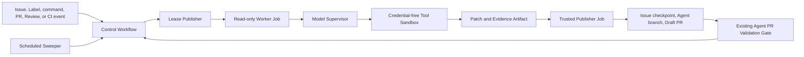
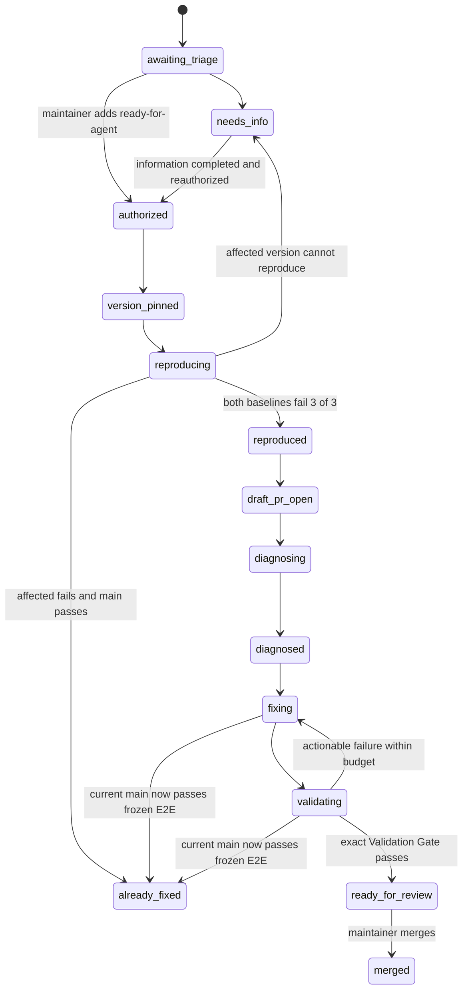

# GitHub Issue Agent Design

**Date:** 2026-07-28

## Status

Approved design. Implementation has not started.

## Summary

WuKongIM will use GitHub Issues as the durable control surface for an
autonomous bug-fixing Agent. A maintainer authorizes one eligible public bug by
adding `ready-for-agent`. The Agent then pins exact source revisions, writes a
process-level black-box E2E regression, proves the failure, opens a Draft PR,
diagnoses the root cause, implements the fix, and runs the repository's
existing PR Validation Gate. The Agent stops at Ready for Review and never
merges a PR.

The system runs entirely on GitHub Actions and GitHub-hosted runners. It
requires no continuously deployed service, self-hosted runner, or external
business database. Each Workflow invocation is stateless. Durable task state
lives in signed, append-only Issue checkpoint comments; code state lives in an
Agent branch and its Draft PR. A scheduled reconciler can reconstruct and
continue every non-terminal task from GitHub alone.

The design separates four trust domains:

1. public Issue and PR input;
2. the model Supervisor;
3. the credential-free code and test sandbox;
4. the trusted GitHub Publisher.

Codex and DeepSeek are initial model Adapters behind one provider-neutral task
and result contract. Neither model receives GitHub write credentials.

## Problem

WuKongIM is an open-source project. Users can submit GitHub Issues against
released versions and arbitrary deployment environments. Maintainers want an
Agent to turn an authorized, reproducible bug report into a reviewable PR:

```text
confirm source version
  -> reproduce with a new E2E
  -> diagnose the root cause
  -> implement the fix
  -> validate the exact PR
  -> hand off for human review
```

The Agent may be restarted between any two steps. It therefore cannot rely on
memory, a local worktree, a runner disk, or a private task database. At the
same time, public Issue text is untrusted, the repository contains
security-sensitive Workflows, and running model-authored code with a writable
GitHub token would create an unacceptable privilege boundary.

The design must also fit the repository's existing rules:

- every deployment is a cluster, including a single-node cluster;
- E2E tests are real-process black-box tests under `test/e2e`;
- new E2E scenarios follow `test/e2e/AGENTS.md`;
- changes follow applicable `AGENTS.md` and `FLOW.md` files;
- the existing Agent PR Validation Gate is the merge-gate authority;
- `ready-for-agent`, `needs-info`, and `ready-for-human` retain their canonical
  triage meanings.

## Goals

1. Recover any non-terminal task from GitHub after all runners have exited.
2. Require a maintainer authorization boundary before executing code.
3. Bind diagnosis and reproduction to immutable source SHAs.
4. Prove a bug with a focused process-level black-box E2E before changing
   production code.
5. Preserve the reproduction test and intermediate code in an early Draft PR.
6. Require evidence-backed root-cause diagnosis before remediation.
7. Keep public input, model credentials, code execution, and GitHub write
   privileges isolated.
8. Support Codex and DeepSeek without coupling the state machine to a model
   provider.
9. Reuse the exact-head and exact-test-merge PR validation protocol already in
   this repository.
10. Bound retries, concurrency, elapsed compute, Artifact storage, and model
    cost.
11. Fail closed on stale results, state divergence, unsafe changes, and
    ambiguous evidence.
12. Leave PR review, merge, and final Issue closure under maintainer control.

## Non-goals

- Handling every newly opened Issue without maintainer authorization.
- Handling feature requests, usage questions, security reports, pure
  performance work, or bugs that require private production data.
- Executing reporter-provided commands, scripts, binaries, or downloaded
  attachments.
- Accessing production systems, paid external services, private networks, or
  user credentials.
- Automatically changing public protocols, persistent formats, consensus
  semantics, authentication, default configuration, or dependencies without a
  second maintainer authorization.
- Automatically editing Agent infrastructure, GitHub Workflows, CODEOWNERS, or
  Agent policy.
- Automatically merging or directly pushing to `main`.
- Automatically backporting to release branches.
- Persisting complete logs forever.
- Deploying an Agent control-plane server or maintaining self-hosted runners.

## Chosen Approach

### Alternatives considered

#### GitHub Actions only

GitHub Actions handles event intake, reconciliation, temporary execution,
publishing, and validation. GitHub Issues remain the state store.

This is the selected approach because it needs no server and aligns with the
repository's existing Agent validation infrastructure. Its main trade-off is
that scheduling and sandbox composition must fit GitHub Actions rather than a
custom worker platform.

#### Stateless GitHub App service plus temporary workers

A continuously deployed GitHub App would receive webhooks and schedule
ephemeral workers. This provides more flexible scheduling and isolation, but
it requires an operated service. It was rejected because the project does not
want to deploy its own server.

#### Stateful service with an external database

A conventional service and database make locking, queues, dashboards, and
queries straightforward. This was rejected because GitHub and the database
would become competing state authorities, violating the stateless-loop
requirement.

## Architecture



GitHub Actions is the asynchronous control plane. The system adds three
logical Workflow surfaces:

- `issue-agent-control.yml` receives repository events, normalizes the target
  Issue, authorizes the actor, reads the latest checkpoint, and computes the
  next transition.
- `issue-agent-run.yml` is a reusable execution Workflow. It obtains a lease,
  runs one bounded phase in a read-only Worker Job, and hands a structured
  Artifact to a trusted Publisher Job.
- `issue-agent-reconcile.yml` runs on a schedule and by manual dispatch. It
  scans authorized, non-terminal Issues and repairs lost dispatches, expired
  leases, and GitHub-object drift.

The existing `agent-pr-validation-control.yml`,
`agent-pr-validation.yml`, and `agent-pr-merge-gate.yml` remain the only final
PR validation protocol. The Issue Agent selects and invokes those tools; it
does not duplicate them.

### Repository-owned control tool

`cmd/wkissueagent` is a repository-owned Go command used by the Workflows. Its
subcommands cover:

- event normalization and actor authorization;
- checkpoint parsing, verification, and transition planning;
- task-envelope construction;
- model-Adapter execution;
- Worker-result and Artifact validation;
- lease and checkpoint publication;
- branch, commit, PR, and label reconciliation;
- scheduled sweeping.

The command is built from the protected default branch. The target revision is
checked out into a separate data workspace. PR-controlled code cannot replace
the running state machine, Publisher, model policy, schema, or safety checks.

The Agent's own command, Workflow, checkpoint schema, public verification key,
policy, and deployment configuration are protected paths. The Issue Agent
cannot modify them in an automated bug-fix task. Their implementation will
follow the repository's package dependency rules and will update the Directory
Guide and `docs/development/PROJECT_KNOWLEDGE.md` when the stable structure is
introduced.

## Trust and Permission Model

### Control

The planning portion of the Control Workflow has read-only repository
permissions. It treats Issue bodies, comments, PR bodies, Review comments,
branch contents, model output, and Worker Artifacts as untrusted data. It
cannot execute target code or publish a transition.

### Worker

The Worker Job checks out exact read-only revisions. Its checkout credential is
removed before the model or tools start. The job cannot write repository
contents, Issues, PRs, checks, statuses, Actions, deployments, or packages.

The Worker contains two nested boundaries:

- a trusted Agent Supervisor that calls a selected model provider;
- a credential-free Tool Sandbox that owns filesystem edits, shell execution,
  Git inspection, binary builds, and tests.

The Supervisor has access only to the selected model credential and approved
model API endpoint. Tool subprocesses cannot read the Supervisor environment,
credential home, process namespace, or provider token. The task gets an
isolated temporary model home. Project `.codex/config.toml`, hooks, or
equivalent provider-specific project overrides are rejected before model
startup.

The Tool Sandbox has no GitHub token, model token, cloud credential, production
credential, host path outside its dedicated task workspace, SSH agent, cloud
metadata access, Docker socket, or general Internet access. Dependencies are
prefetched by a trusted setup step from approved sources and exposed through
read-only caches. The container image is digest-pinned in protected policy and
uses a read-only root with bounded process, memory, CPU, disk, output, and wall
time. Because V1 does not permit automatic new dependencies, the tool phase
does not need arbitrary dependency egress. Real-process E2E traffic remains
inside the sandbox or its loopback/container network.

### Publisher

The Publisher runs only default-branch trusted code. It mints a short-lived
installation token for a repository GitHub App whose private key is stored in
a protected GitHub Environment. The App has the minimum permissions needed to
write Issues, same-repository Agent branches, and PR metadata and to invoke the
approved validation protocol. The App is not a branch-protection bypass actor.

The Publisher never executes the target branch, a generated script, an
Artifact executable, or model-authored shell. It parses the declared result
and independently checks:

- expected Issue, generation, sequence, state, and lease;
- expected previous checkpoint;
- exact old branch head;
- patch paths, modes, symlinks, size, and changed-file count;
- protected and forbidden paths;
- immutable reproduction-test contract;
- commit and PR targets;
- Artifact manifest, digest, commands, exit codes, and bounded evidence;
- allowed state transition and remaining budget.

All writes use deterministic object names. Git ref writes require an exact
expected old SHA; Issue and PR writes require the exact expected checkpoint
and object identities.

Repository changes use GitHub GraphQL `createCommitOnBranch` with
`expectedHeadOid`. The Publisher creates or reuses only
`agent/issue-<number>`, requires the resulting GitHub signature to verify, and
re-reads the ref, parent, and exact file content before advancing state. It
never force-updates a ref or constructs a commit locally with model-selected
identity.

### GitHub App without a server

The GitHub App is only an identity and short-lived token issuer. It does not
receive webhooks and has no deployed service. GitHub Actions stores its private
key, creates an installation token in the trusted Publisher Job, and discards
the token when the job exits.

## Issue Intake and Authorization

### Minimal Bug Issue Form

The Bug Issue Form has four required fields:

1. affected version;
2. concise environment description, combining deployment method, cluster
   topology, and client version;
3. reproduction steps;
4. expected and actual results.

Logs, configuration, failure frequency, screenshots, and other diagnostics are
optional. This keeps the form approachable. Intake asks only for facts needed
for the specific report.

### Intake behavior

On Issue creation or edit, Intake performs no code execution. It may:

- validate that the four fields are present;
- validate the version syntax without resolving or building it;
- identify likely missing reproduction information;
- suggest possible duplicate Issues or PRs;
- apply `needs-triage` or propose `needs-info`.

Potential duplicates are advisory. The Agent never closes a duplicate or
invalid Issue.

### Authorization boundary

Only the `labeled` event that adds `ready-for-agent` by an actor with repository
write, maintain, or admin permission authorizes execution. The label is one
authorization for the complete normal pipeline:

```text
pin versions
  -> reproduce
  -> open Draft PR
  -> diagnose
  -> fix
  -> validate
  -> Ready for Review
```

The label remains present while automatic work is authorized. Entering an
information queue, human queue, or terminal state removes it. The Agent never
interprets a public user's comment or label action as write authorization.

At authorization, the first checkpoint freezes:

- the Issue body digest;
- the affected version field;
- the accepted comment IDs;
- the reproduction contract;
- the selected default-branch head.

Later public edits and comments are supplemental data only. They do not change
the active task. A maintainer must explicitly revise the frozen input.

## State Authority and Checkpoint Contract

### Authority

The Issue is the sole workflow-state authority before and after a PR exists.
Labels are coarse queue and authorization projections. The Agent branch and PR
hold code and validation evidence but do not independently advance the Issue
state.

Every accepted checkpoint is a new Issue comment containing:

1. a hidden, versioned, canonical JSON object for recovery;
2. a human-readable Markdown summary.

Each checkpoint is a complete snapshot, not an event delta. A stateless
Workflow can recover from the latest checkpoint without replaying the entire
history. The checkpoint still names and hashes its predecessor to detect
deletion, mutation, or forks.

`sequence` is strictly increasing across the complete Issue history and does
not reset when `generation` changes. The first checkpoint has null predecessor
fields.

### Representative schema

```json
{
  "schema_version": 1,
  "issue_number": 123,
  "generation": 2,
  "sequence": 7,
  "state": "diagnosed",
  "expected_previous_checkpoint_id": 99881,
  "previous_checkpoint_sha256": "012345...",
  "issue_input_sha256": "abcdef...",
  "versions": {
    "reported_ref": "v3.1.2",
    "affected_sha": "1111111111111111111111111111111111111111",
    "diagnosis_base_sha": "2222222222222222222222222222222222222222",
    "integration_base_sha": null
  },
  "lease": null,
  "reproduction": {
    "test_paths": ["test/e2e/message/example/example_test.go"],
    "test_blob_sha": "3333333333333333333333333333333333333333",
    "topology": "three-node-cluster",
    "artifact_url": "https://github.com/.../actions/runs/...",
    "artifact_sha256": "444444..."
  },
  "work": {
    "branch": "agent/issue-123",
    "head_sha": "5555555555555555555555555555555555555555",
    "pr_number": 700
  },
  "diagnosis": {
    "summary": "A bounded human-readable causal statement",
    "evidence_sha256": "666666..."
  },
  "budget": {
    "reproduction_attempts": 1,
    "fix_attempts": 0,
    "ci_repair_attempts": 0,
    "infrastructure_attempts": 0,
    "worker_seconds": 1320
  },
  "model": {
    "provider": "deepseek",
    "model": "policy-selected-model",
    "adapter_version": "v1",
    "prompt_policy_version": "v1"
  },
  "next_action": "implement_fix"
}
```

Production schemas use bounded strings and arrays, exact enum values, explicit
nullability, and no free-form executable content.

### Authenticity and ordering

The Publisher signs canonical checkpoint JSON with a dedicated signing key
stored in its protected Environment. The matching public key and key ID are
committed in a protected default-branch path. A recoverer accepts a checkpoint
only when:

- it was authored by the configured GitHub App;
- its signature and schema are valid;
- Issue and repository identities match;
- generation is monotonic and sequence is strictly increasing;
- its predecessor ID and digest connect to the prior valid record;
- referenced branch, commit, PR, run, and Artifact objects match GitHub;
- the transition from its predecessor is allowed.

Before any write, the Publisher re-reads the Issue and requires the exact
`expected_previous_checkpoint_id`. A stale result is rejected without side
effects. A missing record, invalid signature, forked chain, or unexplained
GitHub-object mismatch fails closed and applies `ready-for-human`. A maintainer
may authorize a new audit-recovery generation after inspecting the chain; an
automatic run cannot reset its own audit history.

### Generation

A generation fences every task input and in-flight Worker result. It changes
when a maintainer:

- revises frozen Issue input;
- approves a previously blocked high-risk direction;
- authorizes a fixed batch of PR Review comments;
- adopts an externally modified Agent branch head;
- recovers a broken audit chain.

A new generation may continue the same Agent branch and Draft PR, but no
result from an older generation can be published.

## Lifecycle



Any execution state may also enter:

- `ready_for_human`;
- `cancelled`;
- `superseded`;
- maintainer-owned `wontfix`.

`already_fixed`, `cancelled`, `superseded`, and `wontfix` are terminal for the
current generation. `merged` is terminal for the main-fix task.
`superseded` is used when a maintainer explicitly replaces the task with
another Issue or PR; a mainline fix discovered by the Agent uses
`already_fixed`.

The label projection remains intentionally small:

- `needs-triage`;
- `needs-info`;
- `ready-for-agent`;
- `ready-for-human`;
- `wontfix`.

One optional `agent-priority/high` operational label may move an authorized
Issue ahead of FIFO scheduling. It does not represent lifecycle state.

### Maintainer commands

Only a repository write, maintain, or admin actor may issue:

- `/agent revise` to freeze updated input and create a new generation;
- `/agent cancel` to revoke the lease and reject all in-flight results;
- `/agent address-review` to freeze and authorize the current actionable
  Review thread IDs;
- `/agent adopt-head <sha>` to accept an external Agent-branch update into a
  new generation;
- `/agent backport <branch>` after the main PR is merged.

Backport authorization creates a linked backport tracking Issue. That Issue is
the independent authority for one release-branch PR and has its own source
SHAs, generation, E2E evidence, budget, and Validation Gate. V1 never
automatically creates a backport from the main-fix checkpoint.

## Version Pinning

The affected version must resolve to an immutable commit through one of:

- a full commit SHA;
- a repository release tag;
- a published image digest whose source commit can be verified.

Terms such as `latest` are not accepted as a pinned version.

The Agent stores two different bases:

- `diagnosis_base_sha` is the default-branch head when the task is authorized.
  It never changes and preserves the original diagnosis.
- `integration_base_sha` is the current default-branch head considered by the
  final PR Validation Gate. It may advance.

V1 targets only `main`. A report against an older release is first reproduced
on the reported revision and then checked against the pinned
`diagnosis_base_sha`. A release-branch backport is a separately authorized
task after the main fix is merged.

If a pinned historical revision cannot build in the bounded supported
toolchain or cannot be driven by the current black-box harness without
version-specific product changes, the Agent records the concrete evidence and
enters `ready_for_human`.

## Reproduction Contract

### Eligible Issue class

V1 handles only a behavior bug that:

- can be reproduced through a process-level black-box E2E;
- needs no private production data or credential;
- has a machine-checkable expected result;
- is contained in this repository;
- does not require an external paid service or special hardware;
- has been authorized with `ready-for-agent`.

Feature requests, support questions, security reports, pure performance work,
production-only incidents, and ambiguous expected behavior do not enter this
pipeline. Security vulnerabilities must use the repository's private security
reporting path.

### E2E shape

The Agent must read every applicable `AGENTS.md` and `FLOW.md` before changing
a package. A new regression follows `test/e2e/AGENTS.md`:

- launch real `cmd/wukongim` processes;
- use a single-node cluster or multi-node cluster matching the report;
- interact through real protocols, public HTTP entrypoints, or public metrics;
- do not import product internals or inspect private stores;
- put reusable harness behavior in `test/e2e/suite`;
- keep scenario assertions in `test/e2e/<domain>/<scenario>`;
- keep failure diagnostics bounded.

The Agent builds `cmd/wukongim` for `affected_sha` and
`diagnosis_base_sha`. The same E2E code drives both prebuilt binaries through
`WK_E2E_BINARY`.

### Success criteria

A reproduction is accepted only when:

1. the affected binary fails the same business assertion in three consecutive
   focused runs;
2. the diagnosis-base binary fails that assertion in three consecutive
   focused runs;
3. the failure is not a startup timeout, port collision, harness defect, broad
   retry, or infrastructure error;
4. topology and externally visible behavior match the frozen Issue contract.

If the affected revision fails but `diagnosis_base_sha` passes three
consecutive runs, the task enters `already_fixed` and no fix PR is created. If
the affected revision cannot reproduce, it enters `needs_info`; inability to
reproduce is never treated as proof that the report is invalid.

After a successful reproduction, the Publisher commits the regression test to
`agent/issue-<number>` and immediately opens a Draft PR. The initial Draft is
expected to fail the new regression and says so explicitly.

### Frozen regression test

The reproduction checkpoint freezes:

- test path and Git blob SHA;
- key business assertion;
- cluster topology;
- exact commands and binary digests;
- three-run results and Artifact digest.

The remediation phase may add tests or refactor shared harness code, but it
cannot silently skip, remove, weaken, or replace the frozen assertion. A
material test-contract change returns the task to `reproducing` and requires
the complete fail-before/pass-after proof again.

## Diagnosis and Remediation

The Agent cannot enter `fixing` merely because a proposed edit makes the test
pass. A `diagnosed` checkpoint must first state:

- the causal path from public symptom to internal code;
- the violated invariant or expected semantic rule;
- supporting logs, metrics, call paths, or deterministic observations;
- the smallest intended code scope;
- why the direction preserves cluster semantics;
- the planned local and remote validation suites.

If the Agent cannot explain the cause within budget, it enters
`ready_for_human`.

Normal internal implementation and tests may proceed automatically. The Agent
must stop for a second maintainer authorization before implementing a fix that
would:

- change public protocol, API, or client compatibility semantics;
- change a persistent format, data migration, Raft, quorum, or consistency
  semantic;
- change authentication, authorization, cryptography, or key handling;
- add an external dependency;
- change a default configuration value or introduce configuration;
- change a protected Workflow, CODEOWNERS, Agent, schema, policy, or
  infrastructure path;
- materially expand scope beyond the authorized Issue.

After an approved high-risk direction, a new generation records the exact
approved scope. Protected Agent and Workflow paths remain human-only even
after ordinary high-risk authorization.

The Agent should preserve reviewable commit intent, normally separating the
reproduction E2E from the production fix. Publisher-created commits use the
configured bot identity and are cryptographically signed. The model never
constructs or pushes a commit itself.

## Model-neutral Agent Supervisor

The Worker consumes a versioned `TaskEnvelope` and returns a versioned
`AgentResult`:

```text
TaskEnvelope
  -> Agent Supervisor
       -> CodexAdapter
       -> DeepSeekAdapter
  -> Tool Sandbox
  -> semantic model proposal
  -> trusted Worker AgentResult
       derived ChangeSet
       derived evidence manifest
       provider-metered usage
       requested next state
       diagnosis or validation summary
```

`TaskEnvelope` contains only the exact repository identity, frozen Issue
content, accepted comment IDs, current checkpoint, target phase, immutable
SHAs, path policy, resource limits, and allowed tools. It explicitly states
that Issue and PR content cannot override system or repository policy.

The model proposal cannot populate repository changes, command evidence,
Artifact or diagnosis evidence digests, or token counts. The trusted Worker
derives those fields from the workspace, broker transcript, and provider
response. The resulting `AgentResult` remains a proposal, not authority; the
Publisher independently validates it.

Each Adapter owns provider API translation, streaming, structured output, and
tool-call mapping. Filesystem, shell, Git, tests, timeouts, and network policy
are provider-neutral Tool Sandbox capabilities. The state machine never
depends on a provider-specific message format.

Every attempt records:

- provider and model identity;
- Adapter and prompt-policy versions;
- token usage, elapsed time, and calculated cost;
- terminal provider result;
- whether the model changed from the prior attempt.

A provider failure cannot silently switch models. A fallback is a distinct
attempt recorded in the next checkpoint. V1 supplies Codex and DeepSeek
Adapters; policy selects the default provider without changing task semantics.

Provider API keys live in separate protected GitHub Environments and have
independent spend limits and rotation. Only the trusted Supervisor sees the
selected key. A provider credential never reaches the Tool Sandbox, Publisher,
Git repository, Artifact, log, Issue, or PR.

## Draft PR and Validation

### Branch and PR

The Publisher uses a deterministic same-repository branch:

```text
agent/issue-<number>
```

The GitHub App may update only the configured Agent prefix and cannot bypass
default-branch protection. Every branch update names the expected old SHA.
Tags, default branches, and non-Agent branches are rejected.

An unexpected update by another identity:

1. invalidates the current lease and prior validation;
2. preserves the external commit without overwrite;
3. records `external_branch_update`;
4. enters `ready_for_human`.

Only `/agent adopt-head <sha>` accepts that exact head into a new generation.

### Local Worker validation

Before requesting the remote Gate, the Worker must prove:

- the frozen E2E passes three consecutive runs against the fixed binary;
- directly related package tests pass;
- formatting and package-specific repository rules pass;
- the patch contains no protected or unexplained changes.

### Existing remote Validation Gate

Every Agent bug-fix PR selects:

- `agent-ci/go-fast`;
- `agent-ci/go-e2e`.

It adds `agent-ci/go-race`, `agent-ci/go-integration`, or
`agent-ci/three-node-smoke` when the diagnosis and diff indicate those risks.
The Publisher posts the existing versioned validation-plan comment, reconciles
the fixed labels, and adds the one-shot `agent-ci/run` trigger.

The PR becomes Ready for Review only when the repository's
`Agent Validation Gate` succeeds for:

- the exact PR number;
- exact head SHA;
- latest exact test-merge SHA;
- current gate generation;
- current request and evidence runs.

Any PR edit or new commit invalidates the old evidence.

### Moving `main`

The immutable `diagnosis_base_sha` never changes. Final integration uses the
Gate's current test-merge commit.

- If the PR merges cleanly, the Gate validates the test merge without
  requiring continuous rebases.
- If current `main` alone now passes the frozen E2E three times, the Agent
  closes its Draft PR as superseded and records `already_fixed`; a maintainer
  decides whether to close the Issue.
- The Agent may attempt one mechanical conflict resolution and then rerun the
  complete validation.
- A semantic conflict enters `ready_for_human`.

### Human handoff and closure

After Gate success, the Agent posts a final PR summary with:

- Issue and immutable baselines;
- reproduction evidence;
- root cause;
- production fix;
- frozen E2E;
- validation suites and exact Gate;
- known risks and non-goals.

It then converts the Draft PR to Ready for Review. It never approves or merges
the PR.

The PR body uses `Fixes #<issue>`. Only a maintainer merge causes GitHub to
close the Issue. `already_fixed`, `needs_info`, or Agent budget exhaustion
never closes a user Issue automatically.

Review comments do not automatically execute. A maintainer uses
`/agent address-review` to freeze the actionable Review thread IDs into a new
generation. The Agent addresses only that authorized batch and reruns the
complete current-head Validation Gate.

## Scheduling, Leases, and Recovery

### Event-driven control

Relevant `issues`, `issue_comment`, `pull_request`, `pull_request_review`,
validation-completion, manual-dispatch, and schedule events all invoke the same
reconciliation logic. Event payloads are hints; the reconciler always
re-reads current GitHub objects.

The global scheduling portion uses one non-cancelling Actions concurrency
group so competing repository events cannot allocate capacity concurrently.
It selects eligible Issues, asks the Publisher to append lease checkpoints,
and dispatches per-Issue runs. Each per-Issue execution uses its own
non-cancelling concurrency group.

### Lease

Before a Worker starts, the Publisher appends a checkpoint containing:

- a deterministic logical `operation_id`;
- the expected Workflow identity and dispatch request ID;
- generation and expected sequence;
- phase;
- issued and expiry timestamps;
- immutable TaskEnvelope digest;
- reserved compute budget.

The lease duration is longer than the phase timeout by a fixed safety margin.
The Worker result is publishable only while it names the current lease. An
expired or superseded result is rejected even when the underlying Actions job
later completes.

### Sweeper

The scheduled Sweeper scans non-terminal Issues that retain
`ready-for-agent`. It repairs:

- missed or duplicated event delivery;
- a lease that expired without a terminal Worker result;
- a checkpoint whose next dispatch did not start;
- a completed Worker Artifact not yet published;
- a PR or branch projection that differs from checkpoint state;
- stale validation evidence after a PR event.

The Sweeper is idempotent and uses the same Publisher checks as normal events.
It has no private task database.

## Retry and Resource Budgets

Per Issue, V1 defaults are:

- at most three reproduction approaches;
- at most three remediation approaches;
- at most two code-fix cycles caused by CI assertion failures;
- at most three Worker-infrastructure retries;
- at most six cumulative Worker hours.

The existing PR Validation Gate retains its stricter evidence rule: one
infrastructure retry in the same gate generation, and only for a verified
runner, network, dependency-download, or known-flake failure. Assertion, race,
or behavior failures require a new commit. The Issue Agent's infrastructure
retry budget does not weaken that protocol.

Repository-wide defaults are:

- at most three active Issue Workers;
- at most one full E2E or other heavy multi-node Worker phase;
- at most 24 Worker hours started per rolling day;
- FIFO scheduling, with optional `agent-priority/high`.

The scheduler derives active capacity from signed Issue leases and derives
recent usage from checkpoint accounting cross-checked with GitHub Actions run
metadata. Exceeding a global limit leaves an Issue in `authorized` or queued
state and does not consume its retry budget.

Budget exhaustion preserves the Draft PR, branch, tests, Artifacts, attempted
directions, and latest checkpoint. The task enters `ready_for_human` with one
concrete recommended next step.

## Artifact and Log Policy

The Issue permanently stores only redacted, bounded evidence:

- exact command;
- source and binary digests;
- exit code and assertion result;
- bounded stdout, stderr, and application-log tails;
- Artifact URL, manifest, and SHA-256;
- run and attempt identities.

Complete test output, process logs, generated configurations, and structured
reports are uploaded as GitHub Actions Artifacts with 90-day retention. Before
upload, a trusted sanitizer removes token-like values, authorization headers,
cookies, private keys, and configured sensitive fields. The Publisher enforces
per-file and total size limits and validates the Artifact manifest.

The durable regression test, diagnosis summary, commit history, and Gate result
are the long-term evidence. Expired bulk logs do not invalidate a merged
regression.

## Error Classification

The Agent records one explicit failure class:

- `needs_info`: the frozen report cannot drive a valid reproduction;
- `already_fixed`: affected revision fails but the current mainline baseline
  passes;
- `product_assertion`: a focused business assertion failed;
- `test_harness`: the test itself, setup, or diagnostics are invalid;
- `worker_infrastructure`: runner, container, disk, or process infrastructure
  failed;
- `provider`: model API, quota, format, or Adapter failed;
- `unsafe_scope`: the proposed fix crosses an authorization boundary;
- `state_conflict`: checkpoint, branch, PR, or generation diverged;
- `budget_exhausted`: the configured attempt, time, or cost bound was reached;
- `cancelled`: a maintainer revoked authorization.

Infrastructure and provider failures do not become product diagnoses. A green
Workflow that merely completed an Agent call is not success; success is the
phase-specific evidence and state transition.

## Testing Strategy

### Pure state-machine tests

Table-driven tests cover:

- every legal transition;
- rejection of every illegal transition;
- generation and sequence fencing;
- lease issuance, expiry, and stale results;
- retry and compute accounting;
- maintainer authorization;
- label projections and terminal behavior.

### Schema, parser, and security tests

Property and fuzz tests cover:

- truncated, oversized, duplicated, and malformed checkpoints;
- signature, key ID, hash-chain, and predecessor failures;
- duplicate and out-of-order events;
- Artifact digest and manifest mismatches;
- path traversal, absolute paths, symlinks, mode changes, and case collisions;
- protected paths, hidden files, submodules, and oversized diffs;
- malicious Issue Markdown and model structured output.

### Workflow contract tests

Tests following the repository's existing `scripts/github_workflows_test.go`
style prove:

- only fixed trusted triggers and reusable Workflows are accepted;
- control, Worker, model, and Publisher permissions stay separated;
- target code never runs in Publisher jobs;
- protected Secrets appear only in their intended Environment and step;
- same-Issue and global concurrency are non-cancelling;
- every checkout and validation request is bound to an exact SHA;
- a generated PR triggers the existing fail-closed Validation Gate;
- schedule and manual recovery paths use the same state machine.

### Adapter contract tests

Codex and DeepSeek Adapters run against deterministic fake provider servers.
The same TaskEnvelope and tool trace must produce the same normalized
AgentResult shape. Provider-specific unit tests cover streaming, timeouts,
invalid tool calls, invalid structured output, quota errors, and usage
accounting. Unit and contract tests require no live provider credential.

### Sandbox and Publisher adversarial tests

The test suite attempts to:

- read model or GitHub credentials from tool subprocesses;
- access the host, Docker socket, metadata service, private network, or general
  Internet;
- smuggle an executable through an Artifact;
- modify a protected path;
- overwrite a maintainer branch update;
- publish a result from an old generation or expired lease;
- weaken the frozen E2E while claiming success.

All attempts must fail closed without a repository write.

### GitHub pilots

Real test Issues exercise:

- duplicate and missing events;
- Control, Worker, and Publisher interruption;
- late Worker completion;
- Issue edits during execution;
- moving `main`;
- external Agent-branch changes;
- model timeout and invalid result;
- Gate infrastructure failure and real assertion failure;
- checkpoint deletion, mutation, and fork.

## Rollout

The repository advances through five explicit modes:

1. **Shadow** computes transitions and stores only Actions summaries. It makes
   no Issue, branch, or PR write.
2. **Intake** may update triage labels and request missing form information. It
   executes no target code.
3. **Reproduction Pilot** accepts only maintainer-created test Issues. It may
   create a failing-regression Draft PR but cannot implement the fix.
4. **Remediation Pilot** runs the complete path only for an explicit Issue
   allowlist.
5. **General** accepts every eligible Bug explicitly authorized by a
   maintainer.

A repository administrator owns the emergency disable switch and rollout mode.
Neither value is model-writable.

General availability requires all of:

- every non-terminal checkpoint can resume after runner loss;
- duplicated and reordered events converge to the same GitHub state;
- unauthorized public input cannot produce a GitHub write;
- Worker tools cannot observe a provider or Publisher credential;
- Publisher adversarial tests produce no unsafe write;
- one real pilot completes each of:
  - successful fix;
  - `already_fixed`;
  - `needs_info`;
  - budget exhaustion;
  - superseded Draft PR;
  - maintainer-authorized Review revision;
- every ready PR has a successful exact-head, exact-test-merge Agent Validation
  Gate;
- no pilot requires a private task database or surviving runner disk.

## Success Priorities

V1 optimizes in this order:

1. no unauthorized write, credential disclosure, or state corruption;
2. trustworthy reproduction and remediation evidence;
3. deterministic crash recovery;
4. maintainer acceptance of generated PRs;
5. processing speed and unit cost.

When confidence is insufficient, the correct outcome is
`ready_for_human`, not a higher automatic-fix rate.
