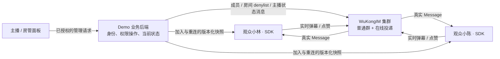

# 小悟新品发布会 · 直播弹幕 Demo 设计

2026-10-02 · 基于本地 main `992321e6713dad54a3bf3def84c81ec6344b138a`。
用户已确认本文的完整范围与实施合同。现有 MQTT Demo 已合并到该 main；直播 Demo 在独立工作树实现。

## 已确认的范围

| 决策 | 用户选择 |
| --- | --- |
| 目标 | 开发者通过完整业务场景理解接入方式 |
| 场景 | 新品发布会直播间 |
| 演示画面 | 内置新品介绍画面；弹幕与互动经过真实 WuKongIM |
| 初版互动 | 文本弹幕、点赞、主播置顶公告、房间内单观众禁言与解除 |
| 多端体验 | 观众直播间与主播管理同屏；可打开第二位独立观众标签页；手机切换角色 |
| 重连 | 从当前直播继续，不补播旧弹幕；恢复当前公告、禁言和待确认状态 |

首版围绕上述闭环，不增加推流/转码/RTC、付费礼物、抽奖、回放弹幕、全员禁言或消息撤回。点赞表现为即时浮心和“某观众点赞了”，不显示全场累计点赞数。没有规模压测或跨物理设备访问的承诺。

## 一分钟体验

1. **进入发布会。** 首屏是一张深色舞台和新品介绍，明确标注“演示画面”。点击“进入直播间”，准备当前房间、观众小林及主播身份；成员准备、SDK 连接和当前快照恢复完成后，输入框才可用。
2. **发送第一条弹幕。** 小林输入“期待实机演示”。发送中显示待确认，成功 ACK 后本人页面展示一次。其他观众通过真实 SDK Message 展示消息；自己的动画不作为他人收到的证明。
3. **第二位观众加入。** 点击“打开第二位观众”，新标签页以小陈的新 UID/Token 加入同一房间。两页互发弹幕、点击点赞，直接看到另一端收到的内容。
4. **主播发布公告。** 同屏主播面板发布“演示结束后开放提问”。公告固定在舞台上方；当前观众通过 WuKongIM 状态消息更新，新加入和重连观众从当前快照恢复。
5. **房管维持秩序。** 在管理面板选择小陈，禁言后小陈不能发送弹幕或点赞，仍能收到直播间消息；小林不受影响。小陈刷新后仍受限。解除禁言后恢复互动。
6. **继续当前直播。** 小陈断开连接，小林继续发言、主播更新公告。小陈重连只恢复最新公告和权限，舞台不会突然播放离线期间的旧弹幕。

上述示例文案由体验者发送。初版不自动生成观众消息，也不虚构在线人数。

## 页面布局

桌面沿用 Demo 的米白、深绿外壳，舞台使用深色。约三分之二宽度为发布会舞台，右侧为现场聊天与紧凑的主播管理面板。

```text
┌───────────────────────────────────────────────────────────────┐
│ WuKongIM · 小悟新品发布会        返回首页  连接状态  接入说明    │
├─────────────────────────────────────────┬─────────────────────┤
│ 当前公告：演示结束后开放提问             │ 现场聊天 · 小林     │
│                                         │ 小陈：期待实机演示  │
│          内置新品介绍画面                │ [输入弹幕] [发送]   │
│       ← 此刻收到的真实弹幕               │ [点赞]              │
│                                         ├─────────────────────┤
│ [开关弹幕] [打开第二位观众]              │ 小悟 · 主播管理     │
│                                         │ [公告] [发布]       │
│                                         │ 小陈 [禁言/解除]    │
├─────────────────────────────────────────┴─────────────────────┤
│ ▸ 接入示例与实际连接参数         ▸ 有界事件记录                │
└───────────────────────────────────────────────────────────────┘
```

手机默认“观众”标签：舞台、当前公告、聊天与输入；“主播/房管”标签显示公告编辑和演示观众管理。切换标签只改变界面，不改变身份或权限。输入区不被不断增长的聊天记录推离屏幕。支持键盘操作、关闭弹幕和系统减少动态效果；关闭动画仍接收聊天。

舞台使用内置三段新品介绍（外观、特点、现场提问），由简单画面轮播提供背景。画面不承担媒体传输功能，也不与弹幕绑定回放时间轴。连接参数、频道类型和原始事件放在折叠的接入说明中。

## 角色与身份

- 每个观众标签页拥有不同 UID、Token 和业务恢复凭据。刷新恢复该页原身份；打开“第二位观众”明确创建新身份，不复制第一位观众或主播凭据。
- 创建者页面获得自己的观众身份及房间管理凭据。主播是另外一个真实产品 UID，并作为群成员准备；管理面板通过受信任 Demo 后端操作，状态通知使用该主播 UID 发送。
- 观众邀请 URL 只携带房间/观众邀请信息，不携带 Token 或管理凭据；观众加入接口不能选择管理角色。角色由后端确定，Payload 声称的 `role` 不产生权限。
- 管理动作校验管理会话、房间和目标观众；目标必须是当前 Demo 房间登记的观众。日志、URL、原型状态面板不显示真实凭据。
- 名单标注“演示观众/已加入”，不把群成员数解释为在线人数。临时断线保留成员及身份；显式离开、房间结束或过期才清理。

## 实际消息接入

使用固定 `easyjssdk@2.0.5`，浏览器直接连接现有 wsmux WebSocket。采用 **普通群 Channel type 2** 管理房间成员与权限，不把仅有枚举的 Live type 9 当作完整的直播房间实现。受信任后端通过既有成员接口入房；SDK SUB 不是本项目当前的入房机制。



业务载荷保留普通聊天可读的 `type:1, content`，扩展放在 `live_demo` 中：

```json
{
  "type": 1,
  "content": "期待实机演示",
  "live_demo": {
    "kind": "barrage",
    "roomId": "room-uuid",
    "eventId": "uuid"
  }
}
```

| 消息 | 发布来源 | 接收与恢复规则 |
| --- | --- | --- |
| `barrage` | 观众 SDK；`noPersist=true, syncOnce=false` | 此刻在线接收；不存历史、不补离线弹幕 |
| `like` | 观众 SDK；相同瞬时标志 | 收到后展示该观众的浮心；无整场累计数 |
| `room_state` | 后端以授权主播 UID 发送，带 `roomVersion`、当前公告及禁言/待确认状态 | 在线通知走 WuKongIM；加入/重连通过后端快照恢复最新状态 |

接收端检查真实 Channel、房间、发送方及 Schema。公告/权限状态只接受当前房间授权主播的真实 `from_uid`；不相信正文里的发送者或角色。消息去重使用 `(roomId, from_uid, kind, eventId)` 与可用的原始字符串 MessageID，保留有界缓存；控制操作使用 UUID，不依赖 JavaScript 数值解析保持 HTTP int64 MessageID 精度。

EasySDK 会强制 `redDot=true`，设计不宣称其能发出 `redDot=false`。本 Demo 不展示聊天未读红点；服务端 NoPersist 路径不会创建普通持久历史。后端状态通知使用 Product HTTP 的 `header.red_dot=0`。

发送中断或超时且已可能写入网络时显示“发送结果未知”，保留输入和原 `eventId/clientMsgNo`；明确拒绝则显示实际拒绝。允许手动重试原消息，接收端有界去重，不自动重发，不承诺瞬时消息 exactly-once。本人 ACK 后的本地展示与另一观众实际收到分别记录。

## 公告与禁言的一致性

Demo 后端是本场 Demo 管理操作和当前快照的拥有者；产品集群负责真实权限与消息投递。公告不通过普通历史向新观众补拉，避免依赖入房前不可见的历史。

1. 每房间的管理动作串行、有界；每次请求携带 `requestId`，同一操作重试保持原请求。每个公开快照版本拥有独立、稳定的通知 UUID，兼作状态事件编号和通知发送的 client_msg_no；待确认与最终确认快照不会共用同一个事件编号。
2. 单观众禁言使用该群的 blacklist/denylist add/remove；保留群成员，使该观众继续接收。它同时限制弹幕和点赞。不用全局 User Send Ban 表示房间禁言，也不加入限制主播的全频道禁发。
3. 黑名单接口没有 Product HTTP 读取路由或政策 CAS 版本。产品写入超时时保留“待确认”操作，重试同一 add/remove 直至确认；不能把本地旧状态当成产品事实，不能先执行相反操作。自动尝试有上限，之后由“重试操作”继续收敛。
4. 所有对客户端可见的快照变化都递增 `roomVersion`，包括公告、加入/离开名单、待确认操作的建立/清除以及已确认禁言值。产品结果尚不确定时保留上一确认值，单独标注 `pending`；确认后再更新该值。以主播 UID 通过真实 WuKongIM 广播最新完整快照，名单变化也同步到已有管理面板。`roomVersion` 只是 Demo 业务版本，不是产品黑名单政策版本。
5. 状态保存与广播不是原子操作。广播结果不确定时保留原通知用于有界重试，管理面板显示“状态已更新，通知待确认”；重复/旧版本不会回滚接收端。加入和重连仍可读取最新快照。通知待确认不阻止新的控制操作；新的完整快照可替代旧通知。通知发送进度属于管理请求结果，不放入 `room_state`，不通过自身确认反复递增版本、触发广播。
6. 客户端先安装监听、缓冲状态通知，再恢复快照；只应用较新版本，合并缓冲通知后才开放输入。重连重复此过程。待确认权限使目标观众暂不可发言，但仍可收消息。
7. 如果实际发送被产品权限拒绝，页面重新同步当前快照；仍不一致时保留“服务端拒绝，权限待确认”，不根据旧快照重新开放输入或自动解除产品限制。当前 Demo 之外的管理写入不冒充已被该后端完整观测。

状态通知使用当前 Product HTTP 合同：

```text
POST /message/send
Content-Type: application/json
from_uid = 已登记的主播 UID
channel_id / channel_type = 房间 / 2
client_msg_no = 控制事件的稳定 UUID
payload = Base64(UTF-8 JSON)
header = {no_persist:1, sync_once:0, red_dot:0}
```

HTTP 200 还须检查业务 `reason=1`。这些产品管理路由由受信任业务后端使用；浏览器只访问其角色授权接口。首版不增加 Manager JWT 依赖或新的产品权限路由。

## 生命周期与资源上限

暂定实现上限，以验收结果调整而不扩大能力承诺：每进程 8 个房间，每房间最多 16 个演示观众；每房间 8 个排队管理动作、64 个管理幂等结果及一条待确认管理操作；闲置一小时结束。活跃页面使用低频业务续期，不轮询弹幕/聊天。

每客户端保留 100 条聊天、512 个去重项、100 条事件记录；桌面最多 4 条弹幕轨道、12 条同时可见、30 条待播。超过舞台容量丢弃旧动画，聊天仍在自身边界内展示；后台页面清空待播动画，返回页面继续当前直播。点赞动效有并发上限和短时合并，不堆积定时器。

每观众文本输入限 120 字，单份业务正文上限 4 KiB；前端限制交互频率，后端限制加入、管理请求、正文、并发与 Origin/Host。前端频率提示是体验约束，不宣称其能阻止恶意客户端；大群业务接入应配置产品既有网关和业务限流，复用既有集群在线 fanout，不增加全员扫描或无界后台队列。

SDK 自带的有限退避后提供手动重连；不无限后台重试。清理监听、连接、动画和续期定时器；显式离开/结束/过期移除已登记成员，失败保持有界待清理记录。业务状态在 Demo 后端内存，后端重启后旧恢复凭据明确失效，创建新演示，不冒充已恢复旧房间。

禁言结果待确认时，该目标观众的离开请求明确返回 `operation_pending`，先确认原权限操作再离开，避免快照引用已删除的目标。主播结束整个房间仍可清理该状态。这是有界演示后端在缺少产品政策 CAS/读取接口时的收敛约束。

## 仓库集成与实施顺序

- 新增 `demo/livedemo/`，入口 `/livedemo/`，前端资源构建到 `internal/access/api/demoui/livedist/`；后端为独立 loopback Node 进程。接入一键启动器、动态端口、首页第六个场景、返回首页与进程清理。
- 后端只提供创建/加入/恢复、当前状态、主播公告、房间禁言/解除及离开。观众弹幕和点赞直接通过 SDK。业务角色和房间状态不进入 Product API 静态资源处理器。
- 保持已有 wsmux/MQTT 配置及单节点集群语义，按 256 hash slots 验收。基础场景不需要修改核心消息语义。
- 先写失败清单与真实进程/浏览器验收场景，再实现后端合同、前端、嵌入和启动器；更新 README、Unreleased、PROJECT_KNOWLEDGE 与受影响 FLOW。适用命名检查按仓库权威策略运行。

## 验收标准

| 场景 | 可验证结果 |
| --- | --- |
| 两观众互通 | 独立 UID 的真实 SDK 接收、消息事件与 DOM 对应；ACK/本人动画不充当 fanout 证明 |
| 点赞 | 对方收到真实消息后有即时互动；无虚构累计或在线人数 |
| 公告与晚加入 | 主播授权有效；新观众拿到当前公告；伪造角色/主播正文不更新状态 |
| 房间禁言 | 小陈文本及点赞实际被产品拒绝，继续接收；刷新仍受限；解除后可发送；不影响小林和另一房间 |
| 快照竞态 | 快照获取期间更新公告、禁言/解除；旧快照及旧广播不覆盖新状态 |
| 不确定控制结果 | 截断真实产品响应；同一 add/remove 待确认并重试收敛，相反操作不越过它 |
| 状态广播失败 | 当前状态可查询，通知可补发，重连恢复；不把保存等同于全员收到 |
| 断线发送与重连 | 未知结果明确；无重发风暴；不补旧弹幕，恢复当前公告/权限 |
| 非法消息与输入 | 用真实客户端发送恶意/缺字段正文，不能 XSS、越权或引发错误公告 |
| 有界展示 | 真实消息突发下轨道、队列、DOM、缓存有上限；减少动画仍能阅读聊天 |
| 交付入口 | 第六场景、内嵌资源、移动布局、返回首页、后端错误、端口冲突与全部 owned 进程清理 |

产物保存 `report.json`、实际接收事件、消息关联、截图、源码/指令摘要和候选二进制 SHA256。设计阶段已走查原型的纯状态模块。真实集群与浏览器的验收由 `demo/livedemo/test/live.integration.mjs` 执行；通过记录只以该次运行的报告为准。

## 确认与可复查依据

用户已确认：开发者接入目标、新品发布会场景、内置画面、四项初版互动、同屏双角色及独立第二观众、重连继续当前直播。完整设计获确认后进入实施；常规排版、文案与有界容量调优属于该授权范围。

可复查入口：

- [运行与合同](../../../demo/livedemo/README.md)
- [先行失败清单](../../../demo/livedemo/test/failure-inventory.md)
- [真实进程与浏览器验收](../../../demo/livedemo/test/live.integration.mjs)
- [业务后端](../../../demo/livedemo/server.mjs)
- [前端](../../../demo/livedemo/src/main.ts)

原型只用于设计走查，不复用为生产状态实现；测试证据保存在每次运行指定的忽略目录。
