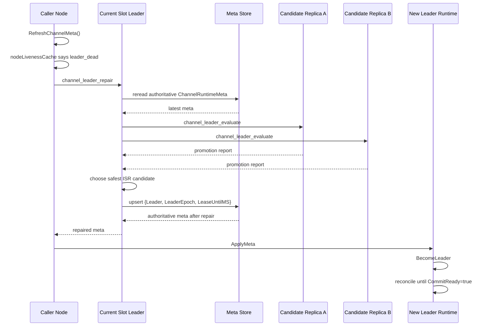

# Channel Leader Repair And Reconcile

## 一句话结论

现在的 channel leader 不会因为 slot leader 变化而自动漂移。

只有当 `RefreshChannelMeta()` 读到的权威 `ChannelRuntimeMeta` 已经出现异常时，当前 slot leader 才会发起一次**权威 leader repair**，持久化新的 `ChannelRuntimeMeta.Leader`。而在 repair 完成后，新 leader 仍然需要按 `pkg/channel` 的正常流程做 reconcile，`CommitReady=true` 之前依旧可能返回 `ErrNotReady`。

## 先记住三个边界

1. **slot leader 变化 ≠ channel leader 变化**
2. **权威 repair ≠ runtime reconcile**
3. **新 leader 被持久化了 ≠ 已经立刻可写**

## 1. 哪些路径会触发 refresh

当前有三条常见路径会走到 refresh：

- 业务发送路径：`sendWithMetaRefreshRetry()` 在 `ErrStaleMeta` / `ErrNotLeader` / `ErrRerouted` 时触发
- 热 slot watcher：slot leader 变化后，`channelMetaSync` 只刷新当前节点已激活的本地 channel
- 显式激活/刷新：`RefreshChannelMeta()` / `refreshAuthoritativeByKey()`

这些路径最终都会：

1. 读取权威 `ChannelRuntimeMeta`
2. 仅在**当前 channel leader 就是本节点**时尝试续租 lease
3. 检查本地 `nodeLivenessCache`
4. 如有必要，再触发权威 leader repair
5. 把最终权威结果 apply 到本地 runtime

## 2. 什么时候才会判断需要 repair

不是每次 refresh 都改 leader。

当前只在下面几种情况进入 repair：

- `leader_missing`：`ChannelRuntimeMeta.Leader == 0`
- `leader_not_replica`：leader 已经不在 `Replicas` 里
- `leader_dead`：本地 liveness cache 认为 leader 已 dead
- `leader_draining`：本地 liveness cache 认为 leader 已 draining

另外还有两个前提：

- channel 必须仍然是 `StatusActive`
- refresh 只读取**本地缓存**的 node liveness，不会每次发消息都直连 controller 查活性

## 3. node liveness cache 从哪来

`RefreshChannelMeta()` 的热路径不会自己去查 controller。

它依赖 `channelMetaSync.nodeLiveness` 这份本地缓存，缓存来源统一走 cluster observer hook：

```text
nodeHealthScheduler / observation delta
-> ObserverHooks.OnNodeStatusChange(...)
-> app.channelMetaSync.UpdateNodeLiveness(...)
```

需要注意的是：

- controller leader：可以直接在 committed `NodeStatusUpdate` 后收到这个 hook
- 非 controller 副本节点：依赖 `SyncObservationDelta()` 的 `delta.Nodes` diff

但对 app 层来说，最终只消费 `OnNodeStatusChange(...)` 这一条统一入口。

## 4. 谁来做权威 repair

**只有当前 slot leader 能做权威 repair。**

如果当前节点不是 slot leader，它不会本地改 `ChannelRuntimeMeta`，而是通过节点间 RPC：

- `channel_leader_repair`

把 repair 请求转发给当前 slot leader。

slot leader 收到请求后，不会盲信调用方传来的旧视图，而是会：

1. 先重新读取最新权威 `ChannelRuntimeMeta`
2. 再判断这次 repair 是否仍然必要
3. persist 新 leader 时只允许**当前本地 slot leader**提案；不会把旧 slot leader 算出来的 repair 结果 forward 给远端代提交
4. 如果 repair 过程中 slot leadership 已翻转，则会重新路由到新的 slot leader 重新执行
5. 如果问题已经被别人修好，则直接返回最新权威 meta，不重复改 leader

## 5. 新 leader 是怎么选出来的

### 候选范围

新 leader **只能从持久化的 `ISR` 中选择**。

这点很关键：不能因为某个副本“看起来活着”就把它提上来，更不能把有旧数据的 stale replica 选成新 leader。

另外：

- 如果 repair reason 是 `leader_dead` 或 `leader_draining`
- 那么旧 leader 会直接从候选里跳过

### 候选评估

slot leader 不会凭空猜哪个副本最新，而是让每个候选副本在本机做一次 dry-run promotion 评估：

- RPC：`channel_leader_evaluate`
- 输入：当前权威 `ChannelRuntimeMeta`
- 执行节点：候选副本自己所在节点

候选副本会读取自己的 durable state：

- `EpochHistory`
- `LEO`
- `CheckpointHW`
- `OffsetEpoch`

如果还需要 peer proof，会再通过同步 `ProbeClient` 复用 `ReconcileProbe` RPC 向其他 ISR 副本取证：

- 外部探测允许 `Generation=0`
- 服务端返回当前 generation
- 这样即使 app 层不知道远端 runtime 的 generation，也能拿到 proof

### 评估目标

评估不是在比“谁的 LEO 最大”，而是在比：

- 谁能证明更大的 quorum-safe prefix
- 谁需要截断得更少
- 谁能更快达到 `CommitReady`

最终排序优先级是：

1. `CanLead`
2. `ProjectedSafeHW`
3. `ProjectedTruncateTo`
4. `CommitReadyNow`
5. `LocalCheckpointHW`
6. `NodeID` 更小者优先

所以：

- 尾巴更长但不安全的副本，会被淘汰
- 已经落后到低于安全前缀的副本，也不能接任

## 6. repair 具体会持久化什么

repair 不会像旧逻辑那样把 slot 拓扑整份重新投影到 channel meta。

当前权威 repair 只持久化这三项：

- `Leader`
- `LeaderEpoch`（递增）
- `LeaseUntilMS`

它**不会**顺手重写：

- `Replicas`
- `ISR`
- `MinISR`

这意味着：

- slot leader 变化本身不会导致 healthy channel leader 漂移
- channel 拓扑和 leader repair 的职责被明确拆开了

## 7. repair 之后还会发生什么

权威 meta 持久化成功后，refresh 路径会重新读取最新结果并 apply 到本地 runtime。

接着会出现两段不同语义的动作：

### 阶段 A：角色切换

- 旧 leader 收到新 meta 后降为 follower
- 已经挂起的 append 会以 `ErrNotLeader` 失败
- 新 leader 执行 `BecomeLeader`

### 阶段 B：runtime reconcile

新 leader 虽然已经被持久化，但如果还没有证明自己的日志尾巴是 quorum-safe，它仍会保持：

- `CommitReady=false`

这时 append 仍可能返回：

- `ErrNotReady`

直到它完成本地或远端 proof reconcile，才会恢复为真正可写。

## 8. slot leader 变化现在到底会怎样

现在 slot leader 变化后的流程是：

```text
cluster observer 发现 slot leader change
-> channelMetaSync.scheduleSlotLeaderRefresh(slot)
-> 只刷新当前节点该 slot 下已激活的 channel
-> reread authoritative ChannelRuntimeMeta
-> apply 到本地 runtime
```

这些后台 refresh worker 也绑定 `channelMetaSync` 生命周期：`Stop()` 会先 cancel 并等待它们退出，再做本地 runtime cleanup，避免停机过程中又把刚删掉的 runtime 重新 apply 回来。

如果 reread 到的权威 meta 本身仍然健康，那么：

- channel leader 不会变化
- 只会完成一次权威 reread / 本地 apply

只有当这次 reread 顺手发现 leader 已缺失、已死、draining、或者已经不在副本集里时，才会进入上面的 repair 流程。

所以应该把它理解成：

**slot leader 变化只负责“把最新权威结果重新拿回来”，而不是“顺手切 channel leader”。**

## 9. 死 leader repair 的主时序



## 10. 业务侧会看到什么

### 旧 leader 上写

通常会返回：

- `ErrNotLeader`

### 新 leader 已持久化，但 reconcile 还没做完

通常会返回：

- `ErrNotReady`

### refresh 发现 dead leader，但当前 ISR 里没有安全候选

会返回：

- `ErrNoSafeChannelLeader`

这说明当前权威 meta 确实需要 repair，但没有任何一个 ISR 副本能证明自己是安全的新 leader。

### 只是 slot leader 变化，channel leader 本身健康

通常业务无感知，最多只是发生一次权威 reread / 本地 apply。

## 快速记忆版

可以把现在的逻辑记成一句话：

```text
slot leader change 只触发 reread，
channel leader 只有在权威 leader 已失效时才 repair，
repair 只改 leader 字段，
真正恢复可写还要等 runtime reconcile。
```

## 关键代码

- refresh / reread：`internal/app/channelmeta.go`
- node liveness cache：`internal/app/channelmeta_liveness.go`
- slot leader 变化后的热 channel refresh：`internal/app/channelmeta_statechange.go`
- 权威 leader repair：`internal/app/channelmeta_repair.go`
- repair RPC：`internal/access/node/channel_leader_repair_rpc.go`
- candidate evaluate RPC：`internal/access/node/channel_leader_evaluate_rpc.go`
- dry-run promotion evaluator：`pkg/channel/replica/promotion_evaluator.go`
- 外部 reconcile probe client：`pkg/channel/transport/probe_client.go`
- runtime reconcile：`pkg/channel/replica/reconcile.go`
