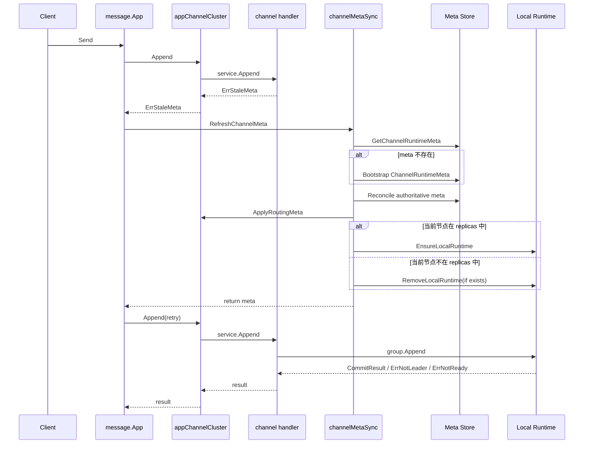
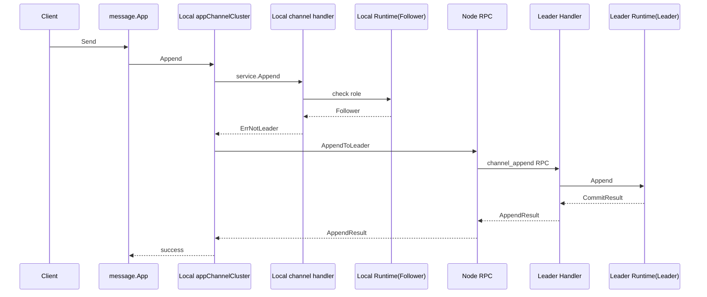
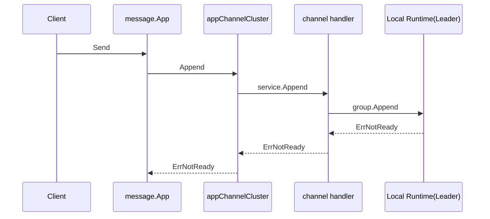

# Send Message Channel Activation

## 一句话结论

发送消息触发 channel 激活时，真正发生的不是“直接创建本地 channel”，而是：

1. 先尝试 `Append`
2. 失败后刷新权威 `ChannelRuntimeMeta`
3. 再决定当前节点是否创建本地 runtime
4. 最后重试 `Append`

## 先记住三个结果

- 本地还没这条 channel 的路由信息：先报 `ErrStaleMeta`，再刷新
- 本地有 runtime，但当前节点不是 leader：报 `ErrNotLeader`，然后转发给 leader
- 本地已经是 leader，但还没完成 reconcile：报 `ErrNotReady`

## 场景一：冷 channel 首次发送

这是最典型的“发送消息激活 channel”场景。



### 这张图想表达什么

- 第一次发送时，系统通常还没有本地可用的 channel 视图
- 所以不会一步到位写成功，而是会先走一次“失败 -> 刷新 meta -> 重试”
- 刷新 meta 之后，当前节点如果属于副本集合，才会真正创建本地 runtime

## 场景二：本地激活后，当前节点其实是 follower

很多人容易误以为“激活成功 = 本地负责写入”，其实不一定。

如果刷新后的 meta 显示当前节点不是 leader，那么本地虽然可能已经创建了 follower runtime，但 append 仍然不会在本地落盘，而是会转发给 leader。



### 这张图想表达什么

- 本地 runtime 被激活，不代表它就是 leader
- follower runtime 的主要职责是复制，不是处理业务写入
- 真正的业务写入仍然发生在 leader 节点

## 场景三：本地是 leader，但还不能写

还有一种比较容易混淆的情况：

- 当前节点已经是 leader
- 本地 runtime 也已经存在
- 但 `CommitReady=false`

这通常发生在：

- leader 切换后
- 本地恢复后
- 还在做 quorum-safe reconcile

此时发送路径不会继续刷新 meta，而是直接返回 `ErrNotReady`。



### 这张图想表达什么

- `ErrNotReady` 不是“meta 过期”
- 而是“leader 已经选出来了，但本地副本还没完成收敛”
- 这时 channel 已经激活了，只是暂时不可写

## 最常见的完整路径

大多数冷 channel 的首次发送，最终会落到下面两种路径之一：

### 路径 A：刷新后本地就是 leader

```text
首次 Append 失败
-> RefreshChannelMeta
-> 创建本地 leader runtime
-> Retry Append
-> 本地提交成功
```

### 路径 B：刷新后本地是 follower

```text
首次 Append 失败
-> RefreshChannelMeta
-> 创建本地 follower runtime
-> Retry Append
-> 本地发现不是 leader
-> 转发给 leader
-> leader 提交成功
```

## 发送路径里，激活和写入不是一回事

这是最值得强调的一点：

- **激活**：把权威 meta 拉下来，并在需要时创建本地 runtime
- **写入**：由 leader 执行 append，并推进提交

所以发送消息触发激活，和发送消息最终写在哪个节点，是两个相关但不同的问题。

## 快速记忆版

可以把“发送消息激活 channel”记成下面这句：

```text
先试写，失败后拉 meta；
按 meta 决定是否创建本地 runtime；
能本地写就本地写；
不能写就转发 leader；
leader 未收敛则返回 ErrNotReady。
```

## 关键代码

- 发送入口：`internal/usecase/message/send.go`
- 刷新重试：`internal/usecase/message/retry.go`
- 激活入口：`internal/app/channelmeta_activate.go`
- meta bootstrap：`internal/app/channelmeta_bootstrap.go`
- meta reconcile：`internal/app/channelmeta_lifecycle.go`
- 本地 runtime 创建与移除：`internal/app/channelcluster.go`
- 本地 append 校验：`pkg/channel/handler/append.go`
- runtime append 状态：`pkg/channel/runtime/channel.go`
