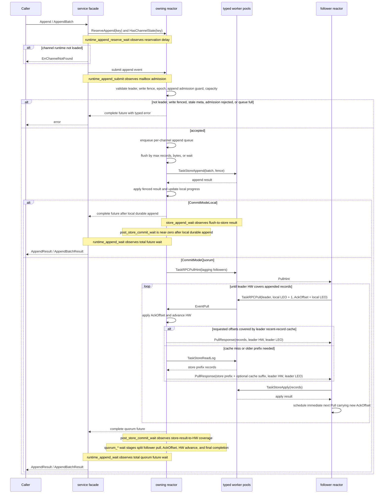
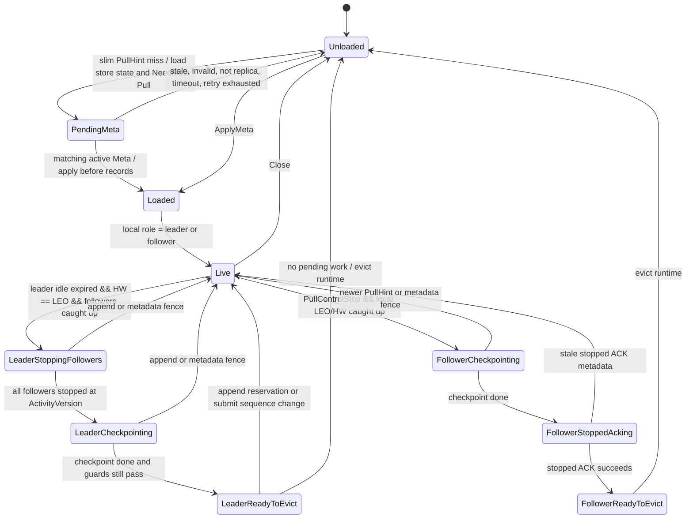

# pkg/channel Flow

## Directory Tree

```text
pkg/channel/        - Multi-reactor channel log runtime; root DTOs, errors, Cluster facade, Config, tests, and benchmarks.
|-- machine/          - Pure per-channel state transitions for metadata, append, progress, and invariants; no blocking I/O.
|-- reactor/          - Channel-key ownership, priority mailboxes, append queues, scheduler, lifecycle, metrics, and worker-result application.
|-- replication/      - Leader/follower replication helpers and protocol decisions used by reactor runtime paths.
|-- service/          - Synchronous facade that routes append and replication transport requests to reactors and waits on futures.
|-- store/            - Narrow persistence contract, memory store, and `pkg/db/message` compatibility adapter boundary.
|-- testkit/          - In-memory multi-node cluster harness for channel tests.
|-- transport/        - V0 local/RPC transport DTOs for pull, ack, notify compatibility, and PullHint.
`-- worker/           - Typed bounded worker admission queues plus ants-backed execution for store append/read/apply, RPC pull/ack/PullHint, checkpoint, and result delivery.
```

`store/channel_adapter.go` is the only channel file that may import the
`pkg/db/message/channelcompat` DTOs required by the message engine; other
channel packages should depend on channel interfaces.

Diagram labels use `event or guard / effect` so agents can distinguish triggers from side effects.

## Append Sequence



Append flush waits are bounded by `AppendBatchMaxWait` by default. When
`AppendBatchAdaptiveFlush` is enabled, the first request in a cold per-channel
append queue uses `AppendBatchColdMaxWait` if it is shorter, while record and
byte thresholds still trigger immediate flushes. Store-append workers may then
coalesce flushed tasks across channels before entering the store adapter;
`StoreAppendBatchMaxWait` can shorten that worker-side wait for low-latency
profiles while zero keeps the default batching window.

Leader reactors keep a configurable recent-record suffix cache for durable
append records, defaulting to 128 records. Follower `Pull` requests that are
covered by this suffix can complete from memory; older requests still use
`TaskStoreReadLog`, and the leader may append a cache-covered suffix to the
store prefix when doing so does not create gaps. The cache is cleared by
metadata fences or role changes and is only a performance optimization.

Ordinary follower progress is piggybacked on `PullRequest.AckOffset`: after a follower durably applies records, it schedules the next `Pull` immediately and carries the latest local LEO as the ACK offset. The standalone `Ack` RPC remains only for stopped-follower lifecycle confirmation, not for the hot replication path.

Follower-side replication uses the message DB adapter's trusted contiguous apply
path after the reactor has validated pull fencing and continuous follower
offsets, avoiding redundant existing-index reads in the hot replication path.
Follower-side replication stage metrics split PullHint wakeup, pull RPC wait,
store apply wait, and apply-to-`AckOffset` return wait. These complement the
leader-side quorum append wait stages: leader stages show when an append becomes
quorum-covered, while follower stages show which follower step delayed that
coverage.

The RPC worker dispatcher may coalesce queued `TaskRPCPull` or
`TaskRPCPullHint` items that target the same remote node into one transport
batch before executing the group on the ants-backed worker executor.

Store worker dispatchers may coalesce queued `TaskStoreAppend` or
`TaskStoreApply` items when the store factory implements the optional
leader-append or follower-apply batch surfaces; ants only runs the prepared
blocking group.

Leader-side PullHint result counters split submissions, successful RPC returns,
and low-cardinality error classes. In 10k-channel runs, compare these counters
with follower replication stage counts to distinguish slow accepted PullHints
from missing or failed wakeups that fall back to recovery probes.
Follower-side PullHint receive counters now stay at the service adapter
boundary: `submit` covers reactor mailbox admission and `await` covers the
reactor future. Missing follower metadata is handled inside the owning reactor
as a bounded `PendingMeta` bootstrap and not as a service-side metadata read.
PendingMeta bootstrap metrics are separate from loaded runtime metrics:
`wukongim_channelv2_pending_meta_current` tracks outstanding bootstrap shells by
reactor, `wukongim_channelv2_pending_meta_total` tracks created, converted, and
released shells by low-cardinality error class, and
`wukongim_channelv2_need_meta_pull_total` plus
`follower_need_meta_pull_rpc` track the `Pull{NeedMeta=true}` success, retry,
failure, and RPC latency path.

Append callers may set `OmitResultPayload` when they only need assigned message
ids and sequences; the leader then avoids cloning payload bytes into successful
append replies.
Authoritative metadata may also carry a durable channel write fence. A fenced
leader rejects new append admission with `ErrWriteFenced`; already accepted
in-flight append bookkeeping is not cleared by the fence-only metadata update
so migration executors can drain it explicitly before changing leadership or
membership.
The hosted runtime may also provide an `AppendAdmissionGuard`. Channel runtime calls
it only after local leader, write-fence, and epoch checks and before enqueueing
new leader appends. The guard is an external readiness fence: it must not mutate
channel state, and rejection completes the caller's append future without
disturbing already accepted in-flight batches.

Runtime probes are read-only control events owned by the channel's reactor. In
addition to loaded leader/follower/missing counts, `RuntimeProbe` returns a
bounded per-loaded-channel proof record: channel epoch, leader epoch, role,
status, LEO, HW, checkpoint HW, current write fence, in-flight append boolean,
and pending append count. It never copies pending append entries or payloads.
`DrainChannel` is a migration-only service boundary. It polls the owning reactor
until the requested local leader is still fenced by the expected fence version,
has no accepted in-flight or pending append work, and local HW covers local LEO;
leader epoch or fence-version changes return `ErrStaleMeta`.
Append callers may also carry `TraceID`, diagnostics `ChannelKey`, per-message
trace metadata, and `Attempt` through `AppendBatchRequest`. These fields are
transient diagnostics data for sendtrace and RPC forwarding only. The reactor
still converts messages to durable records using message id, payload, display
fields, the legacy setting bitset, and the `SyncOnce` command-sync marker, so
trace metadata is not part of channel log storage, idempotency, or DB
semantics.

Leader-side deep sendtrace detail is gated by the active diagnostics detail
sampler. The reactor builds bounded transient sidecars only for selected traced
items, records leader queue/local durable/quorum wait stages from existing
append timing points, and drops the sidecar before durable channel records or
DB-compatible messages are written.

The cluster-facing append stage metric keeps `runtime_append` as the aggregate
facade call and also records service sub-stages: `runtime_append_reserve_wait`
for per-channel append admission, `runtime_append_submit` for reactor mailbox
submission, and `runtime_append_wait` for the future wait after admission.
Inside that admitted future, `store_append_wait` covers append flush submission
through durable store completion, while `post_store_commit_wait` covers durable
store completion through local/quorum waiter completion. Quorum post-store
sub-stages further separate follower pull service, leader-side `AckOffset`
observation, HW advancement, and final future completion.
When an admitted append waiter is canceled by the caller, the reactor emits a
low-volume `AppendWaitCancelSnapshot` before cleanup. The snapshot captures the
channel key, op id, commit mode, LEO/HW/target offset, queue and in-flight
counts, and quorum progress booleans so timeout triage can distinguish slow
storage, missing follower progress, and lost waiter completion.

Committed-message lookup is a read-only recovery/diagnostic path. It asks the
owning reactor to read a durable row by message id, then returns it only when
the row has a positive sequence and the local HW covers that sequence. It never
advances HW, creates rows, or turns an uncommitted local write into success.
The store contract also has an optional local `IdempotencyLookup` surface for
sender/client-message recovery. MessageDB-backed stores resolve it through the
durable idempotency index and return the stored raw-payload hash with the
message row so upper layers can reject conflicting key reuse without parsing
append errors.

Logical channel message compaction is represented by the caller-supplied
`ReadCommittedRequest.MinSeq` floor, normally derived from Slot metadata
`RetentionThroughSeq + 1` by cluster. Forward committed reads clamp their
starting sequence to this floor, reverse/latest reads stop before crossing it,
and message DB adapter reads filter compacted rows even when physical message
rows still exist.

Physical retention is applied through the Channel runtime retention runtime facade.
Reactors first publish the monotonic logical boundary into local state, then a
store-apply worker adopts the boundary in storage and optionally performs one
bounded prefix trim. Physical trim is skipped unless the requested boundary is
covered by local HW, durable checkpoint HW, local LEO, and, for leaders, the
minimum known ISR match offset. Skipped trims still keep the adopted logical
boundary so later retries can advance physical progress without regressing
replica visibility. When checkpoint HW is the only missing trim gate, the
retention runtime can submit a bounded checkpoint from the physical GC path; the
next retry observes the checkpoint result and performs the trim.

## Channel Runtime Lifecycle Model

`Unloaded` is represented by absence from the owning reactor's `channels` map.
`PendingMeta` is a short-lived follower bootstrap shell created from a slim
PullHint when the follower lacks matching local runtime state. It opens the
channel store, sends `Pull{NeedMeta=true}` to the channel leader, applies the
returned active metadata before any records, and releases itself on stale,
invalid, not-replica, timeout, or retry-exhaustion paths. Loaded runtimes hold
`machine.ChannelState`, `appendQueue`, `replicationState`, and
`channelRuntimeLifecycle`. `channelRuntimeLifecycle` is the single controller
for stop, checkpoint, stopped ACK, final eviction, leader-visible follower stop
state, and pull-hint inflight state for that loaded runtime. Ordinary follower
replication state stays in `replicationState` and only exposes a summarized
`RuntimeView` to lifecycle guards.

Metadata reload is not a long-lived lifecycle stage. Accepted metadata fence
changes fail stale waiters, reset transient lifecycle/replication state, apply
the new `Meta`, and then choose the leader or follower runtime path from local
role.

Leader phases:

- `Live`: normal hot or idle leader runtime. Idle slowdown is derived from idle
  age and `leaderPullDelay`; it is not stored as a separate stage.
- `LeaderStoppingFollowers`: the leader is idle-expired, has no pending work,
  and offers stop control only after followers are caught up.
- `LeaderCheckpointing`: all followers stopped for the current activity version
  and the leader checkpoint is in flight or retrying.
- `LeaderReadyToEvict`: the checkpoint finished and a normal-priority recheck
  fences eviction behind same-channel append reservations and submit sequence
  changes.

Follower phases:

- `Live`: ordinary pull, apply, piggyback ACK, park, and retry behavior remains
  in the follower hot path.
- `FollowerCheckpointing`: the follower accepted `PullControlStop` after local
  LEO/HW caught up and is checkpointing before the stopped ACK.
- `FollowerStoppedAcking`: the checkpoint succeeded and the follower is sending
  or retrying the stopped ACK before unloading runtime state.
- `FollowerReadyToEvict`: the stopped ACK succeeded and the local runtime can be
  evicted.

Follower pull hints are only used to wake followers that still trail the hinted
leader LEO. If an empty pull observes newer leader activity without records, the
follower schedules a short retry instead of recursively pulling in the same
reactor turn; this prevents stale hint bursts from turning into empty-pull
storms under write pressure.

## 10k Live Channel Runtime Rules

Channel runtime can bound loaded local runtimes with `MaxChannels`. A limit of `0`
keeps unlimited behavior. Capacity checks happen before opening a new
channel-scoped store handle; metadata updates for already loaded runtimes remain
allowed at capacity.

Caught-up followers park instead of polling the leader on a short idle interval.
The leader wakes followers with PullHint on new activity, while followers keep a
send-timeout-bounded jittered recovery probe so a lost hint can recover before
the caller's sendack budget expires. The runtime default is 2s plus up to 1s
jitter.



Lifecycle decisions are expressed as reactor-owned actions such as starting a
checkpoint, scheduling lifecycle retry, queuing leader final recheck, sending a
stopped ACK, or evicting runtime. Worker completions are fenced by channel key,
generation, epoch, leader epoch, and op id before controller state is advanced.
Store and transport I/O still run through the existing worker pools; the
controller only decides what should happen next.

## Bench Runtime Observation

`RuntimeBench` exposes snapshot, probe, and safe eviction for controlled
benchmark runs. Callers pass concrete `ChannelID` values; benchmark run/profile
range expansion happens above `pkg/channel` so the runtime package does not
depend on wkbench naming rules.
