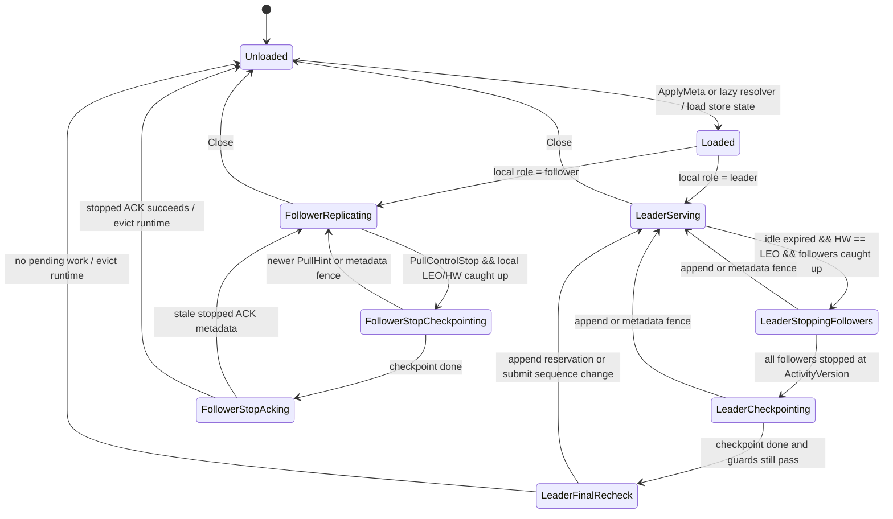

# pkg/channelv2 Flow

## Purpose

`pkg/channelv2` is an experimental multiple-reactor channel log runtime. Phase 2 validates append, fetch, follower replication, ACK, HW commit behavior, idle runtime eviction, and benchmark-visible metrics through multiple reactors plus typed bounded worker pools without replacing `pkg/channel`.

## Package Boundaries

- Root package defines public DTOs, errors, and the `Cluster` interface.
- `service/` is the synchronous facade. It validates requests, routes them to reactors, and waits on futures.
- `reactor/` owns channel-key routing, priority mailboxes, and per-channel state ownership.
- `machine/` owns pure channel state transitions and never performs blocking I/O.
- `store/` exposes the narrow persistence contract plus memory and old-store adapters.
- `transport/` exposes the v0 pull/ack replication protocol.
- `testkit/` provides a memory multi-node cluster harness.

## ApplyMeta

`ApplyMeta` applies the authoritative channel runtime view. It creates local channel state if needed, loads store state, applies leader/follower role, and seeds leader progress and leader activity version from local LEO. It remains the explicit metadata push/refresh path, but Append no longer requires callers to invoke it first when the service is configured with a metadata resolver. ApplyMeta-only loads do not count as Append activity; leaders start cold and remain eligible for scheduled idle slowdown or eviction from their runtime load time. It does not elect leaders or repair metadata.

## Append

`Append` and `AppendBatch` route to the owning reactor. Before submitting the append event, the service reserves the append with the owning reactor, verifies that the reactor already owns channel state, and then submits the append. If state is not loaded and a `MetaResolver` is configured, the service resolves authoritative metadata, applies it through the normal `ApplyMeta` path to create and seed the reactor state, then submits the append. Without a resolver, an unloaded channel keeps the existing `ErrChannelNotFound` behavior. The per-channel reservation and append submit sequence prevent a final leader-idle eviction from deleting that channel's runtime state between loaded-state verification and append mailbox submission without letting unrelated channel appends delay eviction. The reactor admits leader-ready requests into a bounded per-channel append queue, batches them by record count, bytes, or max wait, and proposes one machine append batch with a reactor-owned fence op id. Store appends run on the bounded store-append worker pool; fenced completions return as high-priority worker results, are applied back in the reactor, and may complete multiple client waiters when local or quorum commit criteria are met. Observer hooks record submitted batch records/bytes/wait and append completion latency for accepted requests, and the async append benchmarks report batch and allocation metrics. Worker-pool backpressure rolls the proposed batch back to the queue and retries on a later tick after the append retry backoff, leaving accepted client futures pending. Caller cancellation after admission is cooperative: the owning reactor tracks cancellable append contexts and sweeps them on event turns and flush attempts. A canceled append is removed from the queue, inflight waiter state, or post-store quorum waiter state, and its future completes with the context error. Already-started durable store writes are allowed to finish; their later completions use the original batch record counts and do not complete canceled client waiters as success.

## Fetch

`Fetch` captures the current HW and submits a `StoreReadCommitted` worker task to the bounded store-read worker pool. The reactor keeps only a fenced waiter, so high-priority metadata changes can proceed while storage is blocked. Worker result observer hooks record the read completion kind, error, and worker duration when the group routes the result. A metadata fence change fails pending fetch waiters with `ErrStaleMeta`, and stale worker completions are ignored without leaking the waiter. Reactor/group close fails pending fetch waiters with `ErrClosed` and cancels store-read worker contexts. Fetch never returns records above HW.

## Replication

Replication is owned by each channel's reactor runtime. `service.Tick` only calls `group.Tick(ctx)`, which submits low-priority tick events; keyed ticks nudge one channel directly, while unkeyed ticks and the normal idle loop pop per-channel due scheduler entries instead of broadly scanning all loaded channels. The due scheduler covers append flush deadlines, follower pull/apply/ACK/checkpoint retry deadlines, and leader lifecycle/PullHint retry checks; stale due entries are fenced by per-channel versions. Follower pull offsets are based on local `LEO + 1`, not committed HW or a service-side fetch. RPC pull, store apply, ACK, and PullHint completions flow through worker result observer hooks, while three-node async benchmarks exercise the worker-pool path with local transport. PullHint replaces the old follower nudge semantics for idle wake/resume: leader append completion records a leader-owned activity version from the durable LEO, then sends best-effort PullHint RPCs to parked, stopped, or not-yet-started followers that are behind that version. PullHint carries leader LEO and activity version so unloaded followers can lazily activate and pull immediately, but PullHint inflight work is not an eviction safety dependency; follower pull or ACK progress retires obsolete hint bookkeeping and late hint completions are op-fenced. `transport.Notify`, service `HandleNotify`, and worker `TaskRPCNotify` remain only as legacy transport compatibility wrappers; active replication should use PullHint wording and paths. Short-poll idle retry remains the fallback when PullHints are dropped, backpressured, or race metadata changes.

```text
leader append stored -> TaskRPCPullHint(inactive followers)
Follower->>Workers: TaskRPCPull(leader, local LEO + 1)
Workers->>Reactor: EventPull
alt requested offsets covered by leader recent-record cache
    Reactor-->>Follower: PullResponse(records, leader HW, leader LEO)
else cache miss or older prefix needed
    Reactor->>Workers: TaskStoreReadLog
    Workers-->>Reactor: store prefix records
    Reactor-->>Follower: PullResponse(store prefix + optional cache suffix, leader HW, leader LEO)
end
follower TaskStoreApply -> local LEO/HW
follower TaskRPCAck(matchOffset)
leader EventAck -> AdvanceHW -> complete quorum waiters
follower PullResponse(Control=Stop) -> TaskStoreCheckpoint -> stopped ACK -> follower runtime eviction
leader stopped ACKs from all replicas -> TaskStoreCheckpoint(HW=LEO) -> leader runtime eviction
```

Leader reactors keep a small configurable recent-record suffix cache for durable append records. Follower `Pull` requests that are covered by this suffix can complete from memory; older requests still use `TaskStoreReadLog`, and the leader may append a cache-covered suffix to the store prefix when doing so does not create gaps. The cache is cleared by metadata fences or role changes and is only a performance optimization.

A follower keeps at most one pull RPC in flight, exactly one pending pull response waiting for store apply, and one ACK RPC in flight. Pull, apply, and ACK completions are fenced by generation, epoch, leader epoch, and op id; stale completions are ignored before they clear or advance runtime state. Apply errors and store-apply backpressure retain the pending pull response for retry. Pending ACKs are retried before new pulls, and ACK errors or ACK backpressure retain the exact stored match offset for retry. Leader pull cache misses and store-backed prefix reads are asynchronous through the store-read worker pool so blocked log reads do not block high-priority metadata events. When no records are ready, the leader returns `NextPullAfter` to pace the follower; when idle eviction is safe for that follower, the leader returns `PullControlStop`.
Follower-side stop handling checkpoints before sending a stopped ACK and unloads only after that ACK succeeds; leader stop eligibility and leader-last eviction are lifecycle-owned behavior. A leader returns stop only after the channel has been idle past `IdleEvictAfter`, all replicas in metadata are caught up, and no runtime work is pending. Stopped ACKs must match the current activity version and LEO before they can mark a follower stopped or contribute to leader eviction. After all followers have stopped, the leader checkpoints at the safe HW/LEO and then evicts its local runtime from a normal-priority final recheck, so already-queued or concurrently submitted appends can cancel eviction before runtime deletion.
Metadata fence changes reset follower pull/apply/ACK inflight and pending state before active followers are marked dirty under the new epoch. Leader-side pull waiters complete with `ErrStaleMeta` on metadata fence changes, the caller context error on cancellation, or `ErrClosed` on close; late store completions are ignored after the waiter is removed. Leader ACK handling ignores stale or regressive matches, so they do not advance HW or complete quorum waiters.

## Channel Runtime Lifecycle Model

`Unloaded` is represented by absence from the owning reactor's `channels` map.
Loaded runtimes hold `machine.ChannelState`, `appendQueue`, `replicationState`,
leader-visible follower state, and an explicit `runtimeLifecycle` phase model.
Metadata reload is not a long-lived phase: accepted metadata fence changes fail
stale waiters, reset transient lifecycle/replication state, apply the new
`Meta`, and then choose the leader or follower runtime path from local role.

Leader phases:

- `Serving`: normal hot or idle leader runtime. Idle slowdown is derived from
  idle age and `leaderPullDelay`; it is not stored as a lifecycle phase.
- `StoppingFollowers`: the leader is idle-expired and waits for caught-up
  followers to pull at `LEO+1` so it can return `PullControlStop`.
- `Checkpointing`: all followers stopped for the current activity version and
  the leader checkpoint is in flight or retrying.
- `FinalRecheck`: the checkpoint finished and a normal-priority recheck fences
  leader eviction behind same-channel append reservations and submit sequence
  changes.

Follower phases:

- `Replicating`: ordinary pull, apply, ACK, park, and retry behavior.
- `StopCheckpointing`: the follower accepted `PullControlStop` after local
  LEO/HW caught up and is checkpointing before the stopped ACK.
- `StopAcking`: the checkpoint succeeded and the follower is sending or
  retrying the stopped ACK before unloading runtime state.



Lifecycle decisions are expressed as reactor-owned actions such as starting a
checkpoint, scheduling lifecycle retry, queuing leader final recheck, sending a
stopped ACK, or evicting runtime. Store and transport I/O still run through the
existing worker pools; the lifecycle model only decides what should happen next.

## Backpressure

Mailboxes, append queues, and worker pools are bounded, and observer hooks sample reactor mailbox depths and worker queue depths after cheap submit/drain points. Normal request admission returns `ErrBackpressured` when full. Append queue limits reject new requests before they become waiters; store append worker-pool backpressure keeps already accepted requests pending for retry. Fetch and leader pull log reads use the store-read worker pool, with fetch fail-fast behavior when that pool rejects the task. Follower pull, apply, ACK, PullHint, and checkpoint work use typed bounded worker tasks; store-apply backpressure keeps the single pending pull response for retry, and ACK backpressure keeps the exact match offset for retry rather than issuing duplicate pulls or advancing the offset. PullHint failures are observed but do not fail accepted appends because follower short-poll can still catch up.
Low-priority tick mailbox events are droppable/coalesced; if a direct tick submit carries a future and is dropped, the future is completed immediately so callers do not hang. Benchmarks report allocation counts and selected observer-derived batch/queue metrics but do not assert absolute throughput.

## Import Boundary

Only `store/channel_adapter.go` imports old `pkg/channel` or `pkg/channel/store`. Other channelv2 packages must depend only on channelv2 interfaces.
