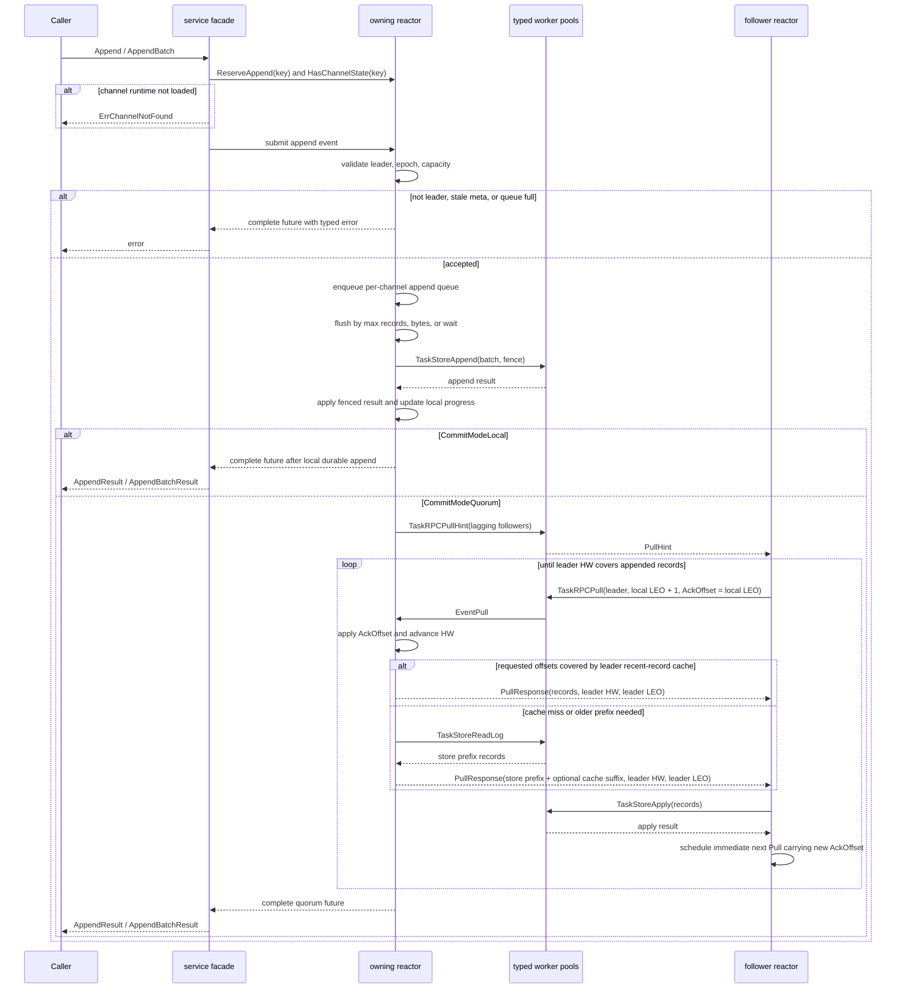
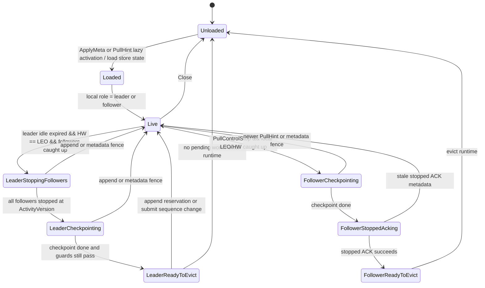

# pkg/channelv2 Flow

## Directory Tree

```text
pkg/channelv2/        - Experimental multi-reactor channel log runtime; root DTOs, errors, Cluster facade, Config, tests, and benchmarks.
|-- machine/          - Pure per-channel state transitions for metadata, append, progress, and invariants; no blocking I/O.
|-- reactor/          - Channel-key ownership, priority mailboxes, append queues, scheduler, lifecycle, metrics, and worker-result application.
|-- replication/      - Leader/follower replication helpers and protocol decisions used by reactor runtime paths.
|-- service/          - Synchronous facade that validates requests, requires preloaded append state, lazily activates PullHint followers, routes work to reactors, and waits on futures.
|-- store/            - Narrow persistence contract, memory store, and `pkg/db/message` compatibility adapter boundary.
|-- testkit/          - In-memory multi-node cluster harness for channelv2 tests.
|-- transport/        - V0 local/RPC transport DTOs for pull, ack, notify compatibility, and PullHint.
`-- worker/           - Typed bounded worker pools for store append/read/apply, RPC pull/ack/PullHint, checkpoint, and result delivery.
```

`store/channel_adapter.go` is the only channelv2 file that may import `pkg/channel` DTOs required by the `pkg/db/message` engine; other channelv2 packages should depend on channelv2 interfaces.

Diagram labels use `event or guard / effect` so agents can distinguish triggers from side effects.

## Append Sequence



Leader reactors keep a small configurable recent-record suffix cache for durable append records. Follower `Pull` requests that are covered by this suffix can complete from memory; older requests still use `TaskStoreReadLog`, and the leader may append a cache-covered suffix to the store prefix when doing so does not create gaps. The cache is cleared by metadata fences or role changes and is only a performance optimization.

Ordinary follower progress is piggybacked on `PullRequest.AckOffset`: after a follower durably applies records, it schedules the next `Pull` immediately and carries the latest local LEO as the ACK offset. The standalone `Ack` RPC remains for stopped-follower lifecycle confirmation and compatibility retry state, not for the hot replication path.

Append callers may set `OmitResultPayload` when they only need assigned message
ids and sequences; the leader then avoids cloning payload bytes into successful
append replies.

## Channel Runtime Lifecycle Model

`Unloaded` is represented by absence from the owning reactor's `channels` map.
Loaded runtimes hold `machine.ChannelState`, `appendQueue`, `replicationState`,
and `channelRuntimeLifecycle`. `channelRuntimeLifecycle` is the single
controller for stop, checkpoint, stopped ACK, final eviction, leader-visible
follower stop state, and pull-hint inflight state for that loaded runtime.
Ordinary follower replication state stays in `replicationState` and only
exposes a summarized `RuntimeView` to lifecycle guards.

Metadata reload is not a long-lived lifecycle stage. Accepted metadata fence
changes fail stale waiters, reset transient lifecycle/replication state, apply
the new `Meta`, and then choose the leader or follower runtime path from local
role.

Leader phases:

- `Live`: normal hot or idle leader runtime. Idle slowdown is derived from idle
  age and `leaderPullDelay`; it is not stored as a separate stage.
- `LeaderStoppingFollowers`: the leader is idle-expired, has no pending work,
  and offers stop control only after followers are caught up.
- `LeaderCheckpointing`: all followers stopped for the current activity version
  and the leader checkpoint is in flight or retrying.
- `LeaderReadyToEvict`: the checkpoint finished and a normal-priority recheck
  fences eviction behind same-channel append reservations and submit sequence
  changes.

Follower phases:

- `Live`: ordinary pull, apply, piggyback ACK, park, and retry behavior remains
  in the follower hot path.
- `FollowerCheckpointing`: the follower accepted `PullControlStop` after local
  LEO/HW caught up and is checkpointing before the stopped ACK.
- `FollowerStoppedAcking`: the checkpoint succeeded and the follower is sending
  or retrying the stopped ACK before unloading runtime state.
- `FollowerReadyToEvict`: the stopped ACK succeeded and the local runtime can be
  evicted.

Follower pull hints are only used to wake followers that still trail the hinted
leader LEO. If an empty pull observes newer leader activity without records, the
follower schedules a short retry instead of recursively pulling in the same
reactor turn; this prevents stale hint bursts from turning into empty-pull
storms under write pressure.



Lifecycle decisions are expressed as reactor-owned actions such as starting a
checkpoint, scheduling lifecycle retry, queuing leader final recheck, sending a
stopped ACK, or evicting runtime. Worker completions are fenced by channel key,
generation, epoch, leader epoch, and op id before controller state is advanced.
Store and transport I/O still run through the existing worker pools; the
controller only decides what should happen next.
